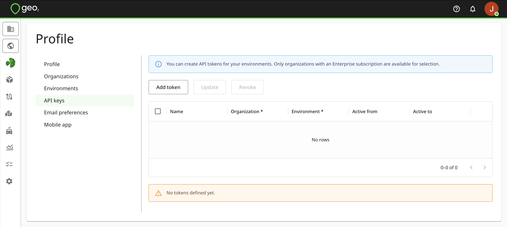
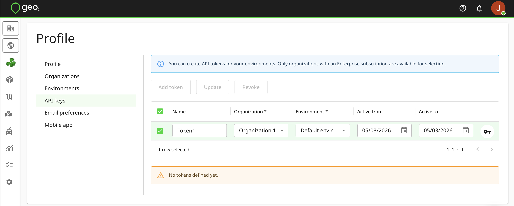
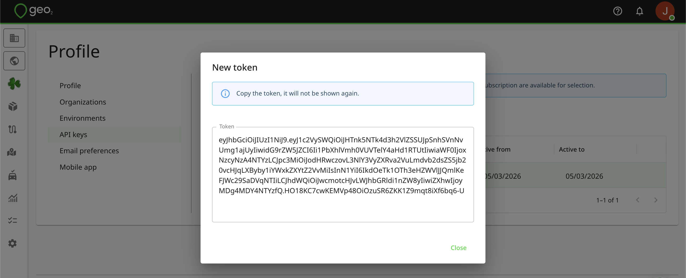

[API](../API.md)

# Authentication

As a user, you can request API keys (authentication tokens) in the [**web-based Hub**](https://hub.geo2.com/en-GB/auth/signin).  Keys are used as bearer tokens in requests to the Geo2 API and are local to each environment in your Geo2 organization.

# API Keys

API keys (personal access tokens) authenticate you to the Geo2 API. You do not need them if you are not using your account for data integration with Geo2. To create API keys, open Hub's Profile menu, select the API keys option, and click the `Add token` button.

You select the organization and environment to which the token belongs and the dates within which it is to be active.  Once a token has been created, copy its value as it will not be shown again. 

The token gives programmatic access to Geo2 using your user credentials.  For maximum security, revoke any tokens that are not needed - you can select a token and press `REVOKE`.  You can further make sure a token isn't used when it is not needed by setting the `Active from` and `Active to` dates.
