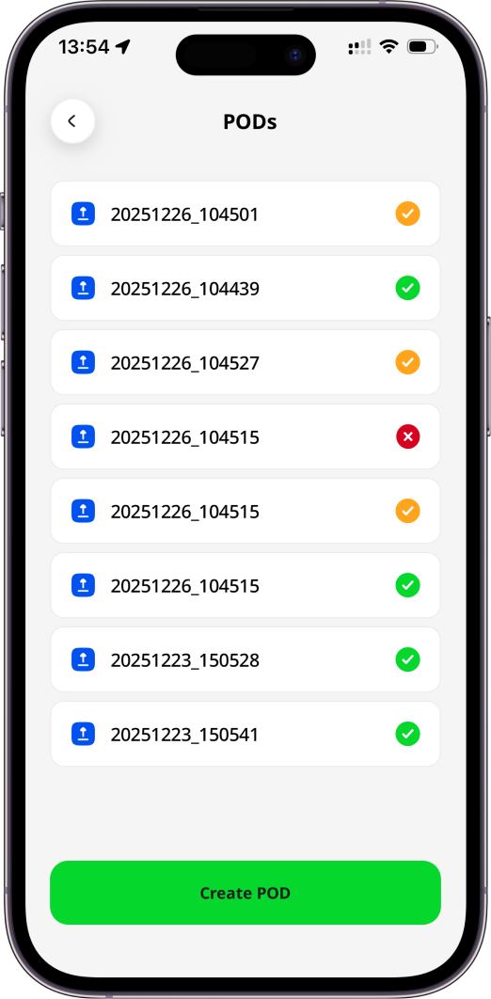
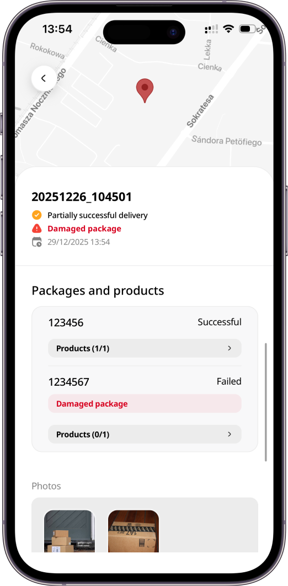
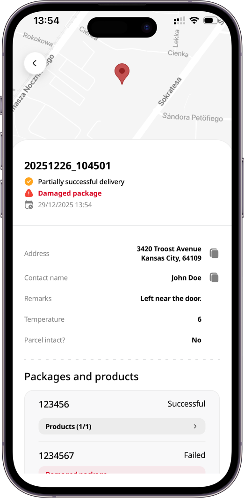
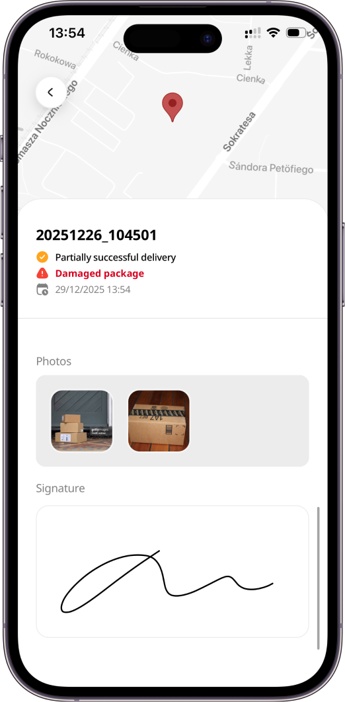
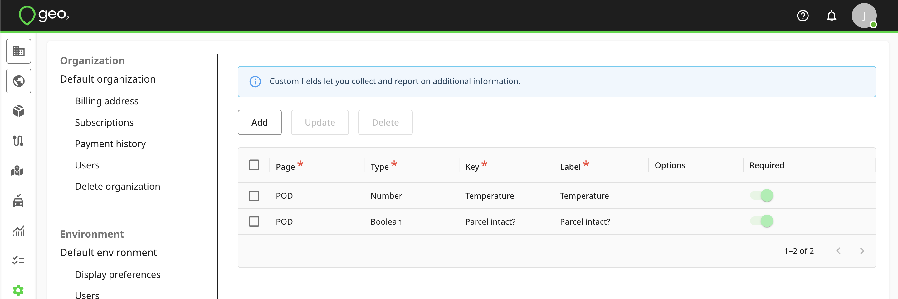

[Mobile App](../Mobile%20App.md)

# Mobile App: POD History

- [POD details](#pod-details)
- [POD Custom Fields](#pod-custom-fields)
- [Photo and Signature Re-uploading](#photo-and-signature-re-uploading)

# POD details

To review the history of PODs recorded by the user, click on PODs page.  By clicking on the POD, you can view its details. 

Depending on the data provided during POD creation, you will see the following details in POD history:

|  **Data**                    |  **Description**                                                                                                                                                                                                                                                                                                                                                                                                                                                                                                                                                                                                                                        |
|:-----------------------------|:--------------------------------------------------------------------------------------------------------------------------------------------------------------------------------------------------------------------------------------------------------------------------------------------------------------------------------------------------------------------------------------------------------------------------------------------------------------------------------------------------------------------------------------------------------------------------------------------------------------------------------------------------------|
| Order key                    | Order unique identifier within the environment, for example, an order number 1, 2, 3, 4, etc.                                                                                                                                                                                                                                                                                                                                                                                                                                                                                                                                                           |
| Status                       | <ul local-id="72fe7ab4-fc99-4109-b34c-f5562c27828b"><li local-id="f430b624-4598-492d-ac9c-be21b18ba8be">
Successful - order has been successfully delivered/collected (a green “done” icon).
</li><li local-id="64441390-941e-4ebc-8f8d-25a45ec5b24f">
Partially successful - part of the order has been delivered/collected (a yellow “done” icon).
</li><li local-id="98b2eb2c-5dc1-4f79-9d5e-1353434e6e9d">
Failed - delivery/collection has failed (a red “cross” icon). 
</li></ul> |
| Type                         | Delivery or Collection. It is taken from an order if it is a POD created for an already existing order.                                                                                                                                                                                                                                                                                                                                                                                                                                                                                                                                                 |
| Date/time                    | Date/time when a POD was recorded.                                                                                                                                                                                                                                                                                                                                                                                                                                                                                                                                                                                                                      |
| Map                          | Map with a precise driver’s location at the moment of a POD creation. It can be tracked only if a driver has enabled location tracking both in the device and app.                                                                                                                                                                                                                                                                                                                                                                                                                                                                                      |
| Address                      | Recipient address. The app uses the address indicated in the order if it was a POD created for an already existing order. If this order has not existed previously, the app will try to detect a driver’s current location but this can be changed to more closely describe the address where the POD is being taken.                                                                                                                                                                                                                                                                                                                                   |
| Contact name                 | Recipient contact name. The app uses the contact name indicated in the order if it was a POD created for an already existing order but it can be edited.                                                                                                                                                                                                                                                                                                                                                                                                                                                                                                |
| Phone                        | Recipient phone number. The app uses the phone number indicated in the order if it was a POD created for an already existing order. By pressing the `"phone"` icon, you can call the number.                                                                                                                                                                                                                                                                                                                                                                                                                                                            |
| Mobile phone                 | Recipient mobile phone number. The app uses the mobile phone number indicated in the order if it was a POD created for an already existing order. By pressing the `"phone"` icon, you can call the number.                                                                                                                                                                                                                                                                                                                                                                                                                                              |
| Remarks                      | Notes left by a driver.                                                                                                                                                                                                                                                                                                                                                                                                                                                                                                                                                                                                                                 |
| Email                        | Recipient email address. The app uses the email address indicated in the order if it was a POD created for an already existing order.                                                                                                                                                                                                                                                                                                                                                                                                                                                                                                                   |
| Number of packages / planned | Number of successfully delivered/collected packages out of the planned total.                                                                                                                                                                                                                                                                                                                                                                                                                                                                                                                                                                           |
| Packages                     | Either pre-defined or added during a POD creation order packages.                                                                                                                                                                                                                                                                                                                                                                                                                                                                                                                                                                                       |
| Products                     | Pre-defined order products. They can be displayed either separately from packages or inside them depending if they are linked via Hub or API.                                                                                                                                                                                                                                                                                                                                                                                                                                                                                                           |
| Delivery instructions        | Optional notes for drivers that are shown in the mobile app taken from the order if it was a POD created for an already existing order.  For example, "leave with reception". They are not displayed if this order did not exist before.                                                                                                                                                                                                                                                                                                                                                                                                                |
| Photos                       | Photos added/recorded during a POD creation.                                                                                                                                                                                                                                                                                                                                                                                                                                                                                                                                                                                                            |
| Signature                    | Signature recorded during a POD creation.                                                                                                                                                                                                                                                                                                                                                                                                                                                                                                                                                                                                               |

# POD Custom Fields

In the Environment settings, you can set up custom fields to collect additional information in POD's.  Here is an example:

- Ask for the driver's name
- Ask if the parcel is intact

That's how the fields would look in POD history:

# Photo and Signature Re-uploading

It is possible that, when the POD was created, the device was not able to successfully upload images such as the signature and any photos to Geo2 Hub.  For example, the device internet connectivity might have been poor at the time.  In this situation, image upload is re-tried up to five times, at 15-minute intervals, when there is internet connectivity.  If the background re-tries have not been successful, you can re-try the image uploads manually, by pressing one of the `Refresh` icons on the signature or the pictures.  For this to be successful, the files must still exist in your device storage and you need reliable internet connectivity.
