[Mobile App](../Mobile%20App.md)

# Mobile App: Permissions

When you open the mobile app for the first time, it requests the necessary permissions. Please grant all permissions for Geo2 to function properly. After granting permissions, you can start using the app. You can manage app permissions anytime in the device settings on both Android and iOS. The required permissions are:

|  **Functionality**    |  **Details**                                                                                                                                                                                                                                                                                                                                                                                                                                                                                                                                                                                                                                                                                                                                                                                                                                                                                       |
|:----------------------|:---------------------------------------------------------------------------------------------------------------------------------------------------------------------------------------------------------------------------------------------------------------------------------------------------------------------------------------------------------------------------------------------------------------------------------------------------------------------------------------------------------------------------------------------------------------------------------------------------------------------------------------------------------------------------------------------------------------------------------------------------------------------------------------------------------------------------------------------------------------------------------------------------|
| Location tracking     | For location tracking in routes, proofs of delivery (PODs), vehicle checks, and public tracking. To fully enable these functionalities, you need to grant access to your device's location, including continuous background tracking.   **Android:**  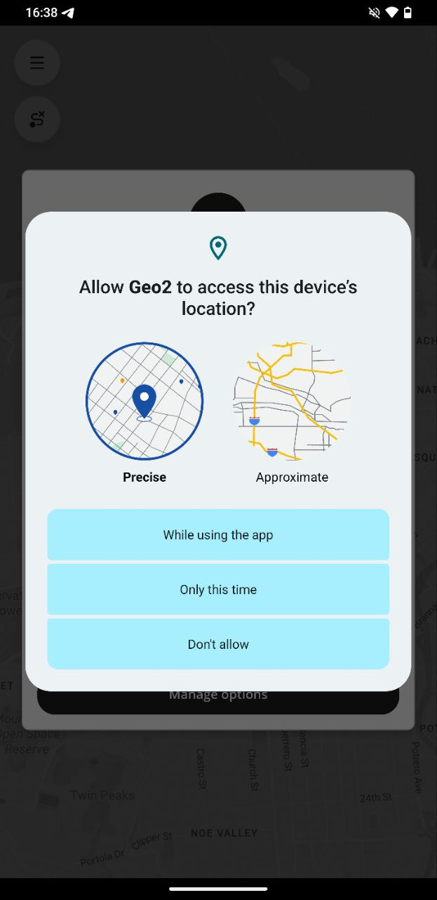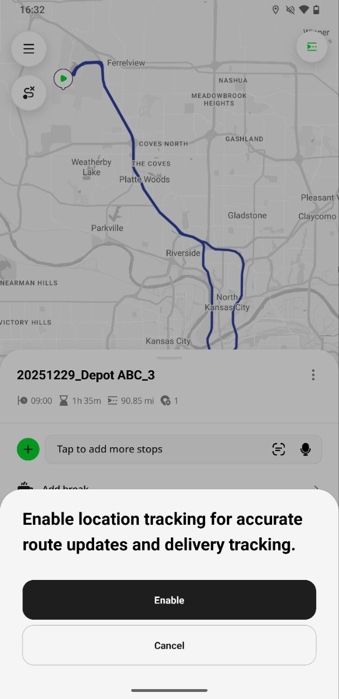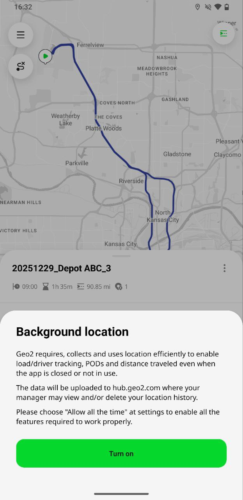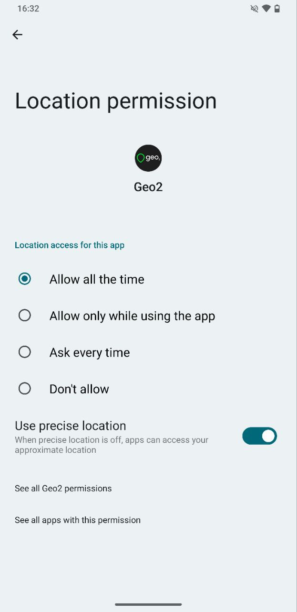 **iOS:**  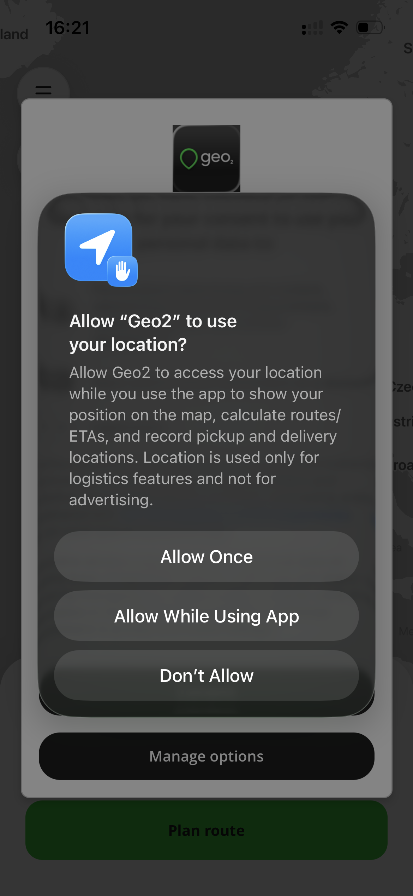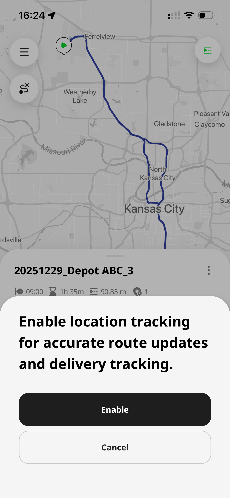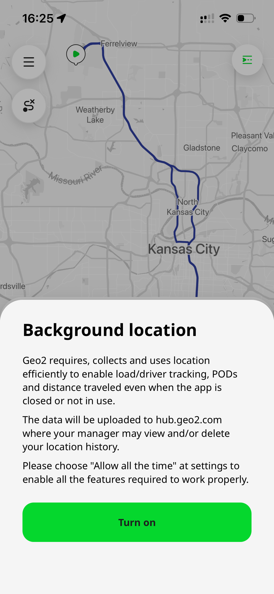 |
| Ads                   | For usage analytics, app improvement, and advertising measurement. Granting this permission helps us understand how Geo2 is used, improve features and performance, and support the ongoing development of the app. Geo2 is funded by advertising, and this permission allows us to continue providing the service.   **Android:**  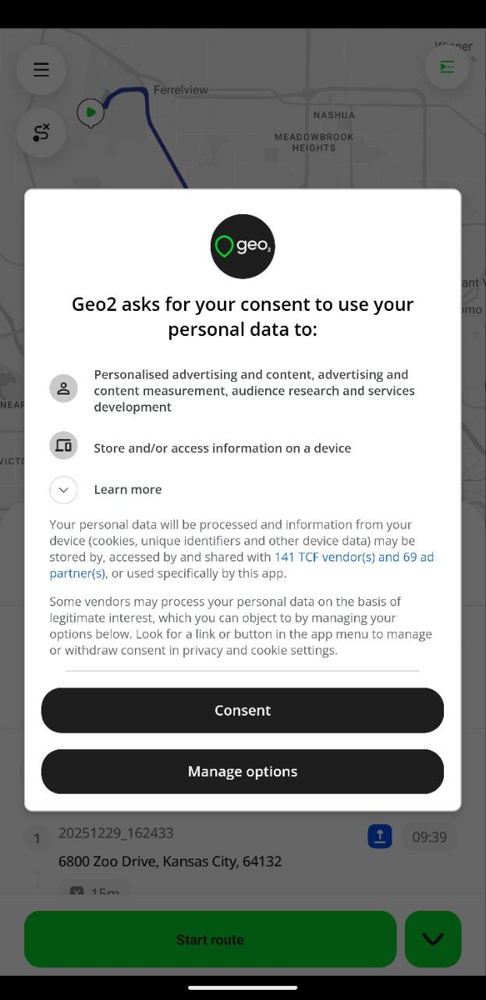 **iOS:**  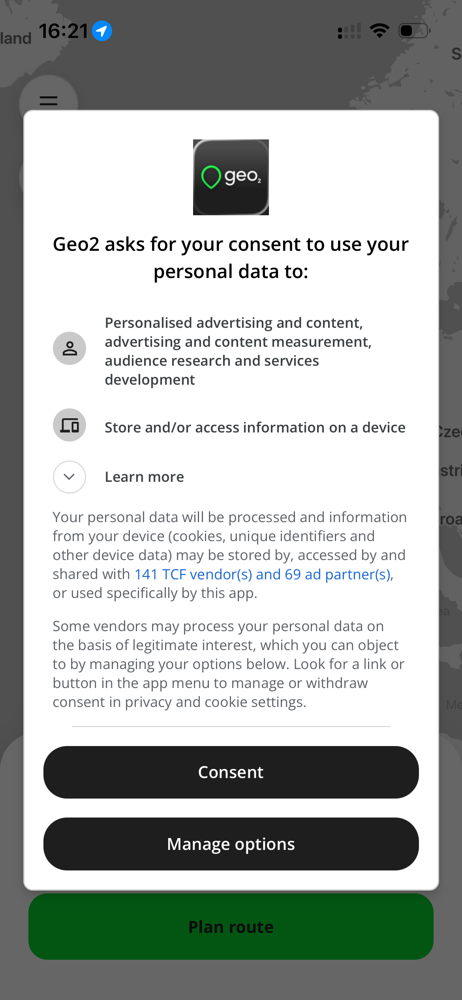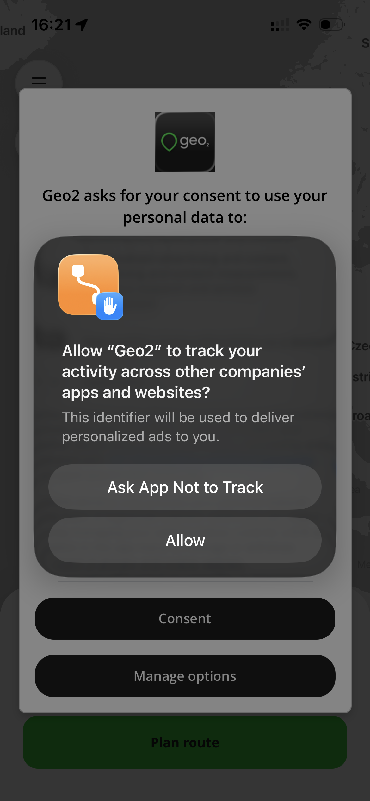                                                                                                                                                                                                                                                                                     |
| Camera                | For barcode scanning and taking photos during POD and vehicle check creation.  Without it, you cannot scan barcodes or take photos.   **Android:**  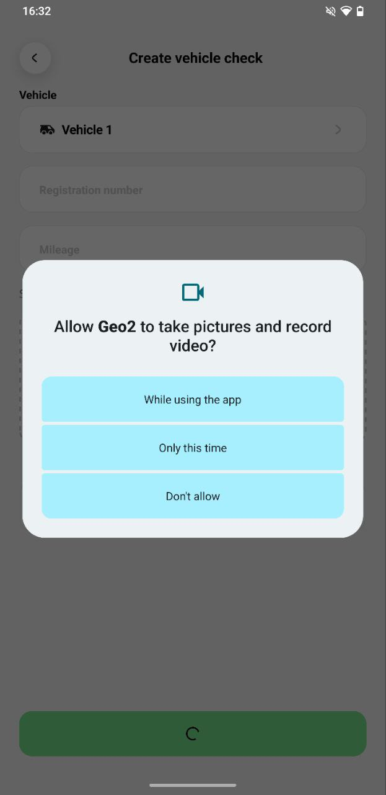 **iOS:**  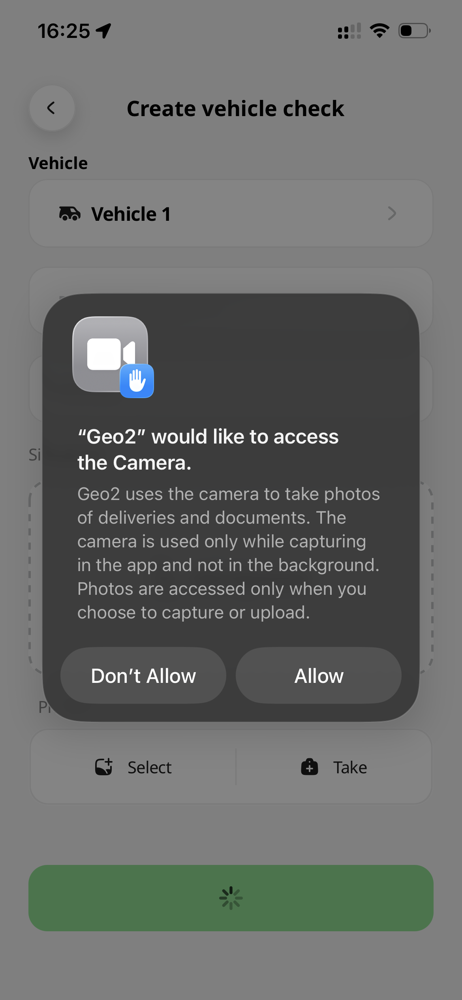                                                                                                                                                                                                                                                                                                                                                                                                                                                                                                                                                |
| Notifications         | For sending push notifications about useful features, updates, tips, and important information related to your use of Geo2. Granting this permission helps you stay informed and get the most out of the app.   **Android:**  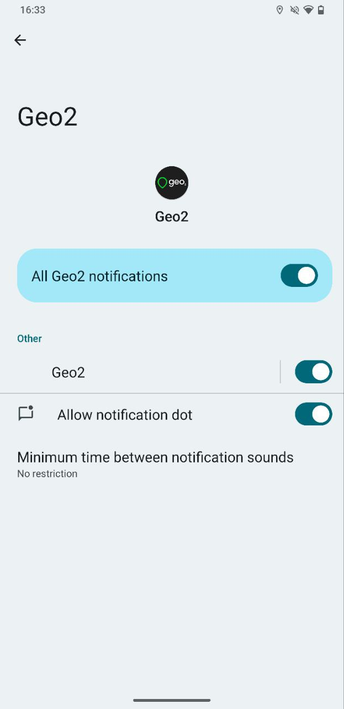 **iOS:**  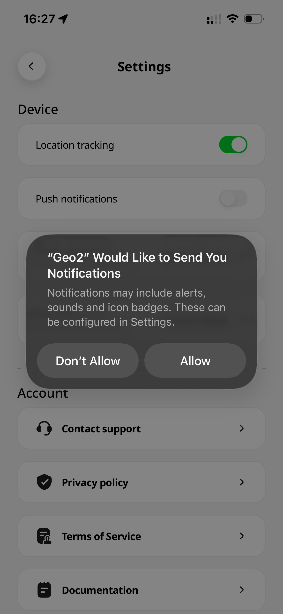                                                                                                                                                                                                                                                                                                                                                                                                                                                                      |
