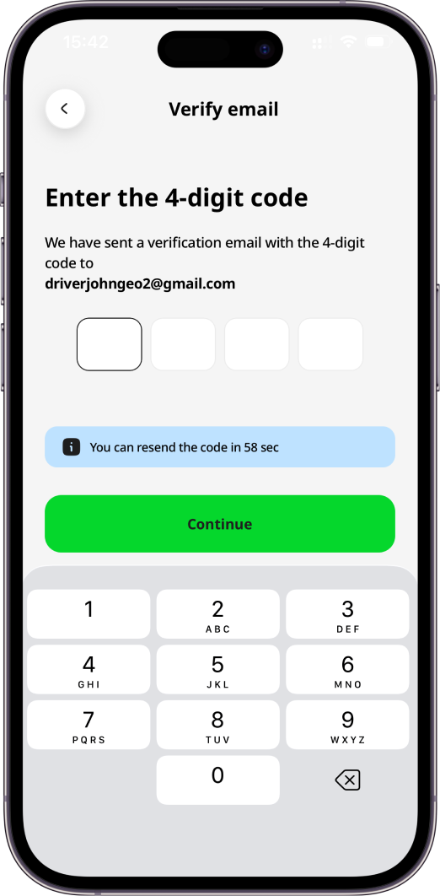
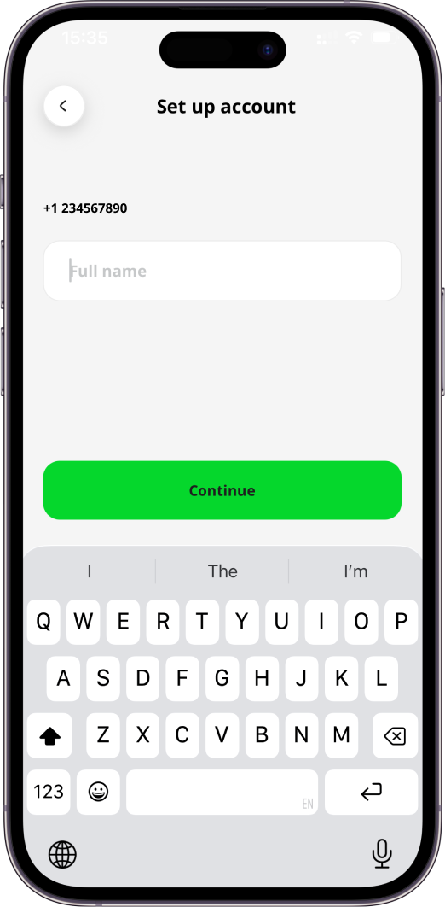
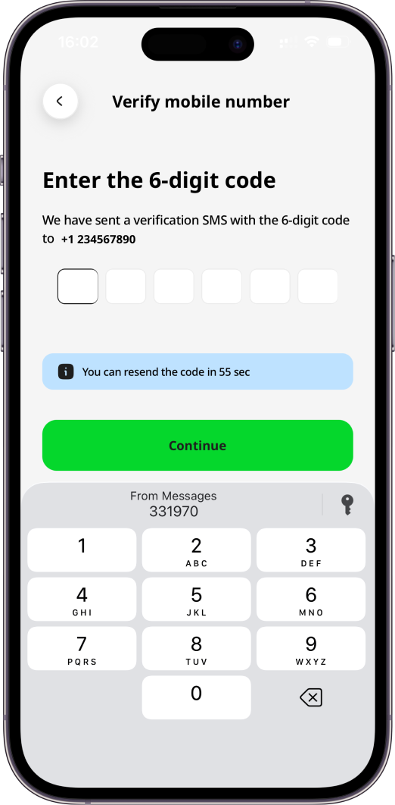
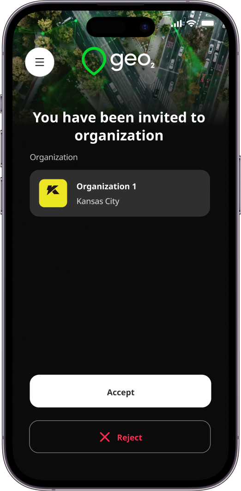
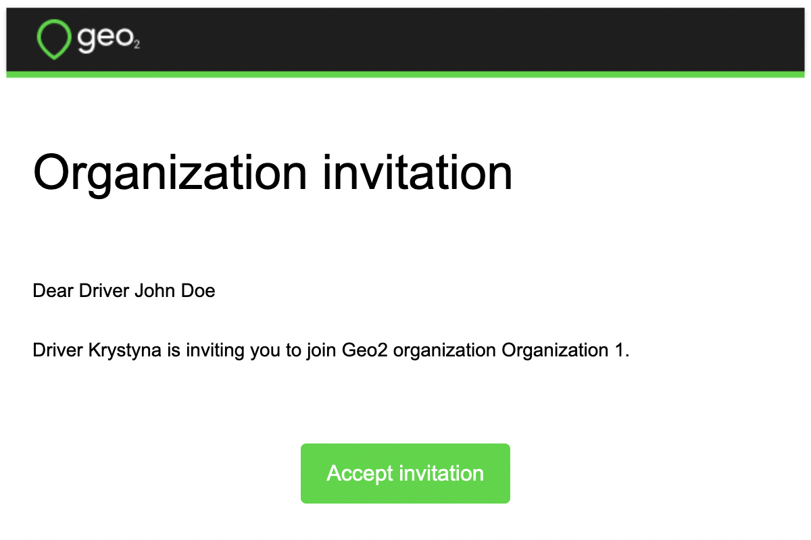

[Mobile App](../Mobile%20App.md)

# Mobile App: Register

- [Introduction](#introduction)
- [Register Account Using Email](#register-account-using-email)
  - [Verify Email](#verify-email)
- [Register Account Using Mobile Number](#register-account-using-mobile-number)
  - [Verify Mobile Number](#verify-mobile-number)
- [Accepting an Invitation](#accepting-an-invitation)

# Introduction

As a user, you can register and create your own [Hub: Organization Settings](../Web-Based%20Hub/Hub_%20Organization%20Settings.md) to which you invite other users.  You have the option to authenticate either with an email address and password, mobile phone number or via an identity provider - Apple, Google, or Microsoft. You may also be invited to join other organizations.  To [Hub: Accept Invitation](../Web-Based%20Hub/Hub_%20Accept%20Invitation.md), [Mobile App: Sign In](Mobile%20App_%20Sign%20In.md) to the app using the email address to which the invitation has been sent.

# Register Account Using Email

To create your account, provide your email address and press `Continue with email` button. Alternatively, you can press the buttons for other authentication providers in order to authenticate with your existing Google, Microsoft, or Apple identity instead.

Once you provide an email address and press `Continue with email`, the system checks if the email is already registered. If it is a new email address, you will be asked to set up your account by providing a full name. It will be shown to other users within the organization and to recipients on Proof of Delivery (POD) page.

By pressing the `Continue` button, you will be redirected to create your password. The password should contain at least 8 characters, 1 uppercase and lowercase, 1 number and 1 special character. Your email and password enable you to sign in to Geo2 mobile app and Hub.

## Verify Email

By pressing the `Continue` button, you are required to confirm your email address before you can fully use the application.  You will see a prompt for you to check your inbox for a verification code sent to the provided email address. Copy the code and paste it to the form in the mobile app:

If you have not received an email with a verification code, press the `Resend email` button in a minute, and a new code will be sent. Once your email is verified, you can continue working in the mobile app.  If you are not invited to any organization, the default organization will be created. **Free level subscription** will be assigned to you - **no payment details are required**.

# Register Account Using Mobile Number

To create your account, press the `Continue with phone` button and provide your mobile phone number.

Once your mobile number is provided, press the `Continue` button. You will be asked to set your full name. It will be shown to other users within your organization and to consignees on Proof of Delivery (POD) page.

## Verify Mobile Number

By pressing the `Continue` button, you will be required to confirm your mobile phone number before you can fully use the application.  You will see a prompt to copy and paste the verification code from the SMS sent to the provided mobile number.

If you have not received an SMS with a verification code, press the `Resend code` button and a new code will be sent. Once your mobile number is verified, you can continue working in the mobile app.  If you are not invited to any organization, the default organization will be created. **Free level subscription** will be assigned to you, **no card required**.

# Accepting an Invitation

You can [Hub: Accept Invitation](../Web-Based%20Hub/Hub_%20Accept%20Invitation.md) or in the mobile app.  You need to open the mobile app and log in with the email address that has been used for the invitation. **You can log in using the email address and reset a password** by pressing the `Forgot password?` button. Alternatively, it can be done using Google, Apple, or Microsoft identity. Once you are logged in, you will see a dialog with the `Accept` and `Reject` buttons to decide whether you want to accept the invitation.

You have full access to the app features once you have accepted the invitation. You can also accept the invitation via the invitation email that has been sent to your email address.

By clicking the `Accept invitation` button, you automatically accept it and will be redirected to the Hub user interface. Once accepted, you can continue your work with the mobile app.

Check the full process of the[Hub: Accept Invitation](../Web-Based%20Hub/Hub_%20Accept%20Invitation.md).
