[Mobile App](../Mobile%20App.md)

# Mobile App: Vehicle Checks

- [Enabling Vehicle Checks for Route](#enabling-vehicle-checks-for-route)
- [Vehicle Check Creation for Route](#vehicle-check-creation-for-route)
- [Unplanned/Ad-hoc Vehicle Check](#unplanned-ad-hoc-vehicle-check)
- [Vehicle Checks History](#vehicle-checks-history)
- [Custom Vehicle Checks Fields](#custom-vehicle-checks-fields)

# Enabling Vehicle Checks for Route

You can activate Vehicle checks on the mobile app when the route is being started and completed in Environment settings in Geo2 Hub.  By default, these options are enabled but you can change it anytime. 

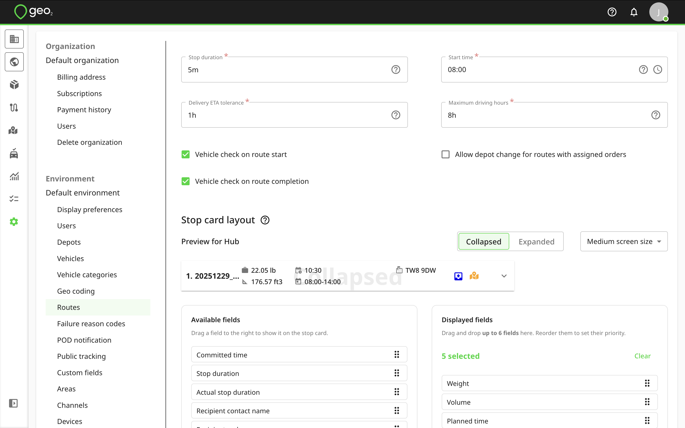

Even though vehicle checks are enabled or disabled in Environment settings, it is possible to manage vehicle checks for an individual route on Create/Edit route and Route plan pages in Hub.

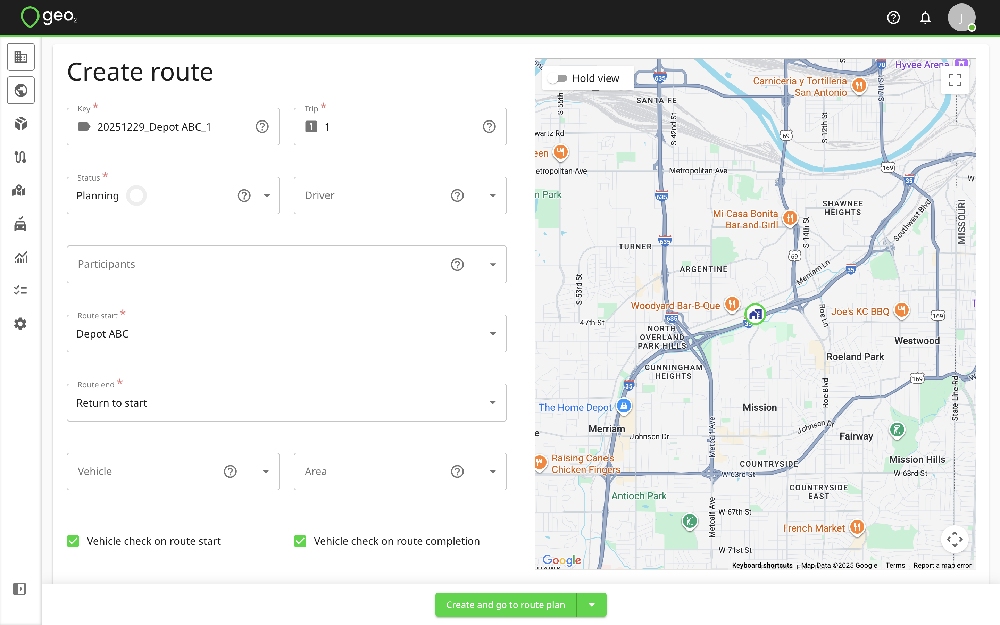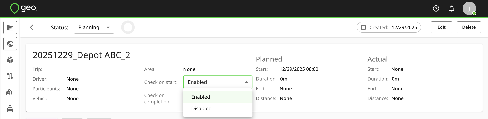

# Vehicle Check Creation for Route

If Vehicle checks are enabled in Geo2 Hub, Vehicle check creation page will be displayed every time the route is started and completed.  If the geolocation is turned off, you will be asked to turn it on for the Vehicle check creation but you can create it without geolocation.

For the Vehicle check creation, you need to take or select photos of the vehicle (optional) and create a signature (optional).  Remember to save it.  If a vehicle is specified for a route, it will be displayed on Create vehicle check page and it is not possible to edit it.  If there is no vehicle provided for a route, you will be asked to select a vehicle existing in your environment settings for which you want to create this check.  If there are no vehicle yet created in the environment and you have permission to update environment settings, you will see the possibility to add a vehicle.

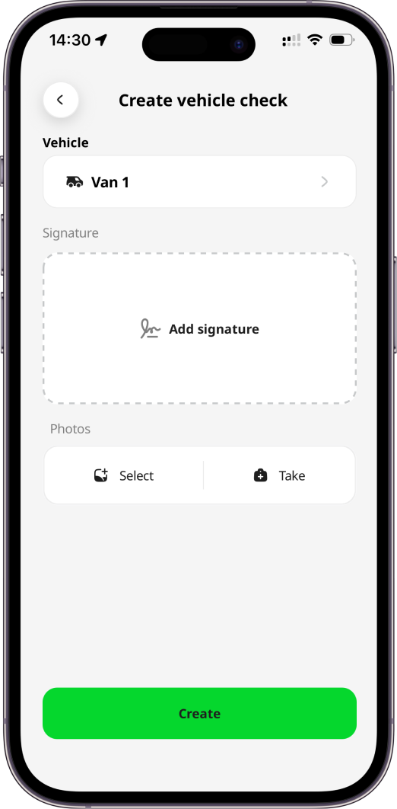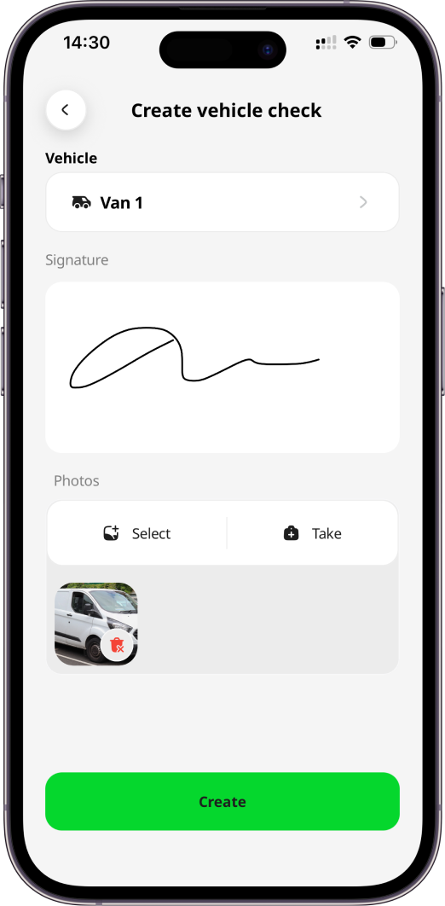

To complete the creation, press the `Create` button.

# Unplanned/Ad-hoc Vehicle Check

To create an unplanned/ad-hoc vehicle check that is not related to any route, you can press the `Create vehicle check` button in Menu or Vehicle checks pages.

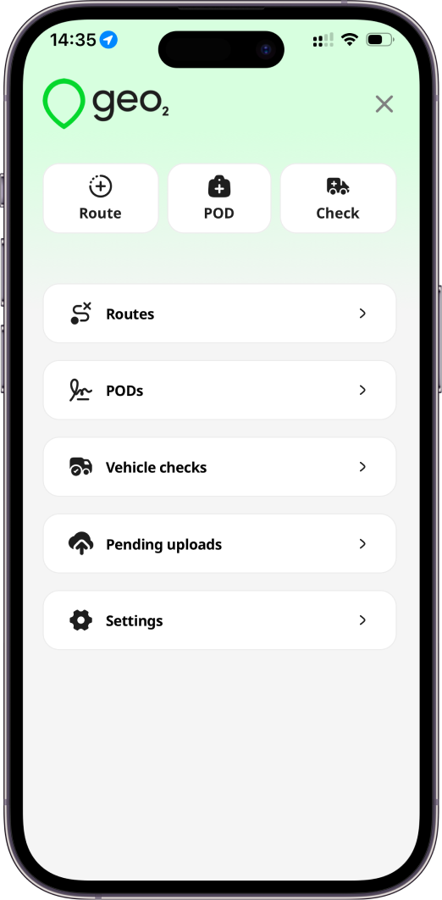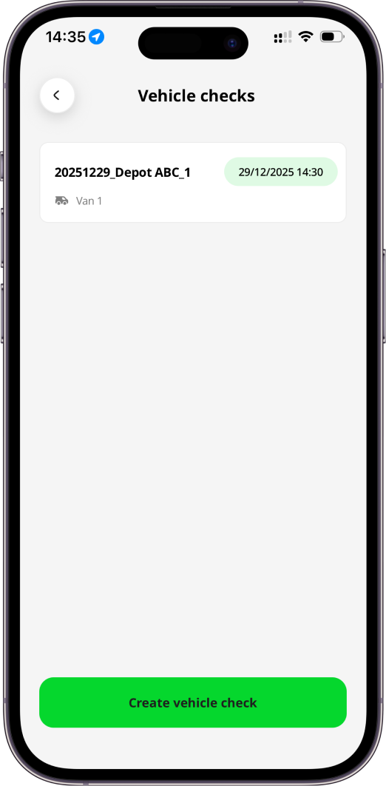

On Create vehicle check page, you will be asked to select a vehicle existing in your environment settings for which you want to create this check.  You also need to take or select photos of the vehicle (optional) and create a signature (optional).  If there are no vehicle yet created in the environment and you have permission to update environment settings, you will see the possibility to add a vehicle.

To complete the creation, press the `Create` button.

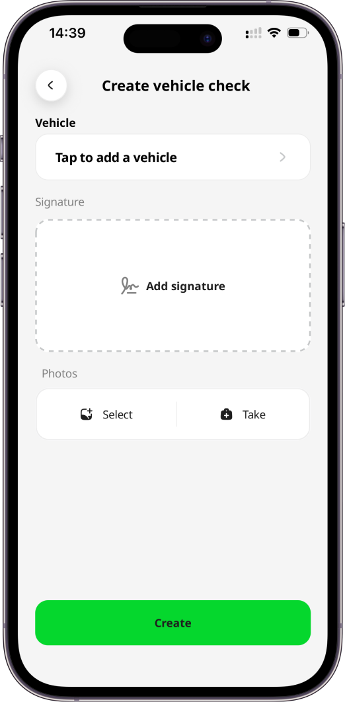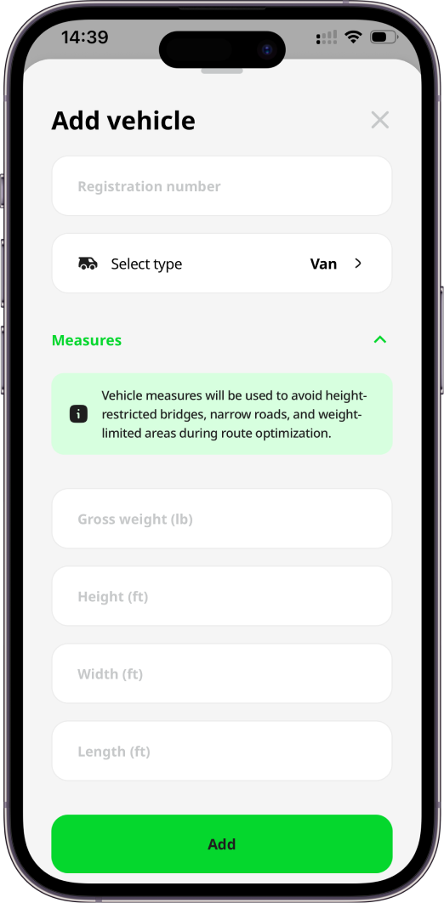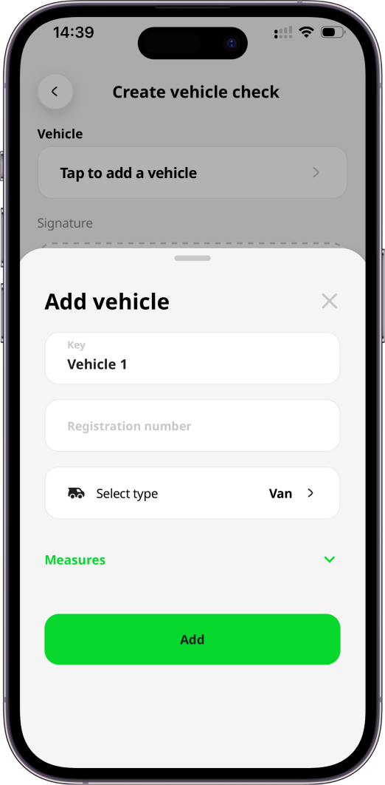

# Vehicle Checks History

The created vehicle check will be stored in the mobile app's menu under Vehicle checks and in Geo2 Hub.

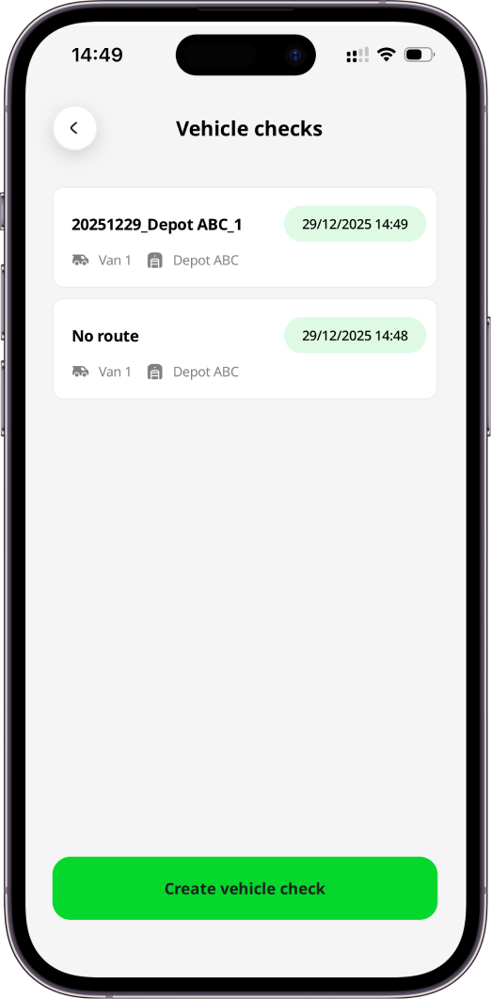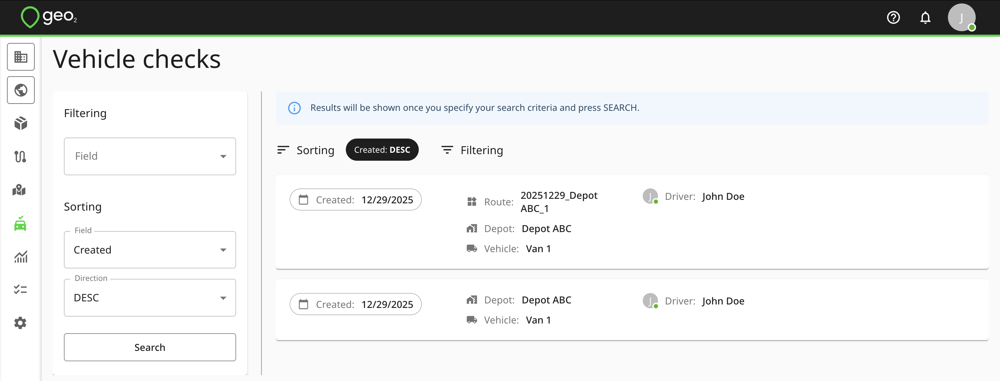

To view details of the vehicle check, you need to click on the Vehicle check card.

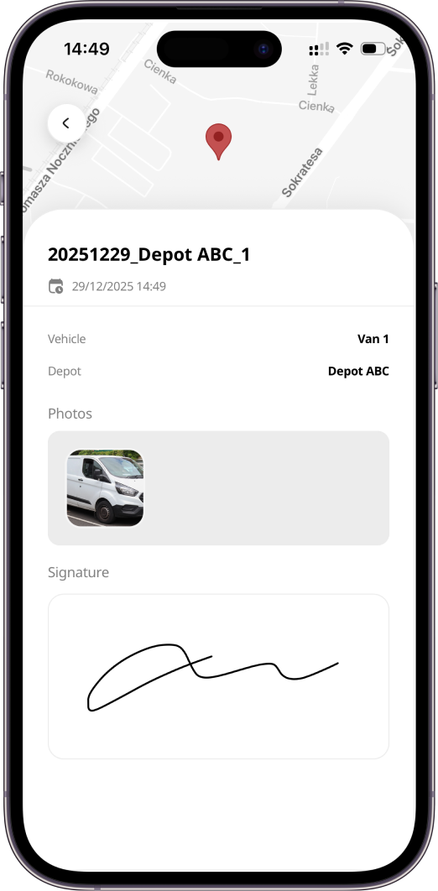

# Custom Vehicle Checks Fields

In the Environment settings, you can set up custom fields for Vehicle checks to ask for needed information from a driver on a route starting and completion.

Examples of the custom fields from Environment settings:

- Ask for the vehicle registration number
- Ask if the damage is reported
- Ask for Mileage

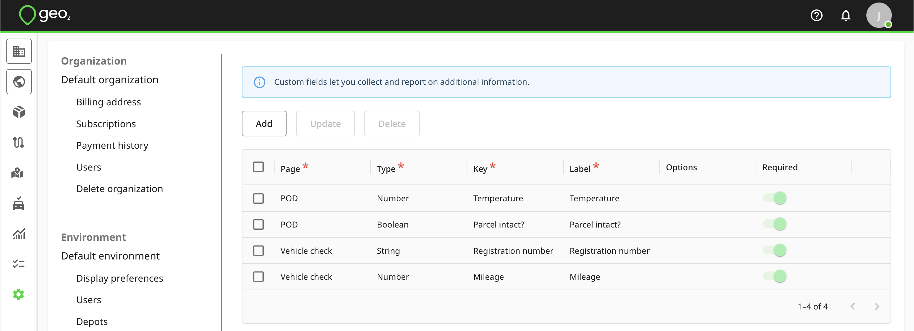

That's how it could look on Vehicle check creation page: 

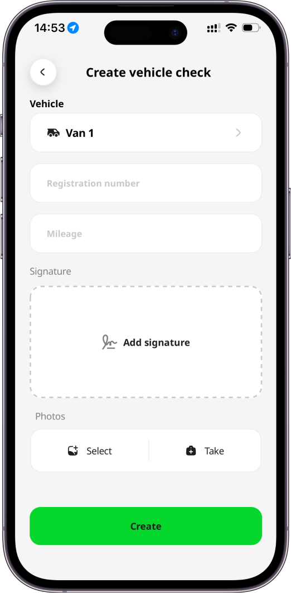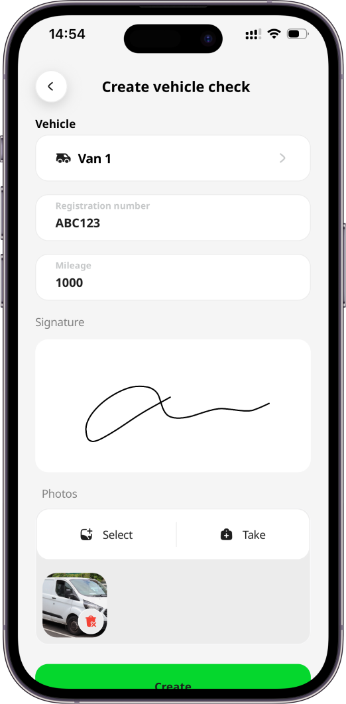

In Vehicle checks history it will be displayed this way:

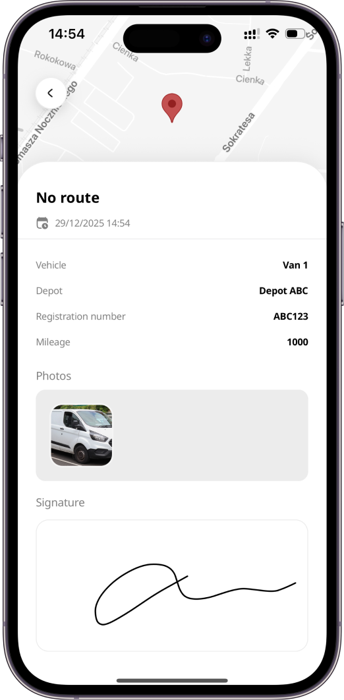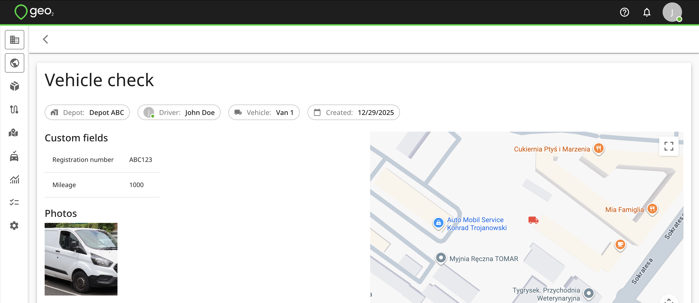
