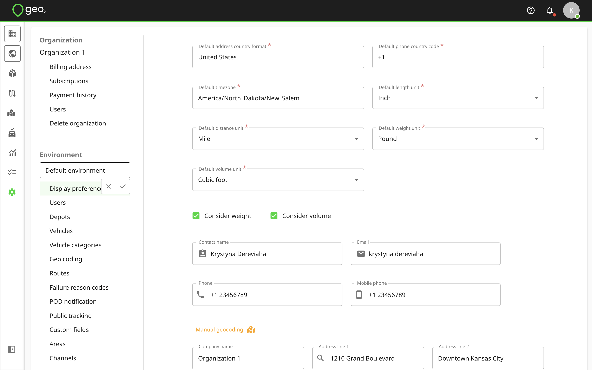
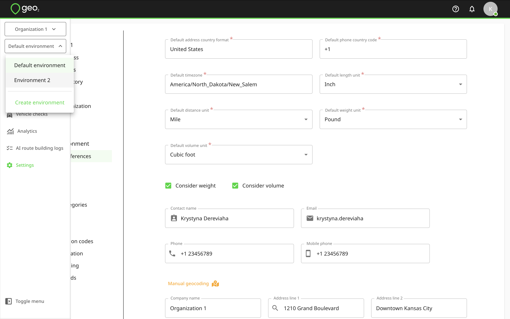

[Web-Based Hub](../Web-Based%20Hub.md)

# Hub: Environment Settings

- [Introduction](#introduction)
- [Environment Settings](#environment-settings)
- [Create Environment](#create-environment)
- [Delete Environment](#delete-environment)

# Introduction

Environments let you represent teams within a single company or provide separate spaces for testing and productive use.  An organization can contain one or more environments.  See [Concepts](../Concepts.md) for the different uses to which you may want to put environments.

# Environment Settings

During the registration of a new account and [Hub: Set Up Organization](Hub_%20Set%20Up%20Organization.md), the address entered will be saved as the environment’s address as well.  If you create an organization manually, its first default environment is created automatically.  By default, the name of a new environment is Default environment.  You can change the name by hovering over the environment name on Settings page and pressing the `Edit (pencil)` icon.

Press the `Tick` icon to save changes.

If you are invited to the environment and you have [Hub: User Roles](Hub_%20User%20Roles.md), you can reach environment settings by opening the menu and pressing the Environment selector.  You can also create a new environment if you have Enterprise subscription level.

Read more about environment settings:

- [Hub: Display Preferences Settings](Hub_%20Environment%20Settings/Hub_%20Display%20Preferences%20Settings.md)
- [Hub: Users Settings](Hub_%20Environment%20Settings/Hub_%20Users%20Settings.md)
- [Hub: Depots Settings](Hub_%20Environment%20Settings/Hub_%20Depots%20Settings.md)
- [Hub: Vehicles Settings](Hub_%20Environment%20Settings/Hub_%20Vehicles%20Settings.md)
- [Hub: Vehicle Categories Settings](Hub_%20Environment%20Settings/Hub_%20Vehicle%20Categories%20Settings.md)
- [Hub: Geo Coding Settings](Hub_%20Environment%20Settings/Hub_%20Geo%20Coding%20Settings.md)
- [Hub: Routes Settings](Hub_%20Environment%20Settings/Hub_%20Routes%20Settings.md)
- [Hub: Failure Reason Codes Settings](Hub_%20Environment%20Settings/Hub_%20Failure%20Reason%20Codes%20Settings.md)
- [Hub: POD Notification Settings](Hub_%20Environment%20Settings/Hub_%20POD%20Notification%20Settings.md)
- [Hub: Public Tracking Settings](Hub_%20Environment%20Settings/Hub_%20Public%20Tracking%20Settings.md)
- [Hub: Custom Fields Settings](Hub_%20Environment%20Settings/Hub_%20Custom%20Fields%20Settings.md)
- [Hub: Areas Settings](Hub_%20Environment%20Settings/Hub_%20Areas%20Settings.md)
- [Hub: Channels Settings](Hub_%20Environment%20Settings/Hub_%20Channels%20Settings.md)
- [Hub: Devices Settings](Hub_%20Environment%20Settings/Hub_%20Devices%20Settings.md)
- [Hub: Reporting Settings](Hub_%20Environment%20Settings/Hub_%20Reporting%20Settings.md)

# Create Environment

If you want to create one more environment in your organization, press the environment selector in the menu bar and press `Create environment`.  This option is available only with Enterprise subscription level. You will be redirected to Create environment page where you will have the option to clone settings and users from an existing environment.

It is up to you whether you decide to clone settings or users or start an entirely fresh environment definition.

If cloning settings and/or users from an existing environment, you will need to select an environment to clone them from.

By pressing the `Create` button, a new environment will be created.  You will be redirected to the settings of the newly created environment.

# Delete Environment

To delete your environment, go to Settings → Environemnt and press the `Delete environment` button. You will be asked to confirm the deletion, as all route, order, POD and vehicle check data will be removed. Press `Delete` to confirm. The environment will be deleted.

