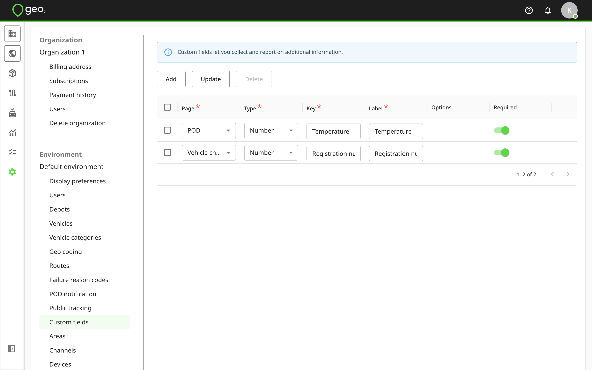
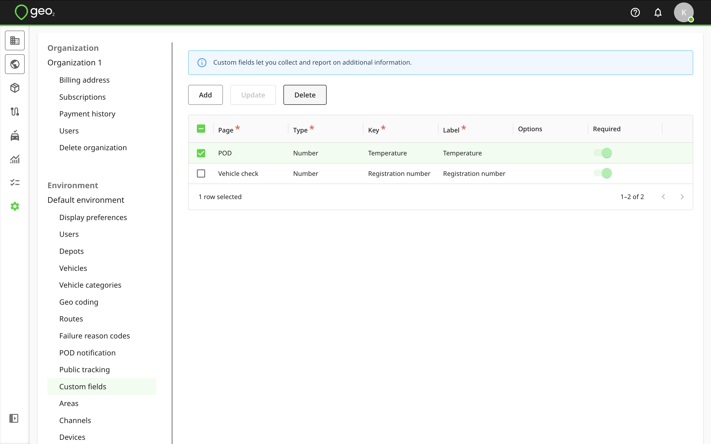
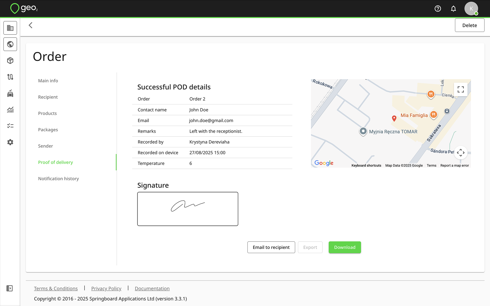

[Web-Based Hub](../../Web-Based%20Hub.md) > [Hub: Environment Settings](../Hub_%20Environment%20Settings.md)

# Hub: Custom Fields Settings

Custom fields let you collect and report on additional information in POD's and vehicle checks.  To add a new custom field, press the `Add` button in Settings → Environment → Custom fields.  A new row will be shown in the table for you to specify the details of the new custom field.  The properties of a custom field are:

|  **Property**    |  **Description**                                                                                                                                                                                                                                                                                                                                                                                                                                                                                                                                                                                                                                                                                                                                                                            |
|:-----------------|:--------------------------------------------------------------------------------------------------------------------------------------------------------------------------------------------------------------------------------------------------------------------------------------------------------------------------------------------------------------------------------------------------------------------------------------------------------------------------------------------------------------------------------------------------------------------------------------------------------------------------------------------------------------------------------------------------------------------------------------------------------------------------------------------|
| Page             | `POD` or `Vehicle check`                                                                                                                                                                                                                                                                                                                                                                                                                                                                                                                                                                                                                                                                                                                                                                    |
| Type             | The options are:  <ul local-id="8ae7a95b-8b4b-43e2-b39a-3b44e187cebc"><li local-id="4e6b5c2c-161f-43f3-807b-244a1ee807e1">
String, i.e. text
</li><li local-id="9e59d1c9-a832-4503-b67e-a59df5071861">
Number
</li><li local-id="02b3307c-e9ef-4ca7-8fe1-50a52f023be9">
Date
</li><li local-id="8cbf28b1-dcb8-4f90-89c6-452e0969c67c">
Date/Time
</li><li local-id="d4cc5dcc-6398-4c82-a313-a6c200655858">
Time
</li><li local-id="fe17a651-9a8a-4d21-be3b-4eac379f05c5">
Boolean, i.e. yes/no
</li><li local-id="9cf6cc78-fe93-41ae-9c22-3833ddb49f34">
Dropdown
</li></ul> |
| Key              | Low-level/technical field identifier.  This becomes significant when using the API.                                                                                                                                                                                                                                                                                                                                                                                                                                                                                                                                                                                                                                                                                                         |
| Label            | Field description visible to mobile app users.                                                                                                                                                                                                                                                                                                                                                                                                                                                                                                                                                                                                                                                                                                                                              |
| Options          | Options for the dropdown field type.  At least one option must be provided.                                                                                                                                                                                                                                                                                                                                                                                                                                                                                                                                                                                                                                                                                                                 |
| Required         | If selected, the field value cannot be left blank.                                                                                                                                                                                                                                                                                                                                                                                                                                                                                                                                                                                                                                                                                                                                          |

Press the `Update` button to save changes.

If you want to edit properties of an existing custom field, click the pencil icon on the right-hand side of the relevant row, edit the values as appropriate press the `Update` button.

You can select a field to `Delete` it.  For data integrity, it is best to not delete a field once it has started to be used.

Once custom fields are added, they will be displayed either on POD or vehicle check pages (depending on the page you added them) in the mobile app and Hub:

