[Web-Based Hub](../../Web-Based%20Hub.md) > [Hub: Environment Settings](../Hub_%20Environment%20Settings.md)

# Hub: Depots Settings

- [Introduction](#introduction)
- [Add Depots](#add-depots)
- [Import Depots](#import-depots)
  - [Upload Spreadsheet File with Column Mapping](#upload-spreadsheet-file-with-column-mapping)
  - [Manually Type or Paste Data](#manually-type-or-paste-data)
  - [Import Options](#import-options)
  - [Spreadsheet Example](#spreadsheet-example)

# Introduction

Depots can be optionally selected as the start and end points for routes.  During the registration of a new account, your first depot is created automatically with the address you provided.  You can add more depots either one by one by pressing the `Add` button or all at once by pressing the `Import` button in Settings → Environment → Depots.

# Add Depots

To add a depot, press the `Add` button.  You will see a dialog where you have to provide the next information - key, name, and address (Address line 1, City and Country fields).  All other fields are optional.  You can provide the address manually by typing it into Address line 1 and selecting the relevant address.  If there is no variant you were looking for, just provide your data to the address form and we will save it.  For routes, it is important that depot addresses are geo-coded accurately.

The properties of each depot are:

|  **Property**       |  **Description**                                                                                                                                                                                                                                                                                   |
|:--------------------|:---------------------------------------------------------------------------------------------------------------------------------------------------------------------------------------------------------------------------------------------------------------------------------------------------|
| Key                 | Depot identifier which is required to be unique within the environment.  For example, Depot 1.                                                                                                                                                                                                     |
| Name                | User-definable depot name to describe a depot, for example, Storage for materials.  It is for internal usage only.                                                                                                                                                                                 |
| Сontact name        | Contact name of a person responsible for a depot.  For example, Jane Doe.                                                                                                                                                                                                                          |
| Email               | Email address of a person responsible for a depot.  It must be in a valid email format - [recipient@domain\_name.domain\_suffix.](#recipient-domain-name-domain-suffix) For example, [janedoe@gmail.com](mailto:janedoe@gmail.com). |
| Phone               | Phone number of a person responsible for a depot.  It must start with "+" and have from 5 to 16 digits.  No spaces, brackets, or other special symbols.  For example, +123456789.                                                                                                                  |
| Mobile phone        | Mobile phone number of a person responsible for a depot.  It must start with "+" and have from 5 to 16 digits.  No spaces, brackets, or other special symbols.  For example, +123456789.                                                                                                           |
| Company name        | Company name as a part of a depot address.  For example, BalloonOne.                                                                                                                                                                                                                               |
| Address lines 1,2,3 | Address lines 1,2,3 as a part of a depot address.  For example, 1221 Grand Blvd.                                                                                                                                                                                                                   |
| City                | City as a part of a depot address.  For example, Kansas City.                                                                                                                                                                                                                                      |
| Postal code         | Postal code as a part of a depot address.  For example, MO 64106.                                                                                                                                                                                                                                  |
| Region              | Region as a part of a depot address.                                                                                                                                                                                                                                                               |
| State               | State as a part of a depot address.                                                                                                                                                                                                                                                                |
| Country             | Country as a part of a depot address.  It must be provided as the two-letter ISO country code, for example, US for the United States.                                                                                                                                                              |

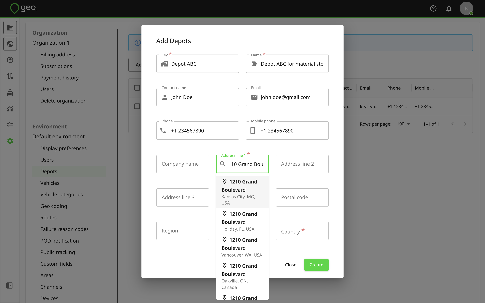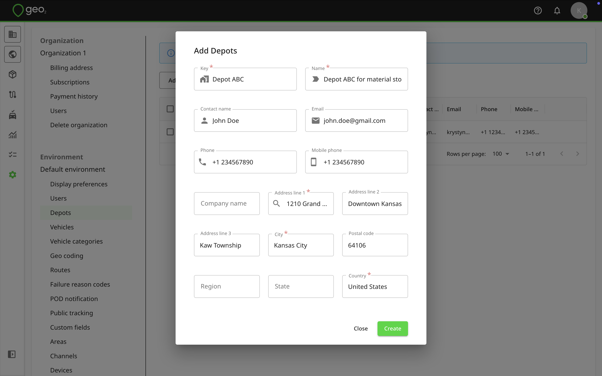

Once information is provided, press the `Create` button and a depot will be created.

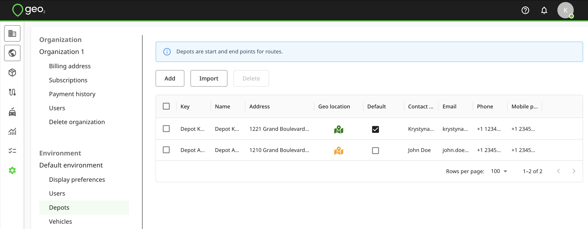

Optionally, you can select it as a default one. The default depot will be used for route creation but it can be changed.  Learn more about [Hub: Routes](../Hub_%20Routes.md). The default depot will be used for order import if the Depot field is blank. Learn more about [Hub: Order Import](../Hub_%20Orders/Hub_%20Order%20Import.md).

In the Depots table, you will see information from the key fields.  Values of other fields can be shown and edited by clicking the `Edit` icon.  Remember to press the `Save` button to save changes.

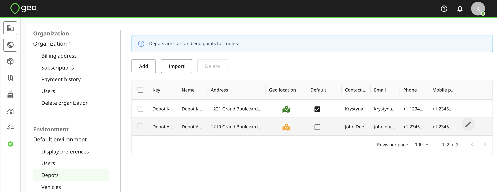

You can `Delete` a depot, though this is only recommended before it has started to be used.

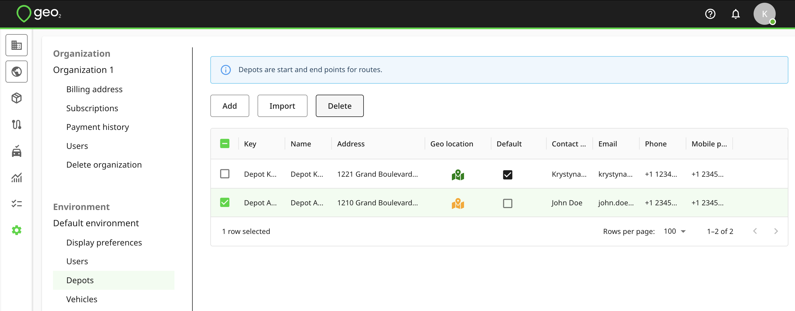

# Import Depots

You can import depot data into Geo2 Hub using two methods:

- Upload your spreadsheet file with column mapping
- Manually paste or type your data into the table.

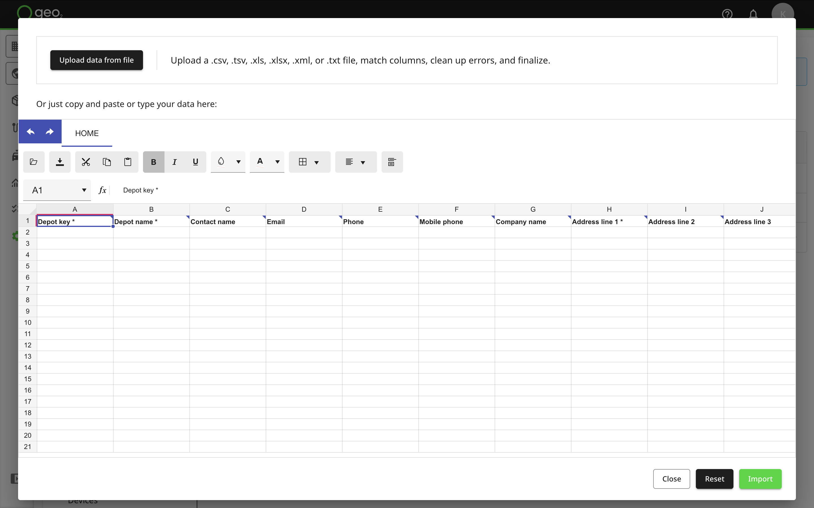

## Upload Spreadsheet File with Column Mapping

Press the `Upload data from file` button at the top of the Import spreadsheet in Hub. Upload a .csv, .tsv, .xls, .xlxs, .xml, or .txt file. After uploading, the Map your data columns dialog will be displayed where you can match your spreadsheet columns to Hub’s data fields. Required fields are marked with an asterisk ( \* ) but you can skip them at this step and add data later.

On the dialog, you will see 4 columns:

|  **Column Heading**    |  **Description**                                                                                                      |
|:-----------------------|:----------------------------------------------------------------------------------------------------------------------|
| Your file column       | Displays the column headers from your uploaded file that the system will attempt to match with known fields.          |
| Your sample data       | Shows a preview of the data in each column from your uploaded file to help with identifying what each field contains. |
| Destination column     | Lets the user select or confirm which system field the uploaded column should map to.                                 |
| Matching result        | Indicates how well the system matched each column, including match strength and confidence percentage.                |

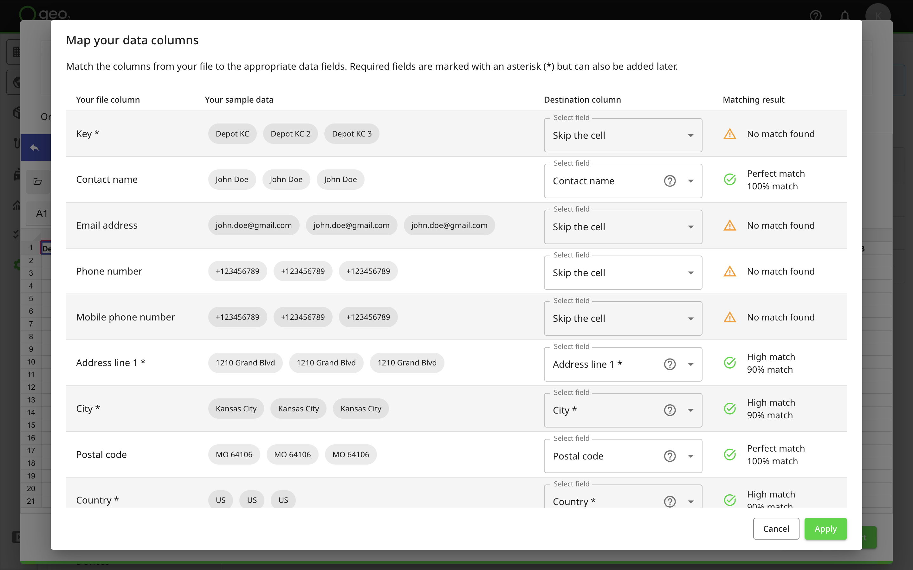

The system will attempt to auto-match fields like Address line 1, Postal code, Country, etc. Matches are clearly marked with a green tick for perfect or high matches, while unmatched columns are shown with a yellow warning icon. You can adjust matches or choose to skip fields, including required ones, these can be added later.

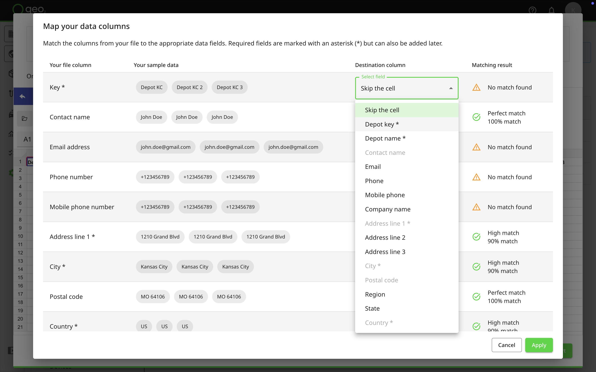

Tooltips are available to help clarify each data point.

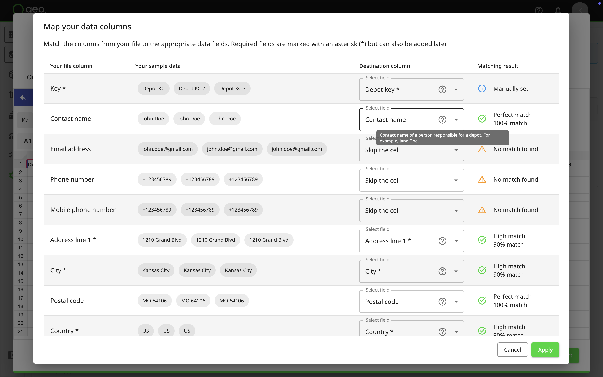

Once everything is mapped correctly, click `Apply`. Your data will appear in the table, where you can review, edit, or fix any errors before finalizing.

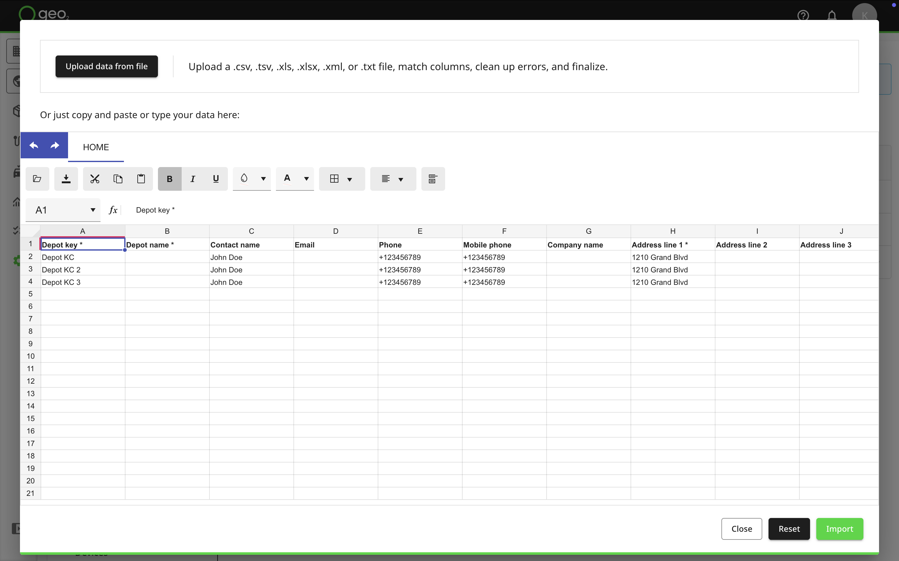

## Manually Type or Paste Data

The spreadsheet interface column headings guide you on the type of data expected in each column.  Hover over a column title to see a tooltip with additional details and explanations.

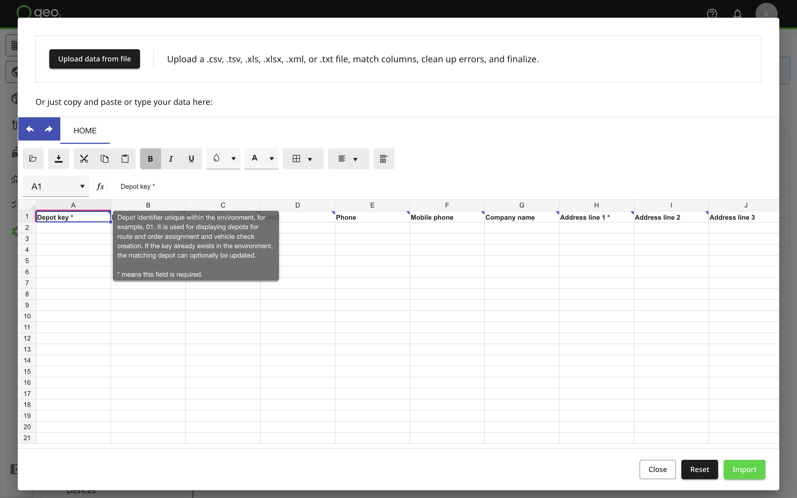

If you have prepared the data in another spreadsheet, you can copy and paste them in.  It is also possible to import a file from your device without column mapping by pressing the `folder` icon.

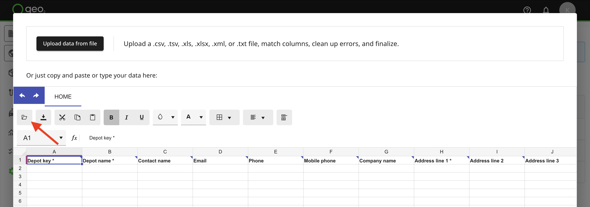

The limit for the import of depots is **500**.  You cannot paste more into the spreadsheet.

|  **Column Heading**    |  **Data Type**    |  **Details**                                                                                                                                                                                                                                                                                       |  **Mandatory**    |
|:-----------------------|:------------------|:---------------------------------------------------------------------------------------------------------------------------------------------------------------------------------------------------------------------------------------------------------------------------------------------------|:------------------|
| Depot key              | String            | Depot identifier unique within the environment, for example, Depot 01.  It is used for displaying depots for route and order assignment and vehicle check creation.  If the key already exists in the environment, the matching depot can optionally be updated.                                   | Y                 |
| Depot name             | String            | User-definable depot name to describe a depot, for example, Storage for materials.  It is for internal usage only.                                                                                                                                                                                 | Y                 |
| Contact name           | String            | Contact name of a person responsible for a depot.  For example, Jane Doe.                                                                                                                                                                                                                          | N                 |
| Email                  | String            | Email address of a person responsible for a depot.  It must be in a valid email format - [recipient@domain\_name.domain\_suffix.](#recipient-domain-name-domain-suffix) For example, [janedoe@gmail.com](mailto:janedoe@gmail.com). | N                 |
| Phone                  | String            | Phone number of a person responsible for a depot.  It must start with "+" and have from 5 to 16 digits.  No spaces, brackets, or other special symbols.  For example, +123456789.                                                                                                                  | N                 |
| Mobile phone           | String            | Mobile phone number of a person responsible for a depot.  It must start with "+" and have from 5 to 16 digits.  No spaces, brackets, or other special symbols.  For example, +123456789.                                                                                                           | N                 |
| Company name           | String            | Company name as a part of a depot address.  For example, BalloonOne.                                                                                                                                                                                                                               | N                 |
| Address line 1         | String            | Address line 1 as a part of a depot address.  For example, 1221 Grand Blvd..                                                                                                                                                                                                                       | Y                 |
| Address line 2         | String            | Address line 2 as a part of a depot address.                                                                                                                                                                                                                                                       | N                 |
| Address line 3         | String            | Address line 3 as a part of a depot address.                                                                                                                                                                                                                                                       | N                 |
| City                   | String            | City as a part of a depot address.  For example, Kansas City.                                                                                                                                                                                                                                      | Y                 |
| Postal code            | String            | Postal code as a part of a depot address.  For example, MO 64106.                                                                                                                                                                                                                                  | N                 |
| Region                 | String            | Region as a part of a depot address.                                                                                                                                                                                                                                                               | N                 |
| State                  | String            | State as a part of a depot address.                                                                                                                                                                                                                                                                | N                 |
| Country                | String            | Country as a part of a depot address.  It must be provided as the two-letter ISO country code, for example, US for the United States.                                                                                                                                                              | Y                 |

Once information is provided, press:

- `Close` to exit the spreadsheet interface with no action
- `Reset` to clear the spreadsheet
- `Import` to start the data import

## Import Options

The import options are:

|  **Option**                                            |  **Functionality**                                                                                                                                                                                                          |
|:-------------------------------------------------------|:----------------------------------------------------------------------------------------------------------------------------------------------------------------------------------------------------------------------------|
| Existing depots will be updated (if any)               | If a depot with the same key already exists, update its data with those in the spreadsheet.  If not selected, attempting to import a depot with an existing key will fail.                                                  |
| Empty fields will clear existing depot property values | If updating a depot and a field value in the spreadsheet is empty, blank the existing depot property even though it has some data in it.  If not selected, an empty field value will not overwrite an existing depot value. |
| Save these options as default                          | Remember this configuration of options for subsequent imports.                                                                                                                                                              |

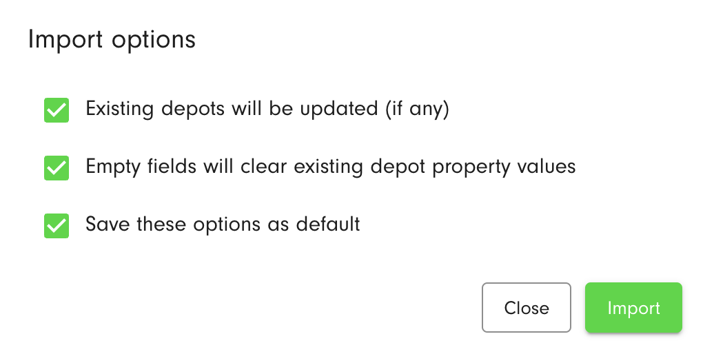

Click the `Import` button to import depots.  The import process feeds back any errors that it encounters.

Depots will be imported and displayed in the Depots list in Settings → Environment.

## Spreadsheet Example

You can also download the example of the spreadsheet with typed-in information for a depot import.

[Depot imports.xlsx](../../../attachments/1d12e030-b524-44e6-a4c2-0f737f846a1d.xlsx)
