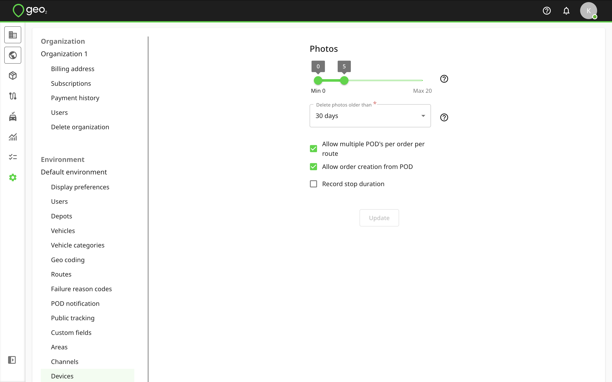

[Web-Based Hub](../../Web-Based%20Hub.md) > [Hub: Environment Settings](../Hub_%20Environment%20Settings.md)

# Hub: Devices Settings

Device settings in Settings → Environment control the behaviour of the mobile app.

You can define the minimum and maximum numbers of photos for POD's and vehicle checks recorded on the mobile app.  With the default value of zero for the minimum, photos are optional, but when the value is greater, the driver will be required to record photos.  You can also remove the possibility of adding photos for a POD or a vehicle check by setting both the minimum and maximum to zero.

To run auto-deletion of photos recorded during a POD or vehicle check creation, you can select the number of days after which photos will be deleted.  By default, 30 days is selected.  If you want to save these photos, select the None value in the Delete photos olden than field.

`Permit multiple POD’s per order per route` means that multiple POD's per order are allowed within the same route.  When the option is disabled, it is not possible to create more than one POD per order in the same route, but it is possible for a POD for the order to be created once it is in another route.  By default, this setting is enabled.

`Allow order creation from POD` makes it possible to create a POD referencing an order key that does not yet exist - a skeleton order will be created in Hub to match the POD.  By default, this setting is enabled.  When disabled, it is only possible to create a POD for an order key that already exists in the environment.

`Record time at stop` enables the mobile app’s feature to record the actual time spent at a stop by a driver. Learn more about [Mobile App: Routes and Stops](../../Mobile%20App/Mobile%20App_%20Routes%20and%20Stops.md).

To save changes, press the `Update` button.
