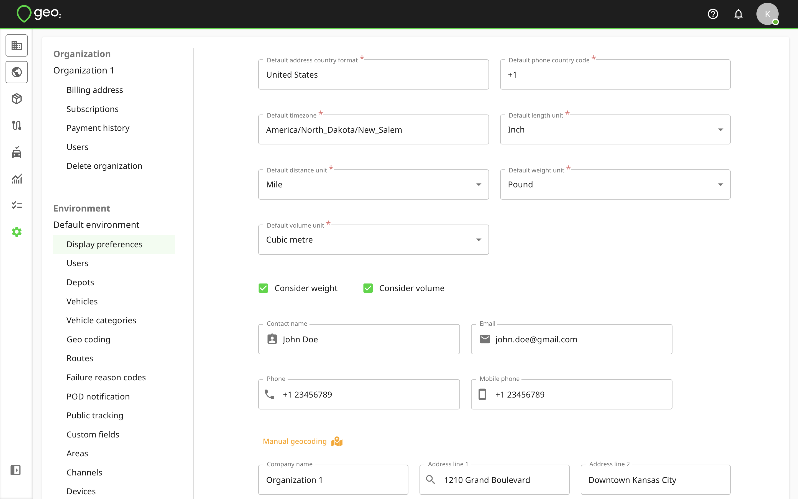
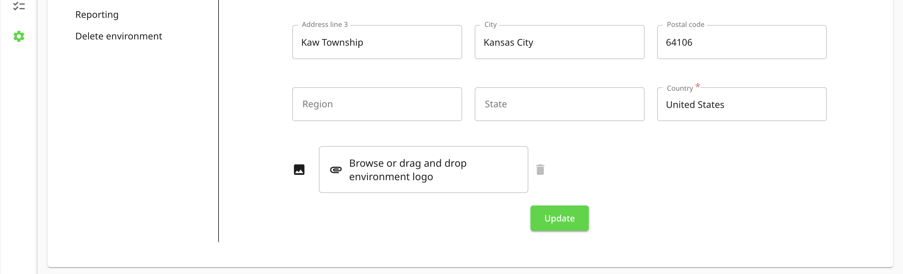

[Web-Based Hub](../../Web-Based%20Hub.md) > [Hub: Environment Settings](../Hub_%20Environment%20Settings.md)

# Hub: Display Preferences Settings

Display preferences in Settings → Environment determine the visual aspects of the user interface:

|  **Setting**                   |  **Description**                                                                                                                                                                                                                                                                                                                                                                                                                                                                                                                                                                                                                                                                                |
|:-------------------------------|:------------------------------------------------------------------------------------------------------------------------------------------------------------------------------------------------------------------------------------------------------------------------------------------------------------------------------------------------------------------------------------------------------------------------------------------------------------------------------------------------------------------------------------------------------------------------------------------------------------------------------------------------------------------------------------------------|
| Default address country format | Address format to use when addresses are formatted as blocks of text, on-screen, and in PDF layouts.  If the country inside an order matches with the default address country format in Environment settings, we do not show the country field on the next pages:  <ul local-id="8a3f1bff-932a-499b-b9e9-49b0487f641b"><li local-id="4e88f110-b509-4a3b-939f-6b0911ef678d">
Order card on Orders page
</li><li local-id="883ee590-a35c-4936-b946-d295a46c8f59">
Stop card on Route plan page
</li><li local-id="378f1449-d3a4-4cf5-9b73-311644ce5e72">
POD PDF (POD PDF, POD email PDF). 
</li></ul> |
| Default phone country code     | Default country code for phone number entry.                                                                                                                                                                                                                                                                                                                                                                                                                                                                                                                                                                                                                                                    |
| Default timezone               | You can select the timezone, according to a specific country/city.                                                                                                                                                                                                                                                                                                                                                                                                                                                                                                                                                                                                                              |
| Default length unit            | You can select whether lengths are shown in metric or imperial units.                                                                                                                                                                                                                                                                                                                                                                                                                                                                                                                                                                                                                           |
| Default distance unit          | You can select whether distances are shown in metric or imperial units.                                                                                                                                                                                                                                                                                                                                                                                                                                                                                                                                                                                                                         |
| Default weight unit            | You can select whether weight is shown in metric or imperial units.                                                                                                                                                                                                                                                                                                                                                                                                                                                                                                                                                                                                                             |
| Default volume unit            | You can select whether volume is shown in metric or imperial units.                                                                                                                                                                                                                                                                                                                                                                                                                                                                                                                                                                                                                             |
| Consider weight                | When selected, weight is shown and can be edited for orders and routes.                                                                                                                                                                                                                                                                                                                                                                                                                                                                                                                                                                                                                         |
| Consider volume                | When selected, volume is shown and can be edited for orders and routes.                                                                                                                                                                                                                                                                                                                                                                                                                                                                                                                                                                                                                         |
| Environment address            | Your organization address will be populated to the environment address once it is created.  The environment address is used in documents created in the environment, such as POD's.  Required fields are Address line 1, City, and Country.  You can provide the address manually by typing it into Address line 1 and selecting the relevant address.  If there is no variant you were looking for, just provide your data to the address form and we will save it.                                                                                                                                                                                                                            |
| Logo                           | The logo gives the environment a distinct visual identity when selecting an environment in the user interface and in PDF layouts.                                                                                                                                                                                                                                                                                                                                                                                                                                                                                                                                                               |

Remember to press the `Update` button to save changes.
