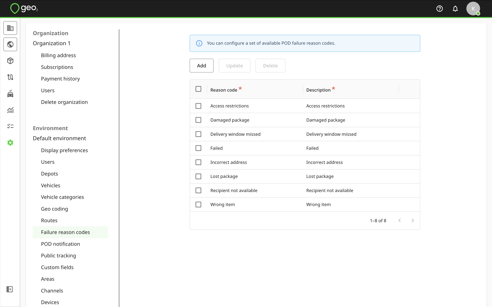
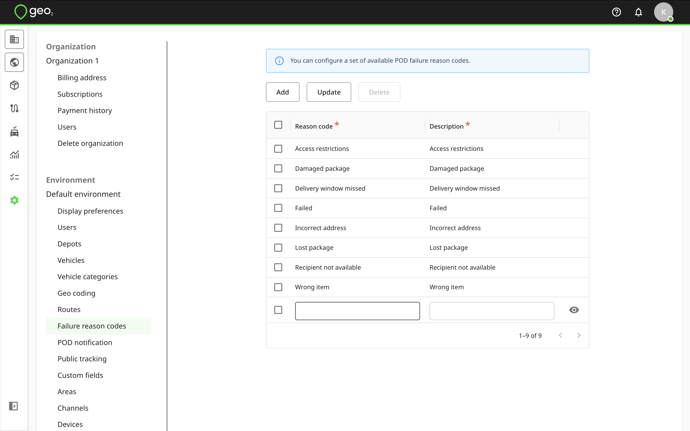
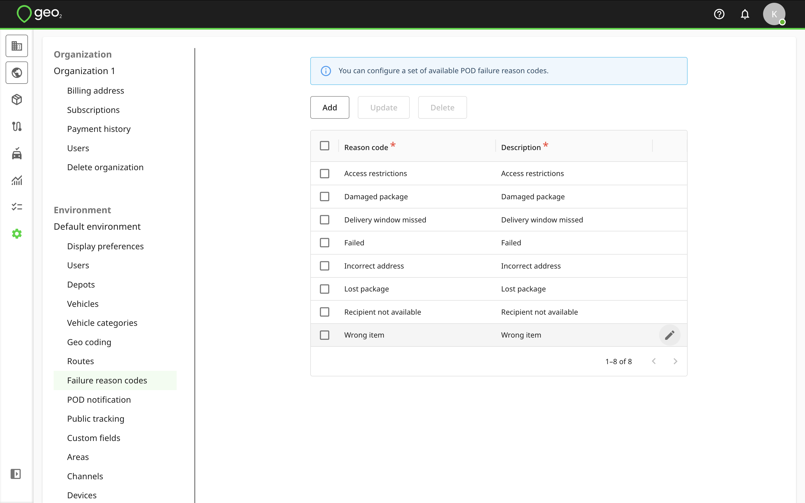
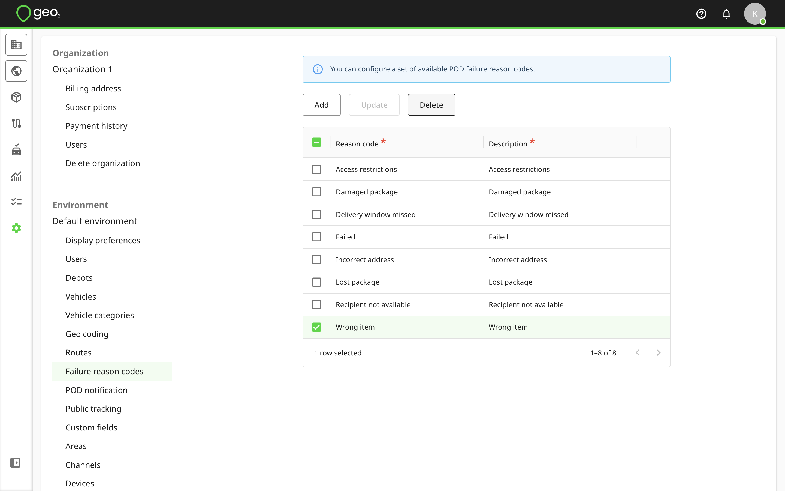

[Web-Based Hub](../../Web-Based%20Hub.md) > [Hub: Environment Settings](../Hub_%20Environment%20Settings.md)

# Hub: Failure Reason Codes Settings

Failure reason codes in Settings → Environment let you classify reasons for failed deliveries/collections and are available to drivers in the mobile app when recording a POD.  Once an environment is created, the first 8 default failure reason codes are added automatically.  Thus, you can create a proof of delivery in the mobile app in a failed or partially successful status.

To add a failure reason code, press the `Add` button.  A new row will be shown in the table for you to specify the details of the new failure reason code.  Both fields are required.  To save changes, press the `Update` button.

To edit a reason code, click the `Edit (pencil)` icon.   Remember to press the `Update` button to save any changes.

You can select a reason code to `Delete` it.  For data integrity, it is best to not delete a reason code once it has started to be used. It is not possible to delete all reason codes as it will impact a POD creation. Your environment needs at least 1 added failure reason code.

