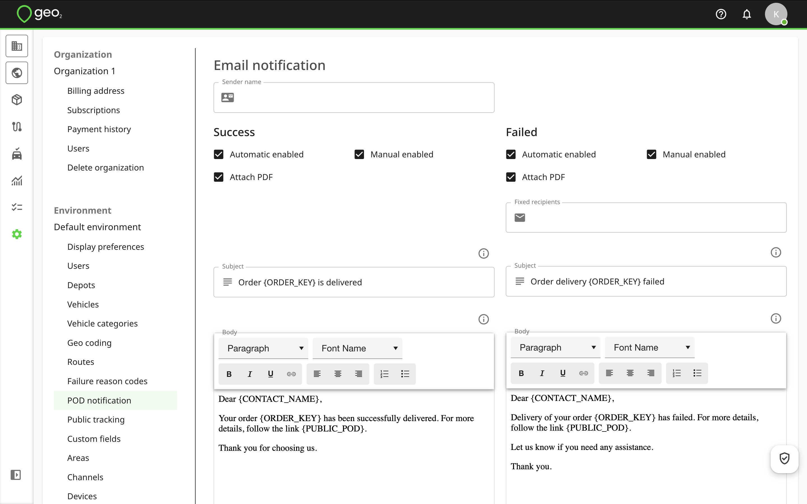
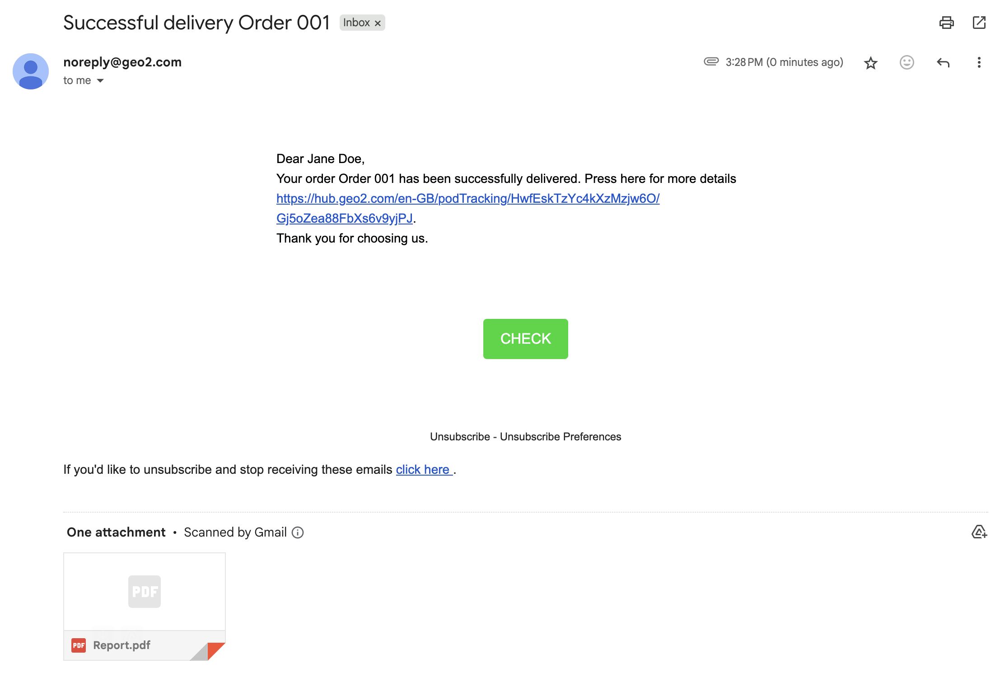
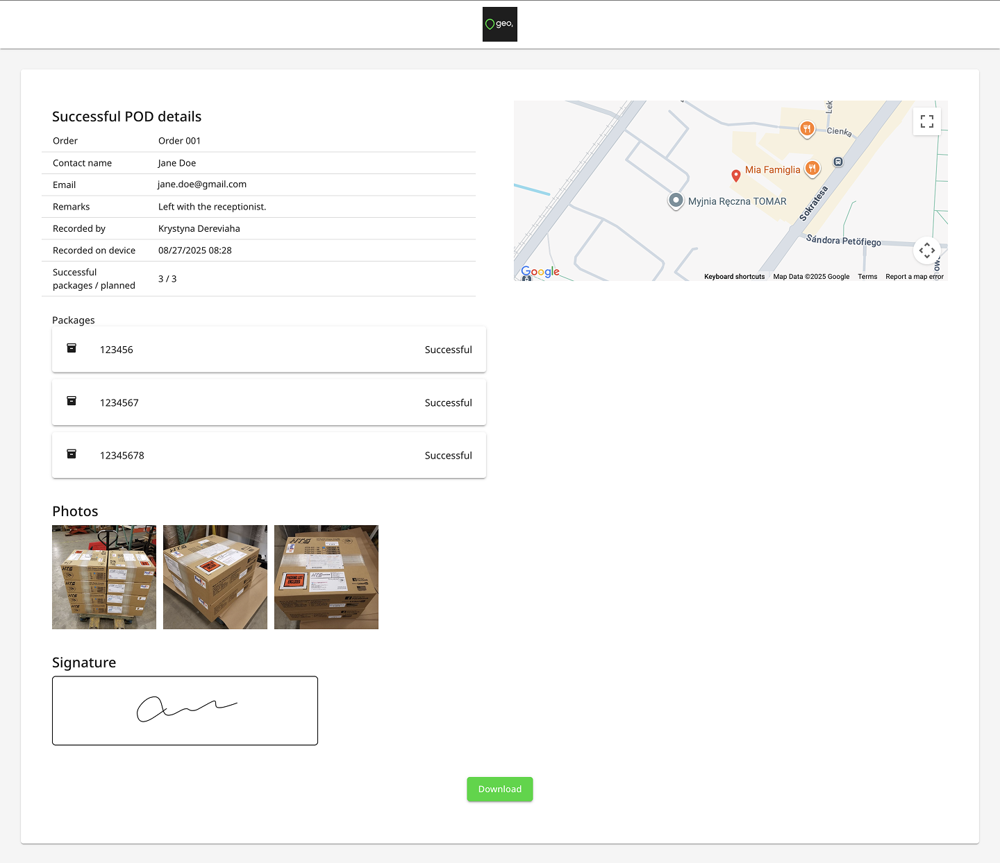
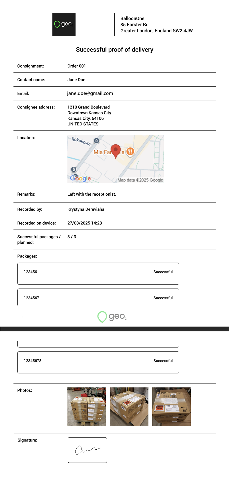

[Web-Based Hub](../../Web-Based%20Hub.md) > [Hub: Environment Settings](../Hub_%20Environment%20Settings.md)

# Hub: POD Notification Settings

A recipient can be sent an email with an order POD (proof of delivery) - both automatically when the POD is recorded and manually at any time from Geo2 Hub. The sender address of email notifications is [noreply@geo2.com](mailto:noreply@geo2.com) if there is no indicated Sender name.  Here are the configurable settings in Settings → Environment → POD notification:

|  **Setting**      |  **Description**                                                                                                                                                                                                                                                                                                                                                                                                                                                                                                                                                                                  |
|:------------------|:--------------------------------------------------------------------------------------------------------------------------------------------------------------------------------------------------------------------------------------------------------------------------------------------------------------------------------------------------------------------------------------------------------------------------------------------------------------------------------------------------------------------------------------------------------------------------------------------------|
| Sender name       | The display name that will accompany the sender address, for example, your company name.                                                                                                                                                                                                                                                                                                                                                                                                                                                                                                          |
| Success/Failed    | Settings from the relevant section will be used in the event of a successful/partially successful/failed delivery/collection.                                                                                                                                                                                                                                                                                                                                                                                                                                                                     |
| Automatic enabled | If selected, POD messages will be sent automatically to a recipient email address and fixed emails (for failed POD emails) when a POD is registered in Hub.                                                                                                                                                                                                                                                                                                                                                                                                                                       |
| Manual enabled    | If selected, Hub users have the option to trigger the sending of the POD manually.  Press the `Email to recipient` button on the Proof of Delivery page inside of an order or on the POD dialog when clicking on the POD icon on an order card or stop card on the Route plan page.                                                                                                                                                                                                                                                                                                               |
| Attach PDF        | Attach a PDF document with POD details to the message.                                                                                                                                                                                                                                                                                                                                                                                                                                                                                                                                            |
| Fixed recipient   | For failure notifications only, a fixed email recipient for the notifications.  Failed delivery emails can be sent to multiple fixed recipients, for example, to managers who are responsible for failed deliveries.  Multiple email addresses can be entered, separated by a semi-colon (;) or by pressing `Enter`.  To edit the entered email address, press it.   For Partially successful POD emails, a Failed template will be used. If fixed recipients are provided, Partially successful POD emails will be sent to them as well (even though they are turned off on an order level). |
| Subject           | Subject line of notifications.  You can use these tokens for POD emails:   **{CONTACT\_NAME}** - recipient name   **{ORDER\_KEY}** - order key   **{COMPANY\_NAME}** - сompany name   **{ENVIRONMENT\_NAME}**- environment name                                                                                                                                                                                                                                                                                                                                                   |
| Body              | Body of notifications.  You can use these tokens for POD emails:   **{CONTACT\_NAME}** - recipient name   **{ORDER\_KEY}** - order key   **{PUBLIC\_POD}** - POD tracking link   **{COMPANY\_NAME}** - сompany name   **{ENVIRONMENT\_NAME}**- environment name                                                                                                                                                                                                                                                                                                               |

Once all information is provided, click the `Update` button to save changes.

When the POD is created and an order has a recipient email address, the POD notification email will be sent (if it was enabled in settings).  Example:

By pressing the Check button, a recipient will see POD details.

If the "Attach PDF" option is enabled, the POD PDF will be attached to the POD email.

