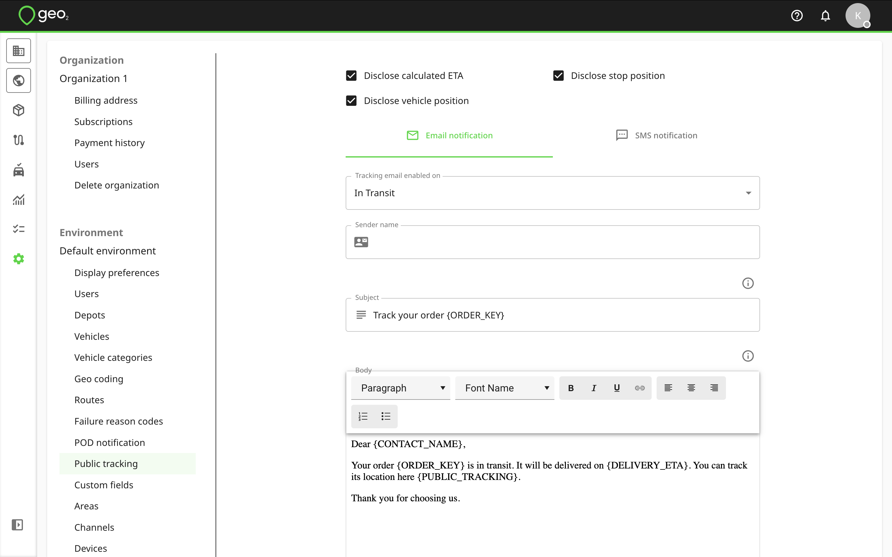
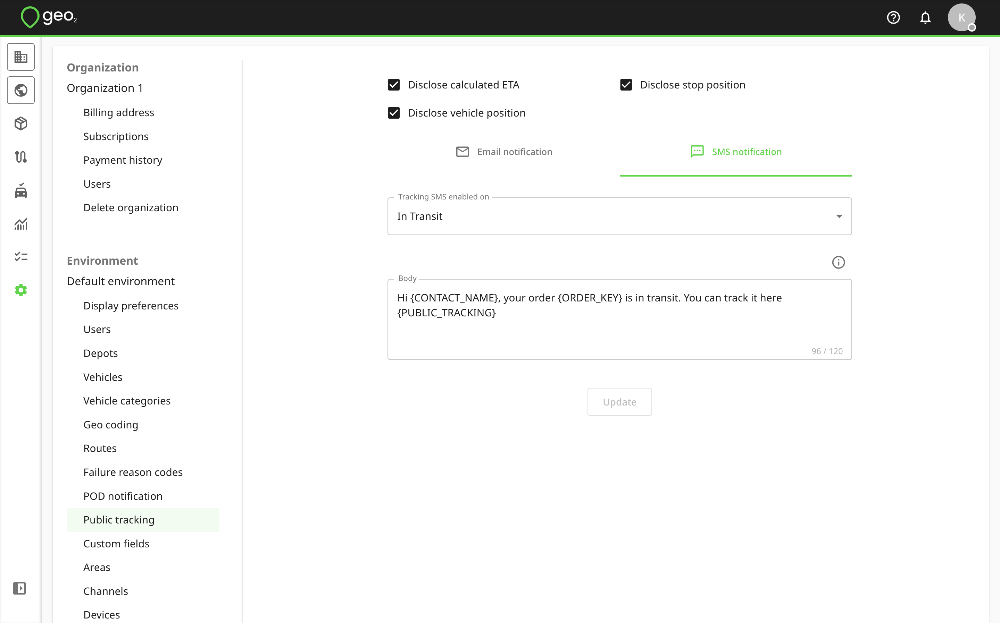
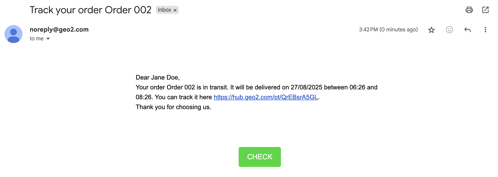
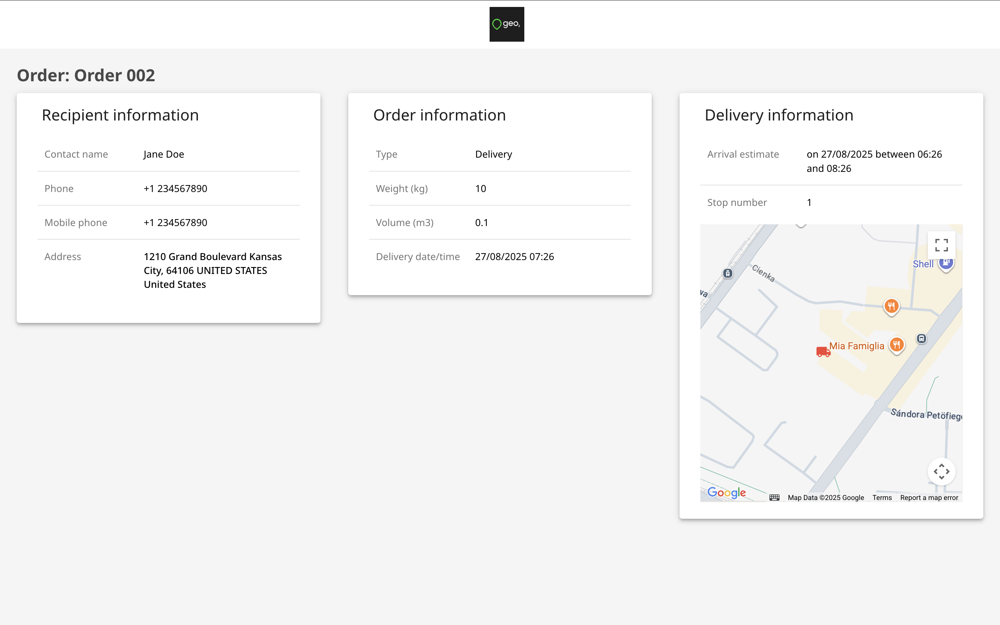

[Web-Based Hub](../../Web-Based%20Hub.md) > [Hub: Environment Settings](../Hub_%20Environment%20Settings.md)

# Hub: Public Tracking Settings

It's possible for external users such as recipients to optionally track the progress of their orders on a public web page.  Public tracking links can be sent via email and SMS notifications.  You do not need to use your email or mobile number to send recipient notifications. Geo2 system will send them for you. You can configure Public tracking settings in Settings → Environment → Public tracking.

|  **Setting**                  |  **Description**                                                                                                                                                                                                                                                                                                                                                                                                                                                                                                                                                                                                                                                                                                                 |
|:------------------------------|:---------------------------------------------------------------------------------------------------------------------------------------------------------------------------------------------------------------------------------------------------------------------------------------------------------------------------------------------------------------------------------------------------------------------------------------------------------------------------------------------------------------------------------------------------------------------------------------------------------------------------------------------------------------------------------------------------------------------------------|
| Disclose calculated ETA       | On Public tracking page, when an order has not been delivered/collected yet, show a calculated ETA based on the last known vehicle position.  This can be expressed as a range.  The calculated ETA is likely to fluctuate as the route progresses and you may find it too volatile for practical use.  When the option is not enabled or when tracking data for the route is not available, the committed time for the order is displayed instead, if set.                                                                                                                                                                                                                                                                      |
| Disclose stop position        | On Public tracking page, when an order has not been delivered/collected yet, show the last delivered stop on the route, giving the recipient an indication of how far away the delivery vehicle is from them in terms of the number of stops.                                                                                                                                                                                                                                                                                                                                                                                                                                                                                    |
| Disclose vehicle position     | On Public tracking page, when an order has not been delivered/collected yet, show the last known vehicle position on the map (requires the vehicle driver to have started load tracking in the mobile app).                                                                                                                                                                                                                                                                                                                                                                                                                                                                                                                      |
| Tracking email/SMS enabled on | Send an email/SMS notification to the recipient, in which you can include the tracking page address, to enable them to track the order prior to delivery/collection.  The possible triggers are:   `None` - Do not send emails.   `Registered` - When the order is created (via the Hub, mobile app, or API).   `Planning` - When the order is assigned to a route in planning.   `Planned` - When the order is assigned to a planned route.   `Released` - When the order is assigned to a released route.   `In Transit` - When the route, to which the order has been assigned, has been started.  For this trigger, it is important that drivers explicitly start tracking routes in the mobile app. |
| Sender name                   | Sender name for the notification email.  Not available for an SMS notification.                                                                                                                                                                                                                                                                                                                                                                                                                                                                                                                                                                                                                                                  |
| Subject                       | Subject for the notification email.  Not available for an SMS notification.  You can use these tokens for Public tracking emails:   **{CONTACT\_NAME}** - recipient name   **{ORDER\_KEY}** - order key   **{COMPANY\_NAME}** - сompany name   **{ENVIRONMENT\_NAME}** - environment name                                                                                                                                                                                                                                                                                                                                                                                                                        |
| Body                          | Body of the notification email/SMS.  Ensure that the wording of the email is appropriate for the trigger you have configured.  You can use the next tokens for an email/SMS notification:   **{CONTACT\_NAME}** - recipient name   **{ORDER\_KEY}** - order key   **{PUBLIC\_TRACKING}** - public tracking link   **{COMPANY\_NAME}** - company name   **{ENVIRONMENT\_NAME}** - environment name   **{DELIVERY\_ETA}** - estimated time of arrival   Without the token PUBLIC\_POD, the public POD link will not be included in an SMS notification.   The limit for an SMS notification is **120 symbols**.                                                                                    |

Once the route status changes to the configured value (e.g. In Transit), an email/SMS notification with a public tracking link will be sent to the recipient's email address/mobile phone number.  For this to work, it is important that the recipient’s contact details (email address and mobile phone number) are specified in the order.

Here is an example of the public tracking email:

By pressing the Check button, a recipient will see tracking details.

