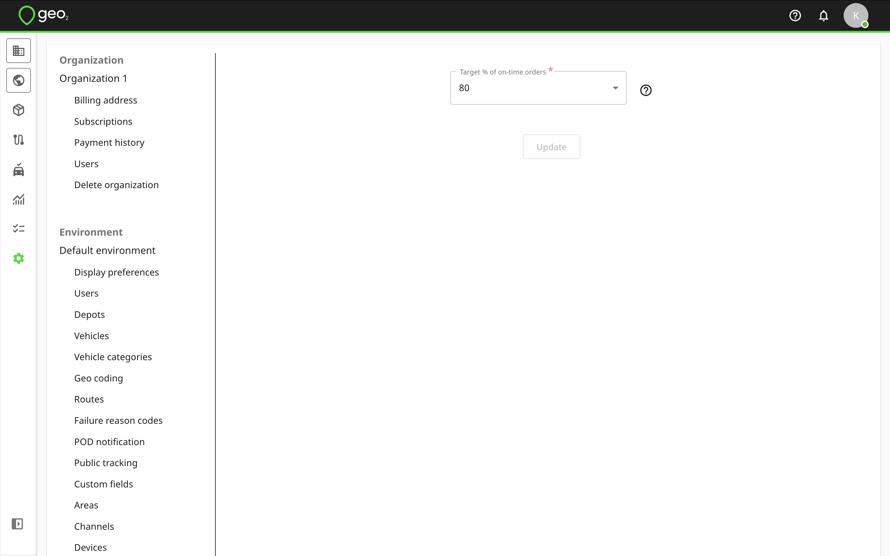

[Web-Based Hub](../../Web-Based%20Hub.md) > [Hub: Environment Settings](../Hub_%20Environment%20Settings.md)

# Hub: Reporting Settings

Reporting settings in Settings → Environment let you define target values for analytics charts displayed on Analytics page.

Target % of on-time orders means the target value for % of total orders to be on-time, by default, it's 80% but you can change it.  You can track the actual % of on-time orders on the “% On-Time Orders” analytics chart on Analytics page.

