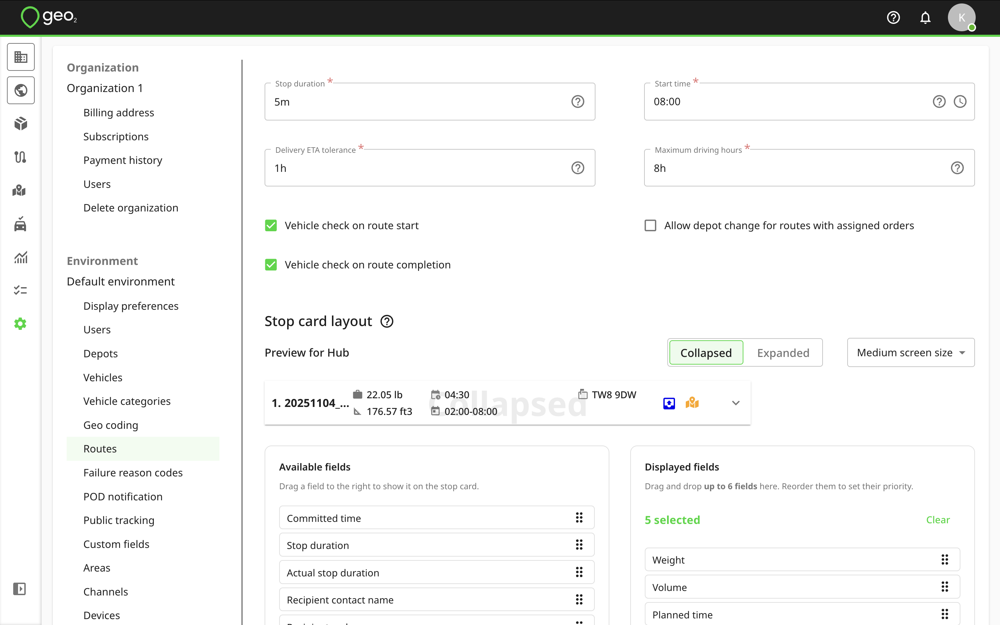

[Web-Based Hub](../../Web-Based%20Hub.md) > [Hub: Environment Settings](../Hub_%20Environment%20Settings.md)

# Hub: Routes Settings

Route defaults from Settings → Environment → Routes are applied to routes when they are first created.

|  **Setting**                                       |  **Description**                                                                                                                                                                                                                                                                                                                                                                                                                                                                                                                                                                                                                      |
|:---------------------------------------------------|:--------------------------------------------------------------------------------------------------------------------------------------------------------------------------------------------------------------------------------------------------------------------------------------------------------------------------------------------------------------------------------------------------------------------------------------------------------------------------------------------------------------------------------------------------------------------------------------------------------------------------------------|
| Stop duration                                      | The default amount of time the delivery vehicle is expected to remain at a route stop.  This is used when orders are first brought into a route and, together with drive times, stop durations are intended to lead to route durations that are more realistic than if only drive time was considered.                                                                                                                                                                                                                                                                                                                                |
| Start time                                         | Default route start time, i.e. the time when a vehicle sets off from the depot.                                                                                                                                                                                                                                                                                                                                                                                                                                                                                                                                                       |
| Delivery ETA tolerance                             | A time range in which an agreed/committed arrival time is considered to be met.  For example, if an order is committed to be delivered at 13:00 and the tolerance is set to 20 minutes, arrival in the range of 12:40-13:20 is considered acceptable.  When the mobile app detects that a later arrival is likely, the mobile app user is alerted.   Also, if the planned time doesn’t match the committed or required time, it will be highlighted with an orange or red colour depending on the difference, if it’s more than the delivery ETA tolerance, it will be highlighted with a red colour, if less - an orange colour. |
| Maximum driving hours                              | The default amount of maximum driving hours used during route building.  This value will be displayed on the Route building dialog whenever you click the Route building button.                                                                                                                                                                                                                                                                                                                                                                                                                                                      |
| Allow depot change for routes with assigned orders | Allow changing a route depot even if it differs from the orders depot assigned to the route.  It is best to keep this setting turned off.  Otherwise, it can cause some inaccuracies during route planning.                                                                                                                                                                                                                                                                                                                                                                                                                           |
| Vehicle check on route start                       | Activate vehicle check in the mobile app when the route is being started.                                                                                                                                                                                                                                                                                                                                                                                                                                                                                                                                                             |
| Vehicle check on route completion                  | Activate vehicle check in the mobile app when the route is being completed.                                                                                                                                                                                                                                                                                                                                                                                                                                                                                                                                                           |

`Stop card layout` settings allow you to customize the stop card information displayed on Route and Map view pages. You can preview how stop cards look in collapsed or expanded views and for medium or large screen sizes. Default options apply for all environments but you can change them. There are two columns:

- Available fields - all possible data options,
- Displayed fields - selected fields for display that let you manage which details are shown).

Fields can be moved between the lists by drag-and-drop or clicking, reordered within the displayed list, or cleared entirely with one click.

The number of fields shown depends on the selected view and screen size (6 for collapsed medium, 8 for collapsed large, and 9 for expanded views). Some longer fields, like Recipient address, Planning instructions, and Delivery instructions, count as 2 fields and take up 2 rows in the collapsed view. When limits are reached, unavailable fields are greyed out. The configuration automatically syncs with how stop cards appear on Route and Map view, updating in real time. Thus, you have complete control and flexibility to display only the most relevant stop information for your operations. You can select what information is displayed separately for medium and large screen sizes, both in the collapsed and expanded view. Depending on your and other users in your environment device screens, the system will automatically display the configured information.

To save changes, remember to press the `Update` button.
