[Web-Based Hub](../../Web-Based%20Hub.md) > [Hub: Environment Settings](../Hub_%20Environment%20Settings.md)

# Hub: Vehicles Settings

- [Introduction](#introduction)
- [Add Vehicles](#add-vehicles)
- [Import Vehicles](#import-vehicles)
  - [Upload Spreadsheet File with Column Mapping](#upload-spreadsheet-file-with-column-mapping)
  - [Manually Type or Paste Data](#manually-type-or-paste-data)
  - [Import Options](#import-options)
  - [Spreadsheet Example](#spreadsheet-example)

# Introduction

Vehicles are assigned to deliver routes with orders.  You can add vehicles either one by one by pressing the `Add` button or all at once by pressing the `Import` button in Settings → Environment → Vehicles.

# Add Vehicles

You will see the dialog to fill in the information.  Required fields are Key, Type, Depot, and Speed factor.  All other fields are optional. Hovering over the `Question` on a field will display a prompt explaining its meaning and the expected data to put there.

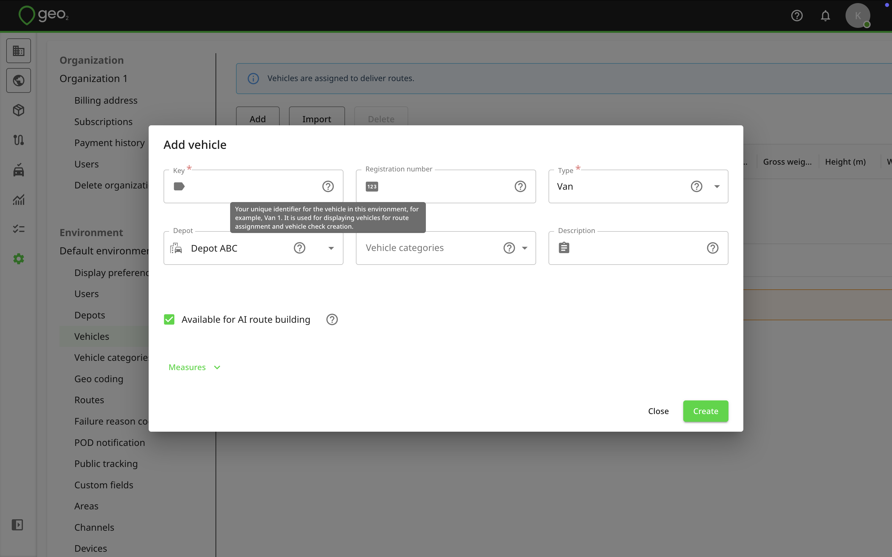

By pressing the `Measures` button, you will see additional fields like Weight and Volume capacity, Gross weight, Height, Width, Length, Emission factor, and Speed factor.

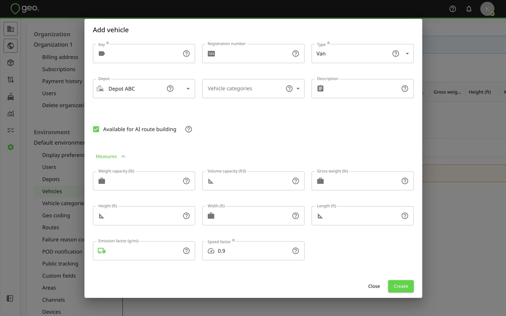

The properties of each vehicle are:

|  **Property**                                       |  **Description**                                                                                                                                                                                                                                                                                                                                                                                                                            |
|:----------------------------------------------------|:--------------------------------------------------------------------------------------------------------------------------------------------------------------------------------------------------------------------------------------------------------------------------------------------------------------------------------------------------------------------------------------------------------------------------------------------|
| Key                                                 | Your unique identifier for the vehicle in this environment, for example, Van 1. It is used for displaying vehicles for route assignment and vehicle check creation.                                                                                                                                                                                                                                                                         |
| Registration                                        | Vehicle registration number to help identify your vehicle, for example, ABCD012.                                                                                                                                                                                                                                                                                                                                                            |
| Type                                                | Vehicle type used to consider average speed for route optimization and planned timing adjustments - truck, van, car, motorbike, bicycle. For each type, the speed factor is pre-defined but you can change it by pressing `Measures` and editing the Speed factor field.                                                                                                                                                                    |
| [Hub: Depots Settings](Hub_%20Depots%20Settings.md) | Depot to which the vehicle is assigned. This determines which loads the vehicle can be assigned to, based on the route depot. Press [Hub: Depots Settings](Hub_%20Depots%20Settings.md)to add more depots to your environment.                                                                                                                                                                                                              |
| Vehicle categories                                  | Categories that let you match users and vehicles for a route assignment. By default, standard driving categories (A, B, C, etc.) are listed. You can edit or delete them and create custom categories for your environment.   See [Hub: Vehicle Categories Settings](Hub_%20Vehicle%20Categories%20Settings.md) for more information about vehicle categories and their usage.                                                          |
| Description                                         | Free text notes to describe the vehicle. For example, DAF 2800 ATI DKSE.                                                                                                                                                                                                                                                                                                                                                                    |
| Available for route building                        | Vehicle availability for [Hub: AI Route Building](../Hub_%20Orders/Hub_%20AI%20Route%20Building.md) functionality.                                                                                                                                                                                                                                                                                                                          |
| Weight capacity                                     | Number to specify the total vehicle weight capacity in the weight units specified in Settings → Environment → [Hub: Display Preferences Settings](Hub_%20Display%20Preferences%20Settings.md), for example, 22000. It is used for calculating the feasibility of a route to which the vehicle is assigned.                                                                                                                                  |
| Volume capacity                                     | Number to specify the total vehicle volume capacity in the volume units specified in Settings → Environment → [Hub: Display Preferences Settings](Hub_%20Display%20Preferences%20Settings.md), for example, 10000. It is used for calculating the feasibility of a route to which the vehicle is assigned.                                                                                                                                  |
| Gross weight                                        | Number to specify the maximum vehicle weight in the weight units specified in Settings → Environment → [Hub: Display Preferences Settings](Hub_%20Display%20Preferences%20Settings.md), for example, 22000. It is considered for route optimization and calibration with vehicle restrictions.                                                                                                                                              |
| Height                                              | Number to specify the maximum vehicle height based on the length units specified in Settings → Environment → [Hub: Display Preferences Settings](Hub_%20Display%20Preferences%20Settings.md), for example, 9. This is considered for route optimization and calibration with vehicle restrictions.   For metric environment settings (cm), the value is in metres.   For imperial environment settings (in), the value is in feet.  |
| Width                                               | Number to specify the maximum vehicle width based on the length units specified in Settings → Environment -> [Hub: Display Preferences Settings](Hub_%20Display%20Preferences%20Settings.md), for example, 9. This is considered for route optimization and calibration with vehicle restrictions.   For metric environment settings (cm), the value is in metres.   For imperial environment settings (in), the value is in feet.  |
| Length                                              | Number to specify the maximum vehicle length based on the length units specified in Settings → Environment → [Hub: Display Preferences Settings](Hub_%20Display%20Preferences%20Settings.md), for example, 12. This is considered for route optimization and calibration with vehicle restrictions.   For metric environment settings (cm), the value is in metres.   For imperial environment settings (in), the value is in feet. |
| Emission factor                                     | Factor to denote environment impact of your vehicle - CO2 emissions in grams/kilometre or mile depending on the distance unit selected in Settings → Environment → [Hub: Display Preferences Settings](Hub_%20Display%20Preferences%20Settings.md).                                                                                                                                                                                         |
| Speed factor                                        | Average speed as a multiple of an average car.  For realistic route timings, this is typically set below 1 for heavier vehicles, such as vans and lorries.                                                                                                                                                                                                                                                                                  |

Once information is provided, press the `Create` button to save changes.  You can edit vehicle properties by clicking the `Edit` icon.  Remember to press the `Save` button to save changes.

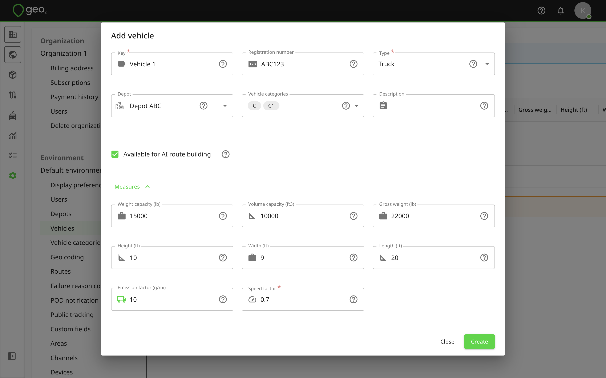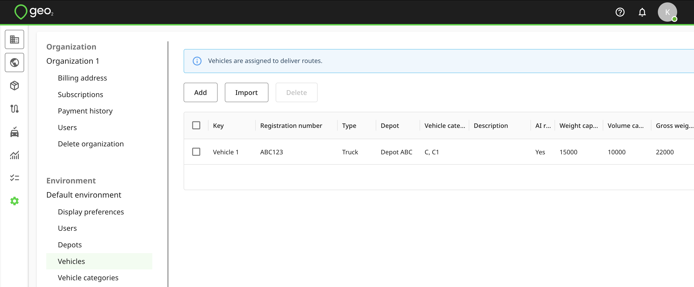

You can select a vehicle to `Delete` it.  For data integrity, it is best to not delete a vehicle once it has started to be used.

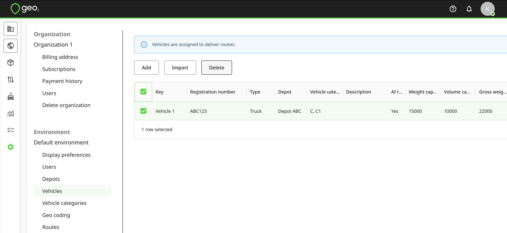

# Import Vehicles

You can import vehicle data into Geo2 Hub using two methods:

- Upload your spreadsheet file with column mapping
- Manually paste or type your data into the table.

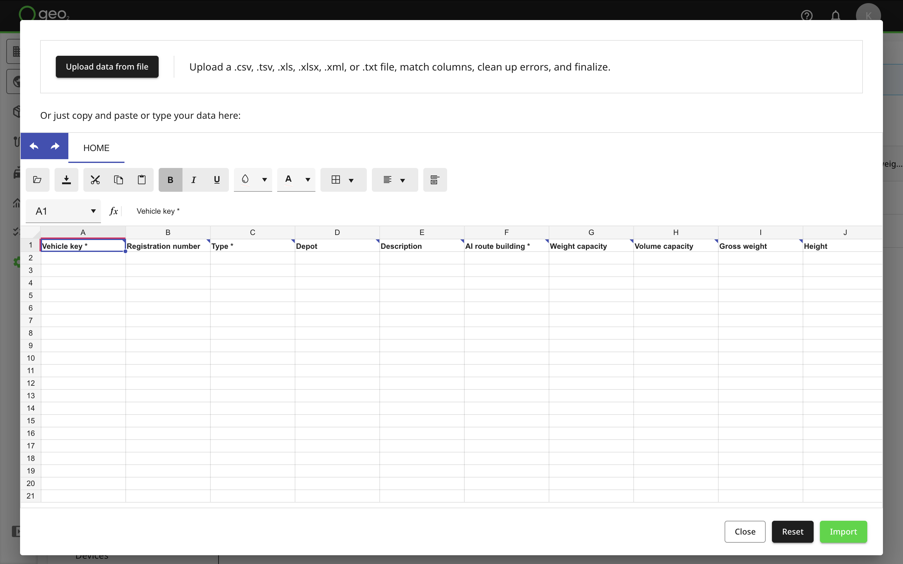

## Upload Spreadsheet File with Column Mapping

Press the `Upload data from file` button at the top of the Import spreadsheet in Hub. Upload a .csv, .tsv, .xls, .xlxs, .xml, or .txt file. After uploading, the Map your data columns dialog will be displayed where you can match your spreadsheet columns to Hub’s data fields. Required fields are marked with an asterisk ( \* ) but you can skip them at this step and add data later.

On the dialog, you will see 4 columns:

|  **Column Heading**    |  **Description**                                                                                                      |
|:-----------------------|:----------------------------------------------------------------------------------------------------------------------|
| Your file column       | Displays the column headers from your uploaded file that the system will attempt to match with known fields.          |
| Your sample data       | Shows a preview of the data in each column from your uploaded file to help with identifying what each field contains. |
| Destination column     | Lets the user select or confirm which system field the uploaded column should map to.                                 |
| Matching result        | Indicates how well the system matched each column, including match strength and confidence percentage.                |

The system will attempt to auto-match fields like Type, Depot, Weight capacity, etc. Matches are clearly marked with a green tick for perfect or high matches, while unmatched columns are shown with a yellow warning icon. You can adjust matches or choose to skip fields, including required ones, these can be added later.

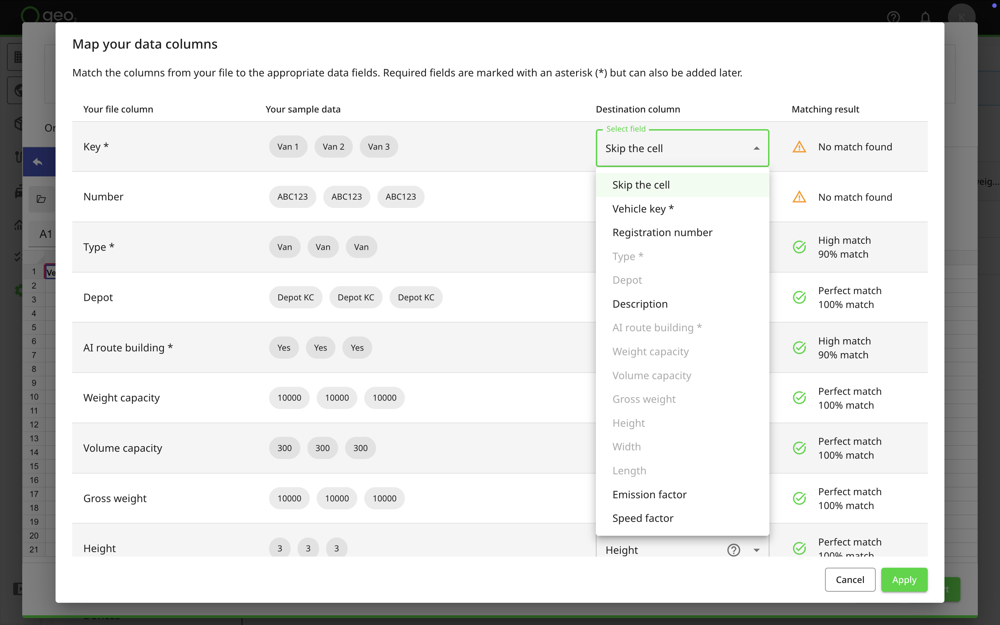

Tooltips are available to help clarify each data point.

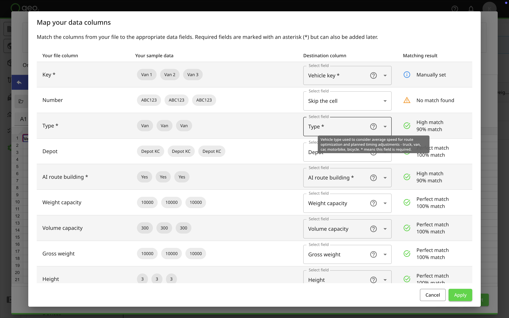

Once everything is mapped correctly, click `Apply`. Your data will appear in the table, where you can review, edit, or fix any errors before finalizing.

## Manually Type or Paste Data

The spreadsheet interface column headings guide you on the type of data expected in each column.  Hover over a column title to see a tooltip with additional details and explanations.

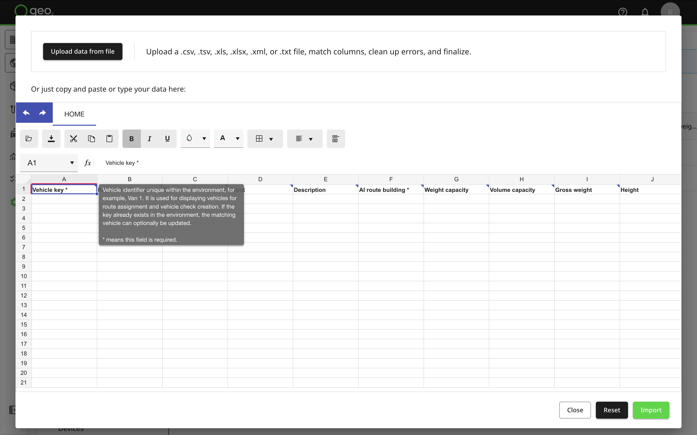

If you have prepared the data in another spreadsheet, you can copy and paste them in.  It's also possible to import a file from your device without column mapping by pressing the `folder` icon.

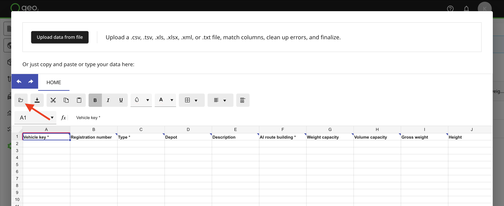

The limit for the import of vehicles is **500**.  You cannot paste more into the spreadsheet.

|  **Column Heading**    |  **Data Type**            |  **Details**                                                                                                                                                                                                                                                                                                                                                                                                                                |  **Mandatory**    |
|:-----------------------|:--------------------------|:--------------------------------------------------------------------------------------------------------------------------------------------------------------------------------------------------------------------------------------------------------------------------------------------------------------------------------------------------------------------------------------------------------------------------------------------|:------------------|
| Vehicle key            | String                    | Vehicle identifier unique within the environment, for example, Van 1. It is used for displaying vehicles for route assignment and vehicle check creation.  If the key already exists in the environment, the matching vehicle can optionally be updated.                                                                                                                                                                                    | Y                 |
| Registration           | String                    | Vehicle registration number to help identify the vehicle, for example, ABCD 012.                                                                                                                                                                                                                                                                                                                                                            | N                 |
| Type                   | Pre-defined string option | Vehicle type used to consider average speed for route optimization and planned timing adjustments - truck, van, car, motorbike, bicycle. For each type, the speed factor is pre-defined but you can change it by providing your own value in the Speed factor column.                                                                                                                                                                       | Y                 |
| Depot                  | String unique identifier  | Depot to which the vehicle is assigned.  This determines which routes the vehicle can be assigned to, based on the route depot.  Provide the depot key already existing in Settings → Environment -> [Hub: Depots Settings](Hub_%20Depots%20Settings.md).                                                                                                                                                                                   | Y                 |
| Description            | String                    | Free text notes to describe the vehicle.  For example, DAF 2800 ATI DKSE.                                                                                                                                                                                                                                                                                                                                                                   | N                 |
| Route building         | Pre-defined string option | Vehicle availability for AI route building functionality. Put "Yes" if the vehicle is available for route building, put "No" if the vehicle is not available.                                                                                                                                                                                                                                                                               | Y                 |
| Weight capacity        | Numerical                 | Number to specify the total vehicle weight capacity in the weight units specified in Settings → Environment -> [Hub: Display Preferences Settings](Hub_%20Display%20Preferences%20Settings.md).  For example, 22000.                                                                                                                                                                                                                        | N                 |
| Volume capacity        | Numerical                 | Number to specify the total vehicle volume capacity in the volume units specified in Settings → Environment → [Hub: Display Preferences Settings](Hub_%20Display%20Preferences%20Settings.md).  For example, 10000.                                                                                                                                                                                                                         | N                 |
| Gross weight           | Numerical                 | Number to specify the maximum vehicle weight in the weight units specified in Settings → Environment → [Hub: Display Preferences Settings](Hub_%20Display%20Preferences%20Settings.md), for example, 22000. It is considered for route optimization and calibration with vehicle restrictions.                                                                                                                                              | N                 |
| Height                 | Numerical                 | Number to specify the maximum vehicle height based on the length units specified in Settings → Environment → [Hub: Display Preferences Settings](Hub_%20Display%20Preferences%20Settings.md), for example, 9. This is considered for route optimization and calibration with vehicle restrictions.   For metric environment settings (cm), the value is in metres.   For imperial environment settings (in), the value is in feet.  | N                 |
| Width                  | Numerical                 | Number to specify the maximum vehicle width based on the length units specified in Settings → Environment → [Hub: Display Preferences Settings](Hub_%20Display%20Preferences%20Settings.md), for example, 9. This is considered for route optimization and calibration with vehicle restrictions.   For metric environment settings (cm), the value is in metres.   For imperial environment settings (in), the value is in feet.   | N                 |
| Length                 | Numerical                 | Number to specify the maximum vehicle length based on the length units specified in Settings → Environment → [Hub: Display Preferences Settings](Hub_%20Display%20Preferences%20Settings.md), for example, 12. This is considered for route optimization and calibration with vehicle restrictions.   For metric environment settings (cm), the value is in metres.   For imperial environment settings (in), the value is in feet. | N                 |
| Emission factor        | Numerical                 | CO2 equivalent emissions in grams/kilometre or mile depending on Settings → Environment -> [Hub: Display Preferences Settings](Hub_%20Display%20Preferences%20Settings.md).  For example, 5.                                                                                                                                                                                                                                                | N                 |
| Speed factor           | Numerical                 | Average speed as a multiple of an average car.  For realistic route timings, this is typically set below 1 for heavier vehicles, such as vans and lorries, for example, 0.6. If you do not provide a value for this field, it will be populated from the type you have selected.                                                                                                                                                            | Y                 |

Once information is provided, press:

- `Close` to exit the spreadsheet interface with no action
- `Reset` to clear the spreadsheet
- `Import` to start the data import

## Import Options

The import options are:

|  **Option**                                              |  **Functionality**                                                                                                                                                                                                                |
|:---------------------------------------------------------|:----------------------------------------------------------------------------------------------------------------------------------------------------------------------------------------------------------------------------------|
| Existing vehicles will be updated (if any)               | If a vehicle with the same key already exists, update its data with those in the spreadsheet.  If not selected, attempting to import a vehicle with an existing key will fail.                                                    |
| Empty fields will clear existing vehicle property values | If updating a vehicle and a field value in the spreadsheet is empty, blank the existing vehicle property even though it has some data in it.  If not selected, an empty field value will not overwrite an existing vehicle value. |
| Save these options as default                            | Remember this configuration of options for subsequent imports.                                                                                                                                                                    |

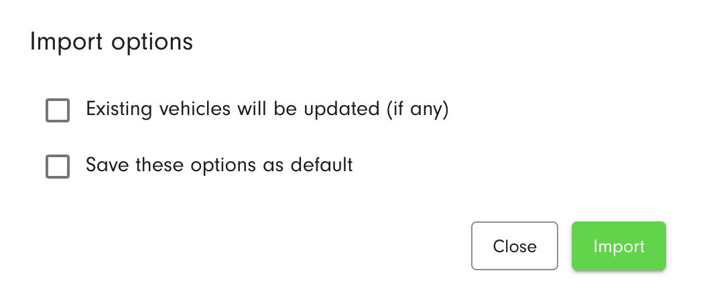

Click the `Import` button to import vehicles.  The import process feeds back any errors that it encounters.

Vehicles will be imported and displayed in the Vehicles list in Settings → Environment.

## Spreadsheet Example

You can also download the example of the spreadsheet with typed-in information for a vehicle import.

[Vehicle imports.xlsx](../../../attachments/75280ae1-73e9-4ac9-9c12-53e366e8f9e6.xlsx)
