[Web-Based Hub](../../Web-Based%20Hub.md) > [Hub: Orders](../Hub_%20Orders.md)

# Hub: Order Creation and Editing

- [Order Creation](#order-creation)
- [Order Editing](#order-editing)
- [Geo-Coding Indicators](#geo-coding-indicators)

# Order Creation

On `Order` page, press the `Create` button to create an order.  You will be redirected to Create order page.

Here are the order properties you can specify:

|  **Property**         |  **Description**                                                                                                                                                                                                                                                                                                                                                                                                                                                                                                                     |
|:----------------------|:-------------------------------------------------------------------------------------------------------------------------------------------------------------------------------------------------------------------------------------------------------------------------------------------------------------------------------------------------------------------------------------------------------------------------------------------------------------------------------------------------------------------------------------|
| Key                   | Order identifier unique within the environment, for example, an order number 1, 2, 3, 4, etc.                                                                                                                                                                                                                                                                                                                                                                                                                                        |
| Type                  | Type of order - `delivery` or `collection.`                                                                                                                                                                                                                                                                                                                                                                                                                                                                                          |
| Weight and Volume     | Number to specify the total order weight/volume in the weight/volume units specified in Settings → Environment -> [Hub: Display Preferences Settings](../Hub_%20Environment%20Settings/Hub_%20Display%20Preferences%20Settings.md).  One of the uses is the calculation of the peak load weight and volume for a route.                                                                                                                                                                                                              |
| Package count         | Number of packages expected as part of the order.  For example, 2.  The field becomes non-editable if packages are specified in the Packages tab.                                                                                                                                                                                                                                                                                                                                                                                    |
| Channel               | Tag that lets you classify delivery methods.  Select a channel key from options defined in Settings → Environment → [Hub: Channels Settings](../Hub_%20Environment%20Settings/Hub_%20Channels%20Settings.md).                                                                                                                                                                                                                                                                                                                        |
| Area                  | Tag that lets you identify depots, order and routes by user-defined geographical regions.  Select an area key from options defined in Settings → Environment → [Hub: Areas Settings](../Hub_%20Environment%20Settings/Hub_%20Areas%20Settings.md).                                                                                                                                                                                                                                                                                   |
| Route                 | Optional assignment of the order to a route.  Once selected, by hovering over the route key and pressing it, you can open this route in a new tab of the browser to view its details.   **If a route starts or ends at a depot, orders with depots must match**: the delivery depot must align with the start, and the collection depot with the end. Orders without assigned depots can be added to any route, and if a route does not use a depot as its start or end point, any order, with or without a depot, can be added. |
| Depot                 | Depot in which the order is being handled.  Select a depot key from options defined in Settings → Environment → [Hub: Depots Settings](../Hub_%20Environment%20Settings/Hub_%20Depots%20Settings.md).                                                                                                                                                                                                                                                                                                                                |
| Required from         | For information - from when the customer requires the order to be delivered/collected.                                                                                                                                                                                                                                                                                                                                                                                                                                               |
| Required to           | For information - till when the customer requires the order to be delivered/collected.                                                                                                                                                                                                                                                                                                                                                                                                                                               |
| Committed             | For information - date/time that has been agreed with the order for delivery/collection.                                                                                                                                                                                                                                                                                                                                                                                                                                             |
| Planned               | For information - date/time when the order is planned to be delivered/collected.                                                                                                                                                                                                                                                                                                                                                                                                                                                     |
| Stop duration         | The amount of time the delivery vehicle is expected to remain at a route stop. This is used when orders are first brought into a route and, together with drive times, stop durations are intended to lead to route durations that are more realistic than if only drive time was considered.                                                                                                                                                                                                                                        |
| Order instructions    | Optional notes for drivers that are shown in the mobile app.  For example, "leave with reception".                                                                                                                                                                                                                                                                                                                                                                                                                                   |
| Planning instructions | Optional notes for transport planners that are shown in the stop card in the Route plan page and not shown in the mobile app.  For example, "must be delivered by 11:00".                                                                                                                                                                                                                                                                                                                                                            |
| Tab - Recipient       | Recipient - contact details and address.                                                                                                                                                                                                                                                                                                                                                                                                                                                                                             |
| Tab - Products        | Optional details of products in the order - product code, commodity code, barcode, description, quantity, currency, unit price, unit tax, tax rate, country of origin.                                                                                                                                                                                                                                                                                                                                                               |
| Tab - Packages        | Optional package details - barcode, height, width, depth, volume, weight.  Packages can optionally specify the products and quantities they contain.                                                                                                                                                                                                                                                                                                                                                                                 |
| Tab - Sender          | Sender contact details and address, taken from the environment settings by default.                                                                                                                                                                                                                                                                                                                                                                                                                                                  |

On the Main info tab, the required fields are Key and Type.

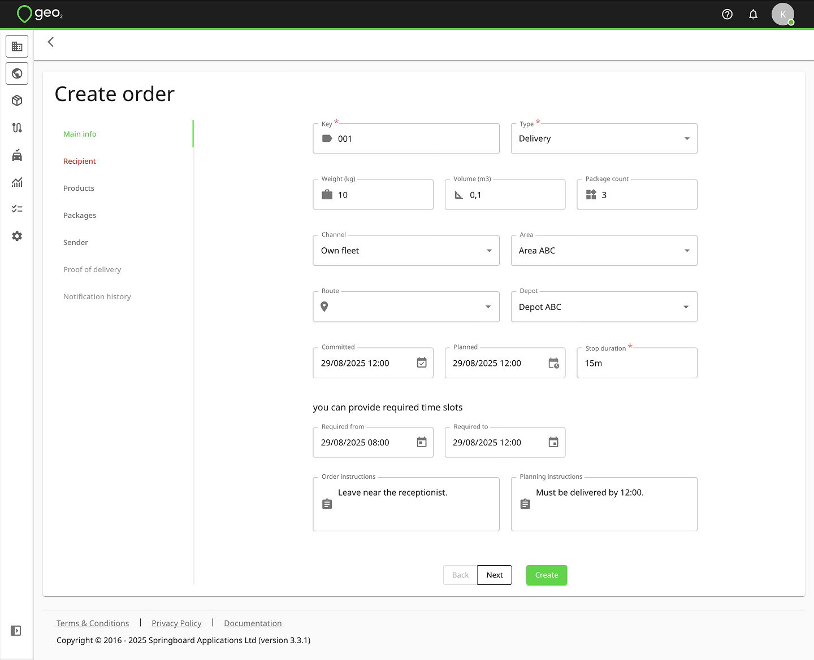

Press the `Next` button to be redirected to the next tab inside an order creation.  On the Recipient tab, the required fields are Address line 1, City, and Country.  To enter the address, you can start typing it into Address line 1 and selecting it from the drop-down which appears.  If no suitable match is found, continue entering the address in the relevant address fields manually. Once the address is selected and the pin is visualised on the map, you can drag-and-drop it to adjust the location if needed.

You can also allow Public tracking and POD notifications on the order level.  Even if they are allowed in Settings → Environment, you can disable them for an individual order and notifications will not be sent to the recipient.  If you set up fixed recipients for failed and partially successful POD notifications, emails will be sent even if they are turned off on an order level.

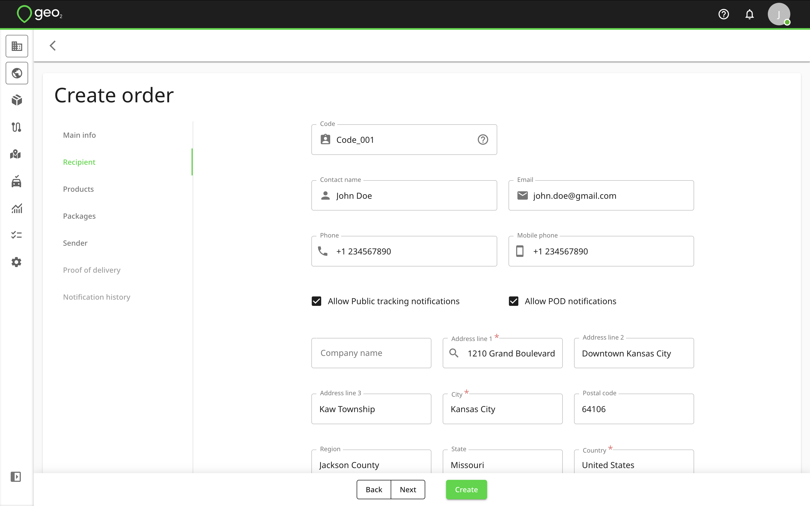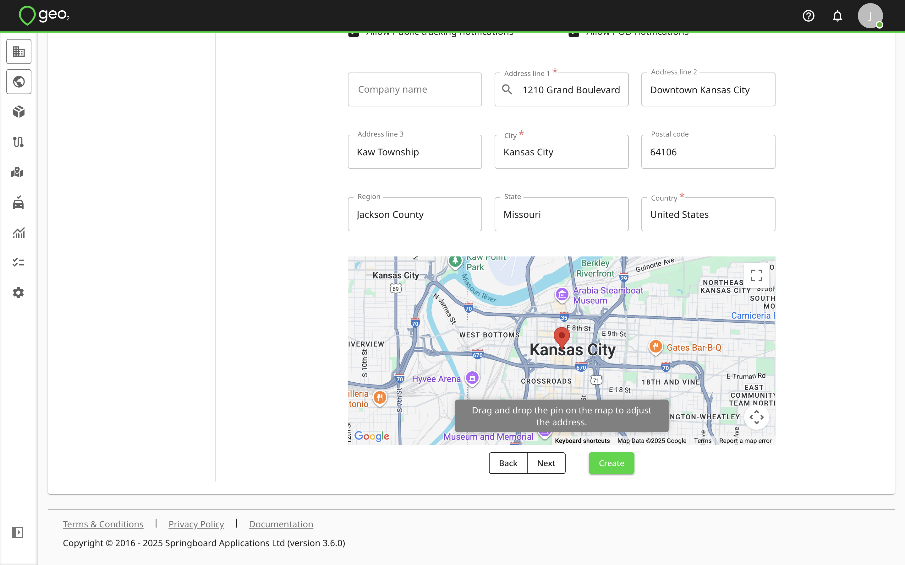

Press the `Next` button to be redirected to the Products tab.  Product is optional for an order creation.  Required fields for a product creation are Product code and Quantity.

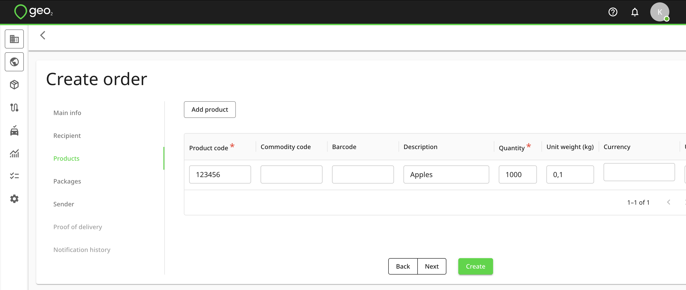

Products can be added to packages.  Press the `Next` button to be redirected to the Packages tab.  Packages are also optional for an order creation.  There are no required fields.

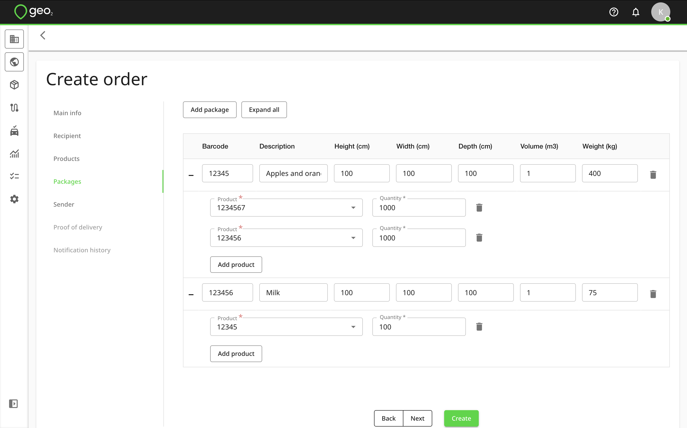

Press the `Next` button to be redirected to the Sender tab.  Here are sender contact details and address, taken from environment settings by default.  This address will be displayed on the POD PDF sent to a recipient if POD notification emails with PDF attaching are enabled in Settings → Environment.

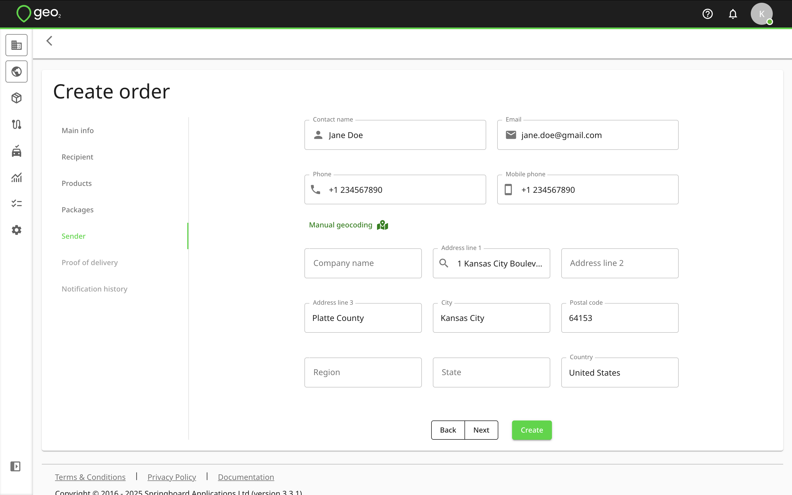

"Proof of delivery" and "Notification history" tabs are disabled during an order creation, you can find created POD and notifications sent to a recipient relevant to this order later.

When you press `Create`, contents of the order form will be validated and an order created.  When successful, you will see an information message `Order has been created`:

The created order will be displayed on Orders page.

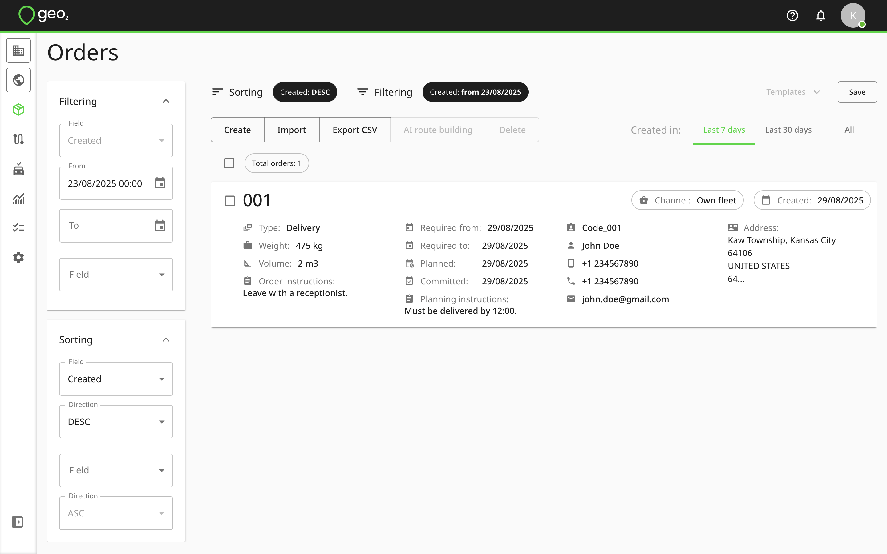

# Order Editing

When you click on an order key on an order card on Orders page, you can edit its properties. Consider the impact of edits if the order has already been included in a route.

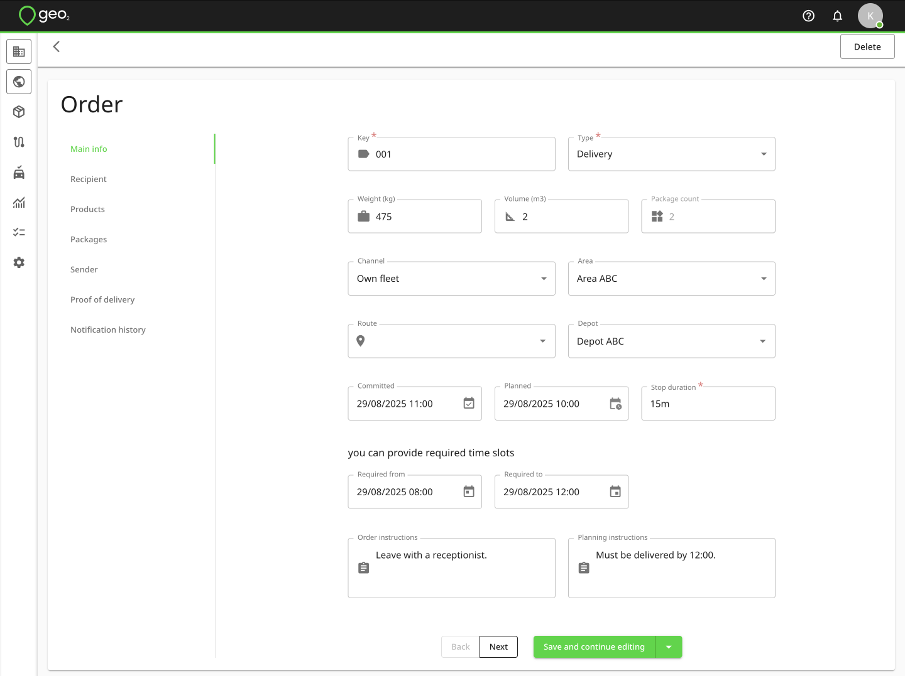

When editing, the `Save` button has two different options you can toggle via the down-pointing arrow:

- `Save and continue editing` - saves your changes without returning to the `Orders` list.  This way you can save updates you have made so far before, for example, moving to another tab.
- `Save and exit` - saves the order changes and takes you to the `Orders` list.

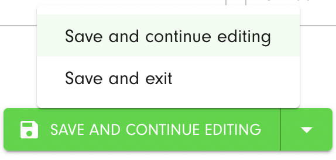

# Geo-Coding Indicators

Geo-coding precision for addresses/locations is shown throughout Geo2 as:

|  **Icon**                                                                        |  **Status**    |
|:---------------------------------------------------------------------------------|:---------------|
|  (green icon)  | Accurate       |
|  (yellow icon) | Accurate area  |
|  (red icon)    | Approximate    |
|  (grey icon)   | Missing        |

If you want to modify the previously determined address geo-location, you can edit it in Order → Recipient by pressing the `Manual geocoding` button.

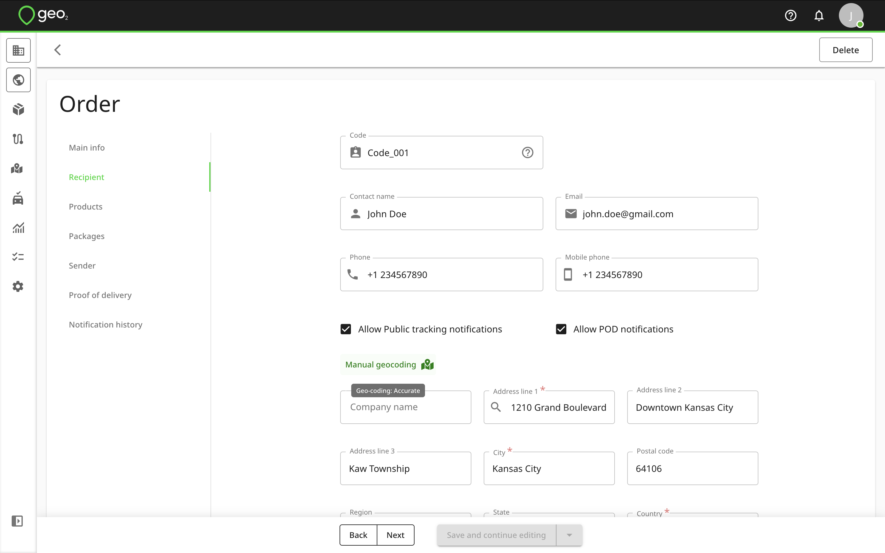

The Geo Code dialog will be displayed.  Checkboxes near the address fields allow you to control which data will be used for geocoding.  By default, enabled fields are taken from Settings → Environment → [Hub: Geo Coding Settings](../Hub_%20Environment%20Settings/Hub_%20Geo%20Coding%20Settings.md).  To check a new geolocation, press the `Check Geo Point` button.  It is often the case that using all parts of the address will lead to a better location match.

You can also edit latitude and longitude or move the pin on the map to adjust the address.

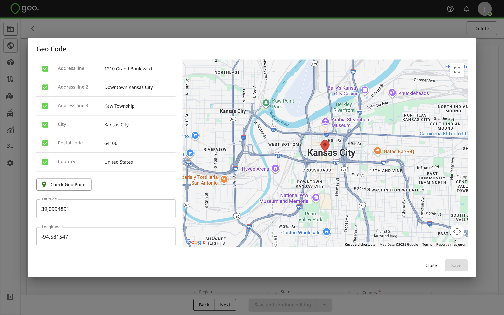

Once you are happy with the result, press the `Save` button.  The geolocation icon will be shown in green.
