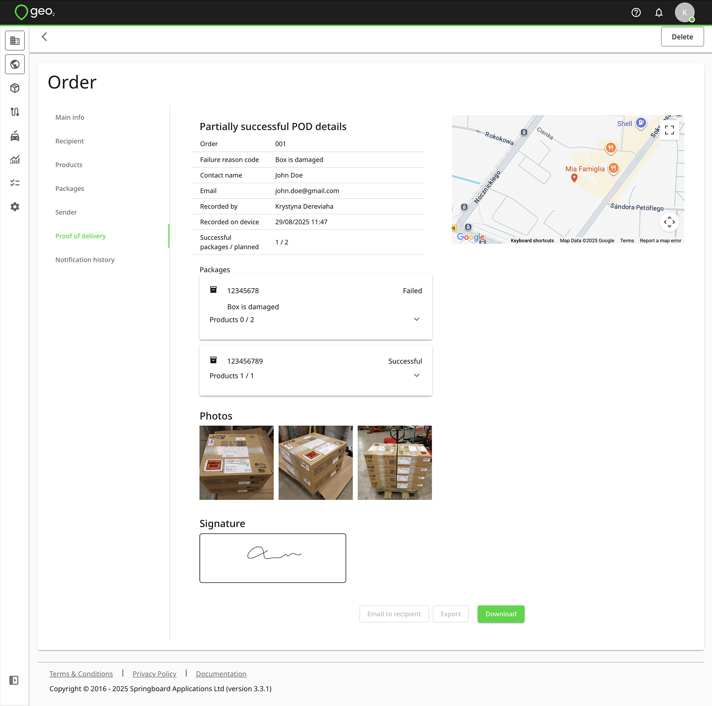
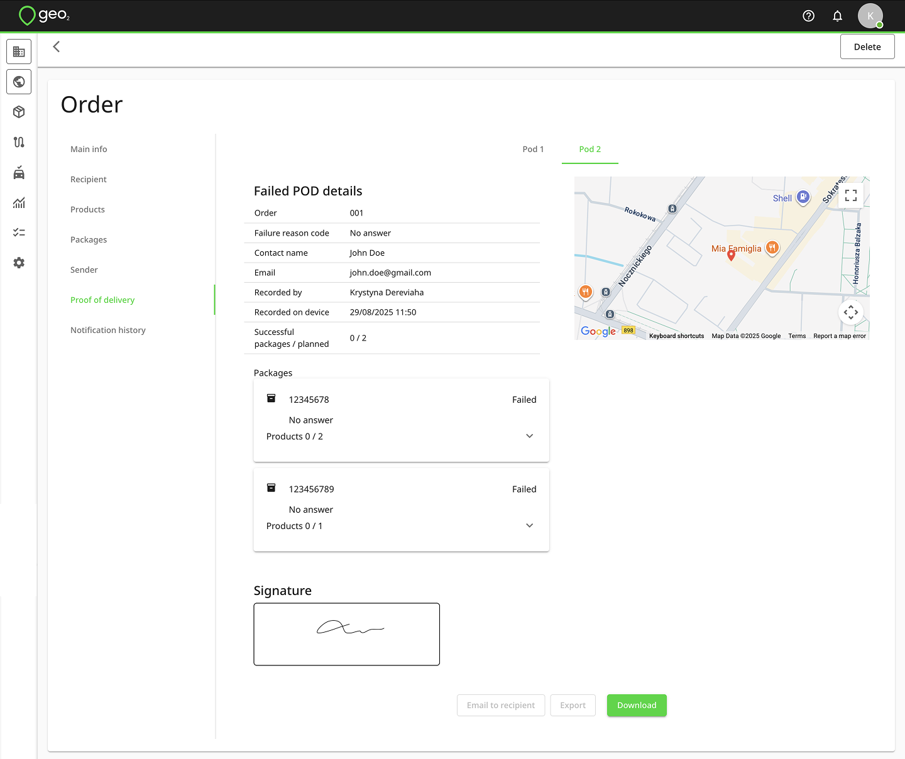
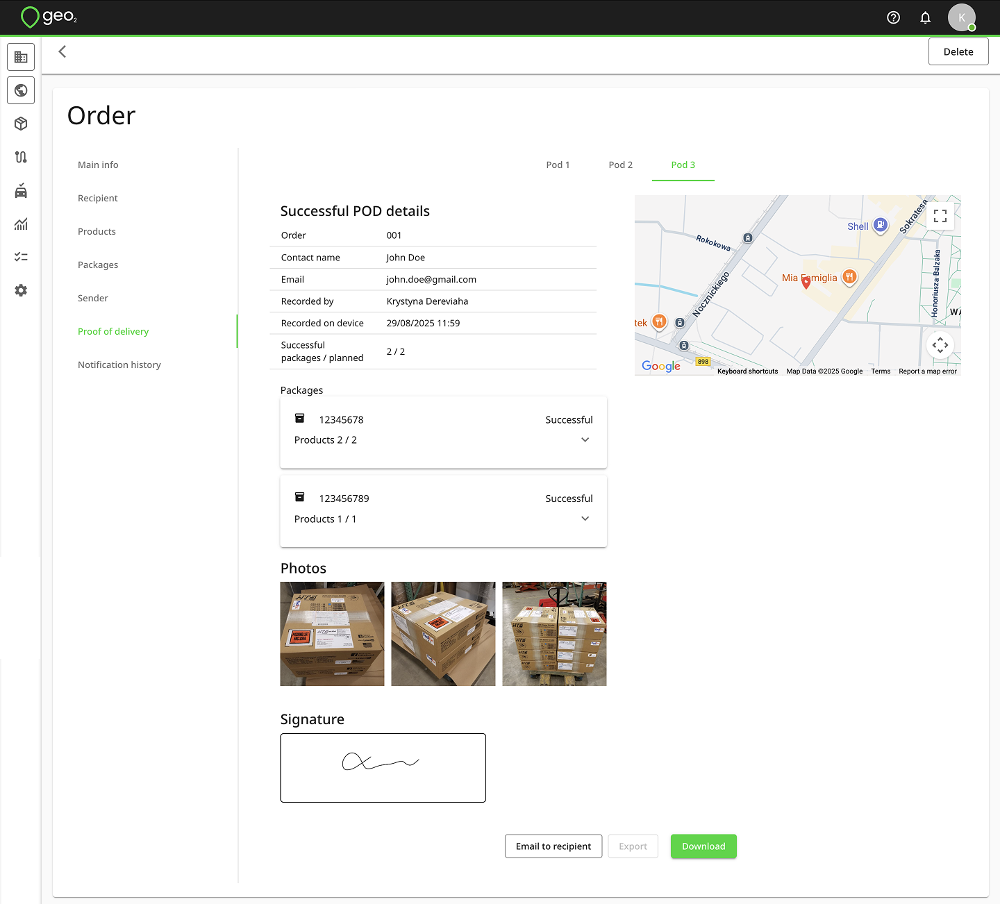

[Web-Based Hub](../../Web-Based%20Hub.md) > [Hub: Orders](../Hub_%20Orders.md)

# Hub: Order Proof of Delivery

When a POD (proof of delivery) has been recorded in the mobile app, you can find it by clicking on the green/yellow/red POD icon on the order card on Orders page.  Also, it will be displayed in Proof of Delivery tab inside the order.

If an order has packages and products, they will be displayed on the POD page with their status - Successful, Partially successful or Failed.  For the partially successful or failed status, the failure reason code is shown.  At a product level, the quantities delivered out of the total planned are shown too.

Example of partially successful POD:

Example of failed POD:

Example of successful POD:

If an orders has several recorded POD's, they will be displayed in separate tabs as Pod 1, Pod 2, etc.

You can click on the `Download PDF` button to save POD as a PDF file.  If manual sending of POD is enabled in the [Hub: POD Notification Settings](../Hub_%20Environment%20Settings/Hub_%20POD%20Notification%20Settings.md), you will see the `Email to recipient` button.  By pressing it, the POD email will be sent to the recipient's email address.
