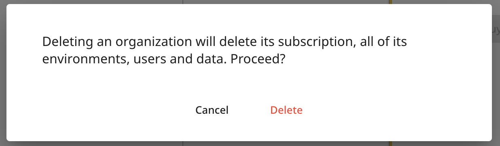

[Web-Based Hub](../Web-Based%20Hub.md)

# Hub: Organization Settings

- [Introduction](#introduction)
- [Organization Settings](#organization-settings)
  - [Organization Name](#organization-name)
  - [Billing address](#billing-address)
    - [Company Logo](#company-logo)
  - [Users](#users)
    - [Add Users](#add-users)
    - [Import Users](#import-users)
      - [Upload Spreadsheet File with Column Mapping](#upload-spreadsheet-file-with-column-mapping)
      - [Manually Type or Paste Data](#manually-type-or-paste-data)
      - [Import Options](#import-options)
      - [Spreadsheet Example](#spreadsheet-example)
- [Delete Organization](#delete-organization)

# Introduction

Organizations are groups of Geo2 users who share a subscription and collaborate on data in one or more [Hub: Environment Settings](Hub_%20Environment%20Settings.md).

# Organization Settings

During the registration of a new account and [Hub: Set Up Organization](Hub_%20Set%20Up%20Organization.md), the address entered will be saved as the organization’s address as well.  If you are invited to the organization and you have [Hub: User Roles](Hub_%20User%20Roles.md)**,** you can reach organization settings by pressing the Settings option in the menu.

## Organization Name

You can change your organization name by hovering over the organization name on Settings page and pressing the `Edit (pencil)` icon. Provide a new organization name and press the `Tick` icon to save changes.

## Billing address

If creating a new organization, you need to provide the Organization name and its billing address (Address line 1, City and Country fields); all other fields are optional.  The tax registration number will be shown on the combined invoice/receipt after successful payments.

To enter the address, you can start typing it into Address line 1 and selecting it from the drop-down which appears.  If no suitable match is found, continue entering the address in the relevant address fields manually.

Press the `Create` button to create an organization. Once your organization is created, you will be redirected to Settings → Organization → Billing address.

To edit organization settings later, you can press Settings option in the menu.  To save changes in the already created organization, press `Update`.

### Company Logo

You can add your own logo to give your organization a distinct visual identity.

The logo is shown in the Organization selector in the menu as well as in the mobile app when selecting an organization to work in.

## Users

You can invite other users to your organization.  As a part of **a FREE 7-day trial of Advanced or Enterprise subscription level**, you can add four additional users to your organization.  If you want to add more users, you can do it after taking a free trial by pressing the `Add users` button on Subscriptions page.

You can invite users either one-by-one, by pressing the `Add` button, or all at once, by pressing the `Import` button in Settings → Organization → Users page.

If you are on a Free subscription level, you will see only your user:

### Add Users

Press `Invite` to create an invitation for the new user.

You will see the dialog prompting you for an email address, full name, first and last name.

Make sure the email address used is valid and can receive incoming messages.  Instructions for the invited user are in the invitation email message and [Hub: Accept Invitation](Hub_%20Accept%20Invitation.md).

The properties of each user are:

|  **Property**     |  **Description**                                                                                                                                                                                                                                                                                                                                                                                                        |
|:------------------|:------------------------------------------------------------------------------------------------------------------------------------------------------------------------------------------------------------------------------------------------------------------------------------------------------------------------------------------------------------------------------------------------------------------------|
| Email             | The email address must be in a valid email format - [recipient@domain\_name.domain\_suffix.](#recipient-domain-name-domain-suffix) For example, [john.doe@gmail.com.](mailto:janedoe@gmail.com)                                                                                                                                                          |
| Full name         | For example, Driver John Doe.  It is used for displaying users for route assignment, POD, and vehicle check creation.                                                                                                                                                                                                                                                                                                   |
| First name        | For example, John. For internal usage only.                                                                                                                                                                                                                                                                                                                                                                             |
| Last name         | For example, Doe. For internal usage only.                                                                                                                                                                                                                                                                                                                                                                              |
| Organization role | Role is a set of permissions for the user in the organization.  Each user can either have the role of User, which does not enable them to modify the organization, or Admin, which gives them control over the organization, including the ability to create environments.  For organization user roles and their permissions, see [**User Roles**](https://balloonone.atlassian.net/wiki/x/L4D_Ag#Organization-Roles). |

**To enable the use of the Geo2 product, an Organization Admin needs to assign a subscription to a newly invited user.**The message at the top of the `Users` tab informs you about your current organization subscription.

You also need to choose the environment(s) to which a user will have access and their role in each of them.  For environment user roles and their permissions, see [Hub: User Roles](Hub_%20User%20Roles.md).

The `Status` value against the user shows you if the invitation has been accepted.  You can select one or more users using the checkbox leading each row.  Pressing `Delete` will remove the selected users from the organization.  When `Deleted are hidden` is enabled, both active and deleted users are shown.  Previously deleted users can be recovered, i.e. made active again.

Deleting a user frees up that user's subscription.  After a user is recovered, a subscription needs to be assigned to them to become functional.

Product news emails are enabled by default.  To turn off the emails, the Organization Admin can unset the `Product news email` toggle and press `Update` to save changes.  A user will receive product news emails if they are enabled in at least one of the organizations they belong to.  It is also possible to turn off the emails in profile settings.

### Import Users

You can import user data into Geo2 Hub using two methods:

- Upload your spreadsheet file with column mapping
- Manually paste or type your data into the table.

#### Upload Spreadsheet File with Column Mapping

Press the `Upload data from file` button at the top of the Import spreadsheet in Hub. Upload a .csv, .tsv, .xls, .xlxs, .xml, or .txt file. After uploading, the Map your data columns dialog will be displayed where you can match your spreadsheet columns to Hub’s data fields. Required fields are marked with an asterisk ( \* ) but you can skip them at this step and add data later.

On the dialog, you will see 4 columns:

|  **Column Heading**    |  **Description**                                                                                                      |
|:-----------------------|:----------------------------------------------------------------------------------------------------------------------|
| Your file column       | Displays the column headers from your uploaded file that the system will attempt to match with known fields.          |
| Your sample data       | Shows a preview of the data in each column from your uploaded file to help with identifying what each field contains. |
| Destination column     | Lets the user select or confirm which system field the uploaded column should map to.                                 |
| Matching result        | Indicates how well the system matched each column, including match strength and confidence percentage.                |

The system will attempt to auto-match fields like Email address, First name, Last name, etc. Matches are clearly marked with a green tick for perfect or high matches, while unmatched columns are shown with a yellow warning icon. You can adjust matches or choose to skip fields, including required ones, these can be added later.

Tooltips are available to help clarify each data point.

Once everything is mapped correctly, click `Apply`. Your data will appear in the table, where you can review, edit, or fix any errors before finalizing.

#### Manually Type or Paste Data

The spreadsheet interface column headings guide you on the type of data expected in each column.  Hover over a column title to see a tooltip with additional details and explanations.

If you have prepared the data in another spreadsheet, you can copy and paste them in.  It's also possible to import a file from your device without column mapping by pressing the `folder` icon.

The limit for the import of users is **50**.  You cannot paste more than that into the spreadsheet.

|  **Column Heading**    |  **Data Type**    |  **Details**                                                                                                                                                                                                                                                                                                                                                                                                        |  **Mandatory**    |
|:-----------------------|:------------------|:--------------------------------------------------------------------------------------------------------------------------------------------------------------------------------------------------------------------------------------------------------------------------------------------------------------------------------------------------------------------------------------------------------------------|:------------------|
| Email address          | String            | The email address must be in a valid email format - [recipient@domain\_name.domain\_suffix.](#recipient-domain-name-domain-suffix) For example, [janedoe@gmail.com.](mailto:janedoe@gmail.com)                                                                                                                                                       | Y                 |
| Full name              | String            | For example, Driver John Doe.  It is used for displaying users for route assignment, POD, and vehicle check creation.                                                                                                                                                                                                                                                                                               | Y                 |
| First name             | String            | For example, John. For internal usage.                                                                                                                                                                                                                                                                                                                                                                              | N                 |
| Last name              | String            | For example, Doe. For internal usage.                                                                                                                                                                                                                                                                                                                                                                               | N                 |
| Organization role      | String            | Role is a set of permissions for a user in the organization. Each user can either have the role of User, which does not enable them to modify the organization, or Admin, which gives them control over the organization, including the ability to create environments. For organization user roles and their permissions, see [**User Roles**](https://balloonone.atlassian.net/wiki/x/L4D_Ag#Organization-Roles). | Y                 |

Once information is provided, press:

- `Close` to exit the spreadsheet interface with no action
- `Reset` to clear the spreadsheet
- `Import` to start the data import

#### Import Options

To enable the use of the Geo2 product, an Organization Admin needs to assign a subscription to a newly invited user.

You also need to choose the environment(s) to which the user will have access and their role in each of them.  For environment user roles and their permissions, see [Hub: User Roles](Hub_%20User%20Roles.md).  When importing multiple users, the same settings are applied to all of them.

Click the `Import` button to import users.  The import process feeds back any errors that it encounters.

Users will be imported and displayed in the Users list in Organization and Environment settings.  Emails with invitations will be sent to all imported users.  Learn how users can [Hub: Accept Invitation](Hub_%20Accept%20Invitation.md).

#### Spreadsheet Example

You can download an example spreadsheet with typed-in information for user import.

[Workbook.xlsx](../../attachments/4ccda8d2-0c8e-47f8-a789-6e3ad3b78969.xlsx)

# Delete Organization

To delete your organization, go to Settings → Organization and press the `Delete organization` button. You will be asked to confirm the deletion, as all route, order, POD, vehicle check, and user data will be removed. Press `Delete` to confirm. The organization and its environment(s) will be deleted.

