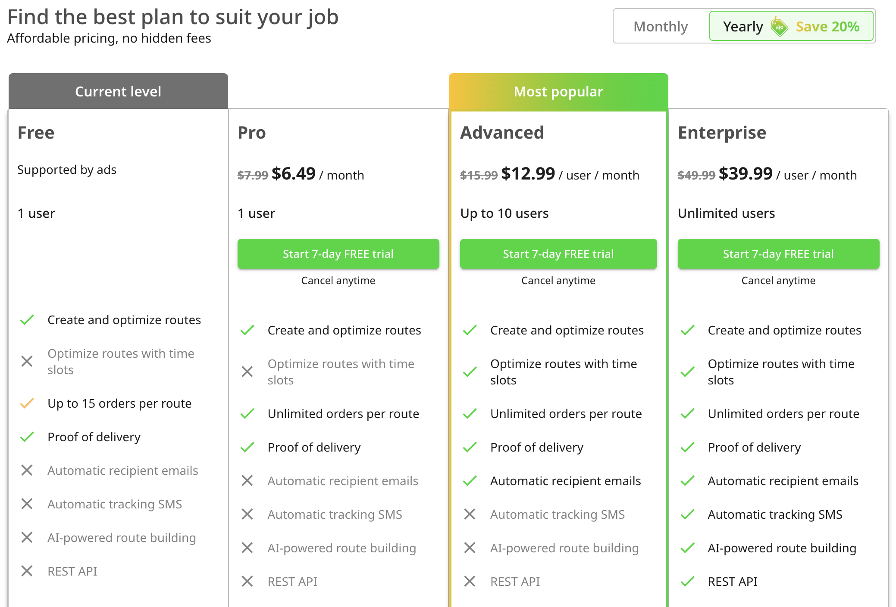
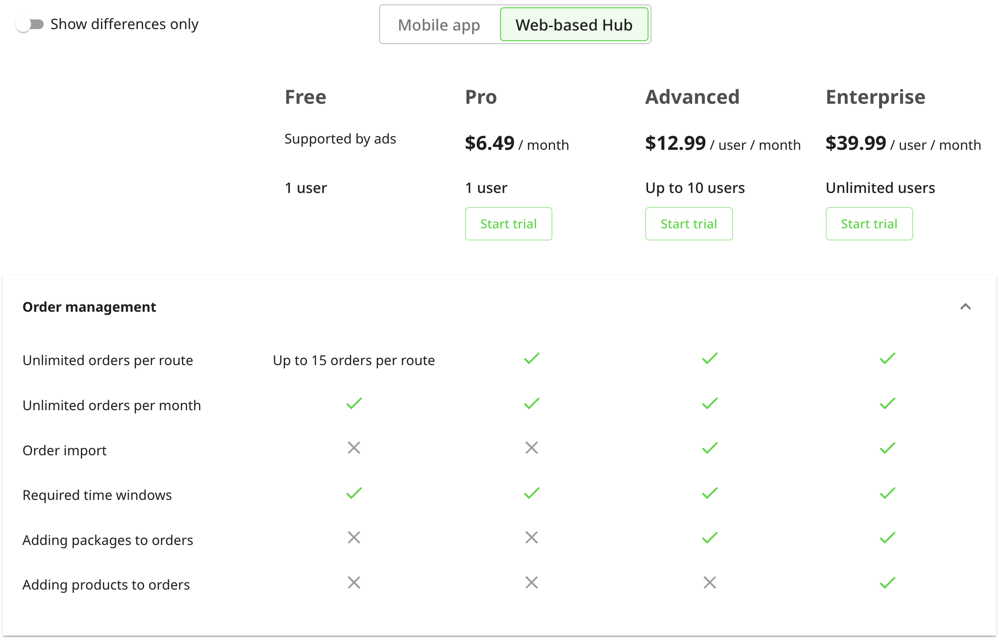
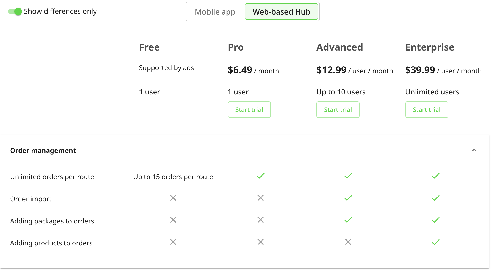
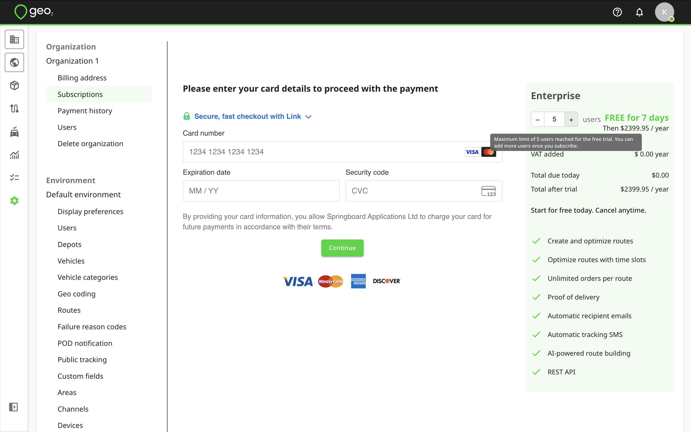
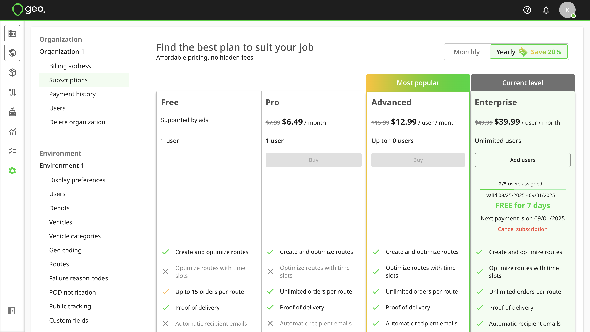
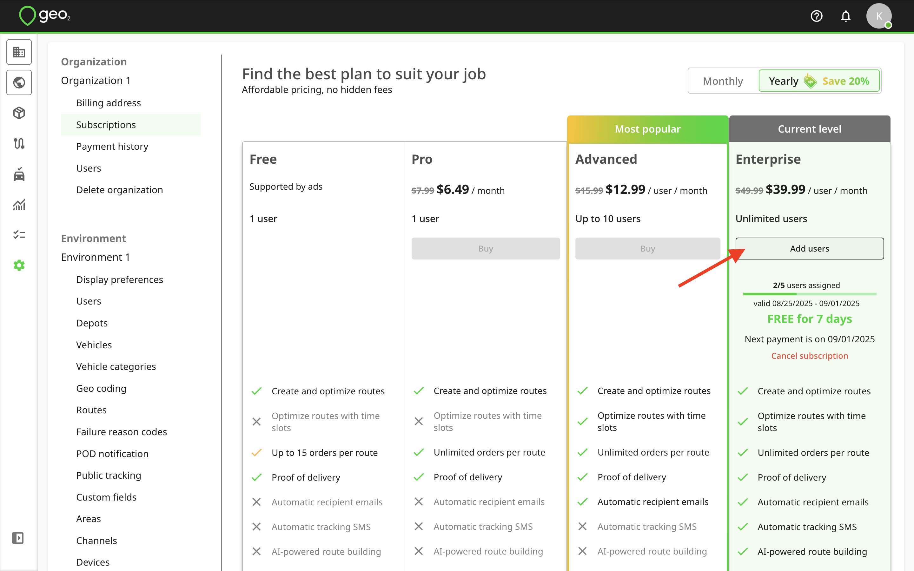
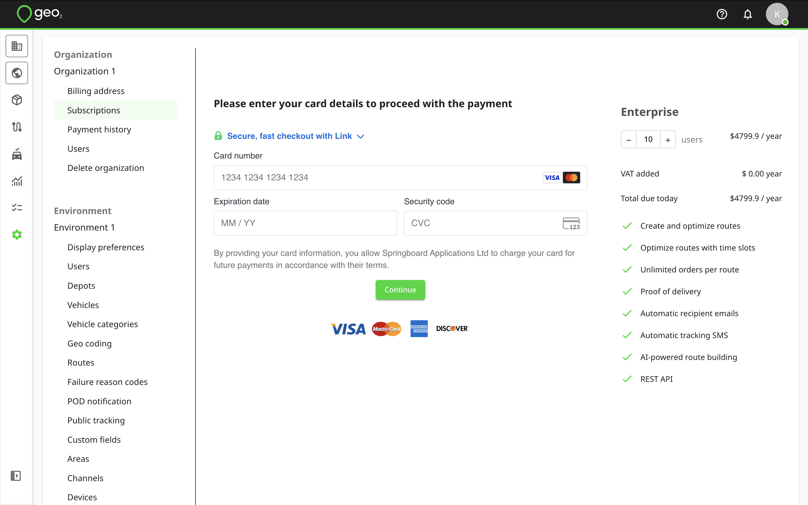
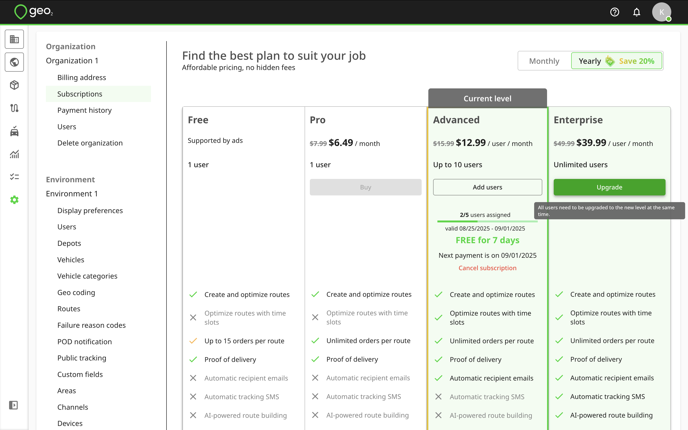
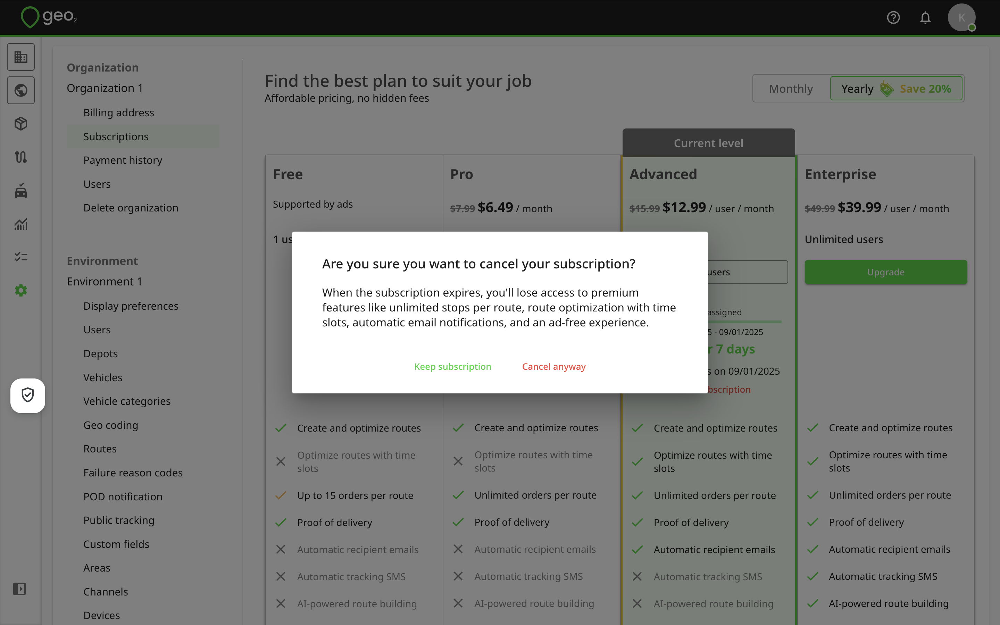
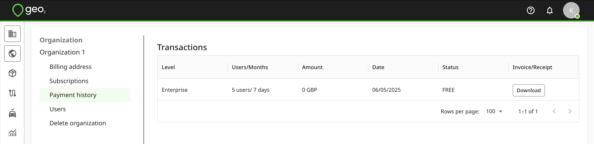

[Web-Based Hub](../Web-Based%20Hub.md)

# Hub: Subscriptions

- [Introduction](#introduction)
  - [Free Subscription Level](#free-subscription-level)
  - [7-day FREE Trial](#key-7-day-free-trial)
  - [Purchase Additional Users](#purchase-additional-users)
  - [Upgrade Subscription](#upgrade-subscription)
  - [Cancel Subscription](#cancel-subscription)
  - [Expired Subscription](#expired-subscription)
- [Payment History](#payment-history)

# Introduction

By default, for your newly created organization, **you get a Free subscription**, **no card is required**. A subscription would be automatically assigned to you.

## Free Subscription Level

With a **Free** subscription in Geo2, you get access to a solid set of core features at no cost both in the Geo2 web-based Hub and the mobile app. It is available for **one user per organization**, and additional users cannot be added on this level. The Free subscription includes:

|  **Feature Name**           |  **Description**                                                                                                                                                                                                                                                                                                                                                                                                                                                                                                                                                                                                                                                                                            |
|:----------------------------|:------------------------------------------------------------------------------------------------------------------------------------------------------------------------------------------------------------------------------------------------------------------------------------------------------------------------------------------------------------------------------------------------------------------------------------------------------------------------------------------------------------------------------------------------------------------------------------------------------------------------------------------------------------------------------------------------------------|
| Order management            | Create unlimited number of orders per month, add required time windows, assign orders to routes, check proof of delivery (POD) history both in the web-based Geo2 Hub and mobile app. Use address scanning and voice search in the mobile app for fast adding route stops.                                                                                                                                                                                                                                                                                                                                                                                                                                  |
| Route planning              | Create unlimited number of routes per month, customize route start and end points, add up to 15 orders in them, optimize routes with vehicle restrictions, and/or update planned timings on stops depending on distance and traffic information, move stops to other routes, and add driver breaks both in the web-based Hub and mobile app. Reverse and drag-and-drop stops, plan vehicle weight and volume capacities, calculate emissions produced for routes in Hub. Routes in the "Released" status are displayed for assigned drivers in the mobile app.  You can [Hub: Routes](Hub_%20Routes.md) on the map inside a route in Hub. Drivers' positions are also displayed on POD history and POD PDF. |
| Vehicle loading with photos | Efficiently load vehicles by setting parcel placements with optional photos.                                                                                                                                                                                                                                                                                                                                                                                                                                                                                                                                                                                                                                |
| App navigation              | Get directions to order addresses using the navigation app of your choice - Google Maps, Apple Maps, Waze, and others.                                                                                                                                                                                                                                                                                                                                                                                                                                                                                                                                                                                      |
| Proof of delivery           | Create planned (for an existing order in a planned route) and ad-hoc (for an existing order without a planned route or without planned order) proof of delivery (POD) with photos and signature in the mobile app.  Create successful, partially successful and failed POD's and check recorded POD's in Hub and mobile app.                                                                                                                                                                                                                                                                                                                                                                                |
| Data storage                | Store proof of delivery, order and route history up to 30 days both in the web-based Geo2 Hub and mobile app.                                                                                                                                                                                                                                                                                                                                                                                                                                                                                                                                                                                               |
| Offline data access         | Work without an internet connection in the mobile app: create routes and stops, add breaks, capture PODs, and record location data, with all offline actions syncing when back online.                                                                                                                                                                                                                                                                                                                                                                                                                                                                                                                      |
| Support                     | Contact us for some help or request a new feature.                                                                                                                                                                                                                                                                                                                                                                                                                                                                                                                                                                                                                                                          |

## 7-day FREE Trial

You can take a 7-day FREE trial of any paid subscription level (Pro, Advanced, or Enterprise) by going to Settings → Organization → Subscriptions page. You can check there the list of available features for different subscription levels for the web-based Hub and mobile app. By enabling `Show differences only` toggle, you will see only differences between subscription levels ignoring what is included equally into each of them. For example:

Geo2 offers three paid subscription levels: **Pro**, **Advanced**, and **Enterprise**, each building on top of the Free plan. Any paid subscription disables ads in Hub and the mobile app.

- **Pro** — In addition to Free features, Pro includes unlimited stops per route, unlimited data storage in Hub for routes, orders and PODs, as well as the ability to export order data.
- **Advanced** — Includes everything in Free and Pro, plus route optimization with time windows, automated POD and public tracking emails, order import via Excel (CSV), package management with scanning and validation in the mobile app, support for multiple vehicles and vehicle checks, multi-route management on a single map view, and analytics and reporting. With Advanced subscription, you can add up to 10 users to your organization.
- **Enterprise** (available for purchase in Hub only) — Includes all Free, Pro, and Advanced features, plus product-level order management, driver-to-vehicle assignment based on vehicle categories, multiple route participants, AI-powered route building, automated public tracking SMS notifications, actual stop duration tracking, multiple environments per organization (for example, testing and production), custom fields, and access to the REST API. With Enterprise subscription, you can add unlimited number of users to your organization.

For an additional cost, Enterprise customers can also request custom integrations with existing systems and 24/7 customer support. Press the `Talk to us` button to contact our Sales team.

If you take a free trial of Pro subscription, you can get 1-user subscription that is automatically assigned to you. If you take a free trial of Advanced or Enterprise subscription level, you сan get up to 5-user subscription, so you can invite up to 4 additional users to your organization. See how to [Hub: Organization Settings](Hub_%20Organization%20Settings.md). If you want to add more users, you can do it after taking a free trial by pressing the `Add users` button on Subscriptions page.

**You do not pay anything when taking a trial, it is FREE for 7 days.** By pressing `Assign subscription to users` on Success page, you will be redirected to Settings → Organization → Users to invite more people.

On Subscriptions page, your current level will be highlighted with a green background and labeled as “Current level.” Here, you can view the number of assigned subscriptions out of your total, the valid dates (from and to), and the date of your next payment.

The free trial is available as long as neither the user nor the organization have had a free trial before.

## Purchase Additional Users

It is possible to add new users to the current subscription level, for example, for seasonal workers if you are on Advanced or Enterprise subscription level.  If you are on Advanced level, you can add up to 10 users to your organization in total. If you are on Enterprise level, you are not limited in the number of users. You can press the  `Add users` button on Subscriptions page, select the number of users, and proceed with payment.

If you want to buy your subscription for a month, select the "Monthly" switcher at the top of the page.  If you want to buy new subscription for a year, make sure the "Yearly" switcher is selected at the top of the page.  When paying yearly, you can **save up to 20%.** At Geo2, subscription pricing is calculated per user added to an organization.

Once the payment is done, you will get a combined invoice/receipt on your email address.  Also, you can check your payment details in [Hub: Subscriptions](Hub_%20Subscriptions.md).

Press `Assign subscription to users` on Success payment page to be redirected to Settings → Organization → Users.  You can invite more users to assign subscriptions.  See how to [Hub: Organization Settings](Hub_%20Organization%20Settings.md).

New subscriptions will be displayed above the existing one on your current subscription level, with the number of available users and valid-from/to dates.

## Upgrade Subscription

If you currently have the Pro, or Advanced subscription, you can optionally upgrade to the Advanced, or Enterprise level accordingly.  Press the `Upgrade` button for the higher level.

You cannot select the number of months - if you currently have a monthly subscription, the upgrade will follow the monthly plan; if yearly, it will follow the yearly plan. You cannot select the number of users - all users from your current subscription level are included. Additionally, the start date cannot be changed; it will automatically be set to the current date.

On Checkout page, you will see the amount of money for unused days from your current subscription being subtracted from the total amount you pay for the subscription upgrade.

Once the payment is done, you will get a combined invoice/receipt on your email address.  Also, you can check your payment details in [Hub: Subscriptions](Hub_%20Subscriptions.md)**.**

Press `Assign subscriptions to users` to be redirected to Settings → Organization → Users.  You can invite more users to assign subscriptions.  See how to [Hub: Organization Settings](Hub_%20Organization%20Settings.md). If all subscriptions are already assigned, you will see the message about it on this page.

After successful payment, your current subscription level will be automatically updated.

## Cancel Subscription

To cancel your subscription(s), press `Cancel subscription` button on your current level below the number of users and valid dates. The prompt will be displayed to confirm your action.

Once the subscription is cancelled, only the valid from/to dates will be shown, and the next payment information will no longer be displayed.

## Expired Subscription

When your subscription expires, you'll see a prompt offering two options:

- Extend your current subscription
- Continue with a Free level subscription.

By pressing `Extend subscription`, you will be redirected to Subscriptions page where you can renew your subscription, change number of users (for Advanced or Enterprise levels) or your subscription level.

By pressing `Continue with Free subscription`, a Free level subscription will be assigned to you automatically, allowing you to keep using Geo2 with limited features. A Free level subscription is limited to **one user per organization**; all other users in your organization will lose access.

# Payment History

The history of your payments (paid, declined, pending) can be found on Payment history tab in Settings → Organization.

To download the combined invoice/receipt, press the `Download` button.

After a successful payment, **you will also be sent an email with the combined invoice/receipt**.
