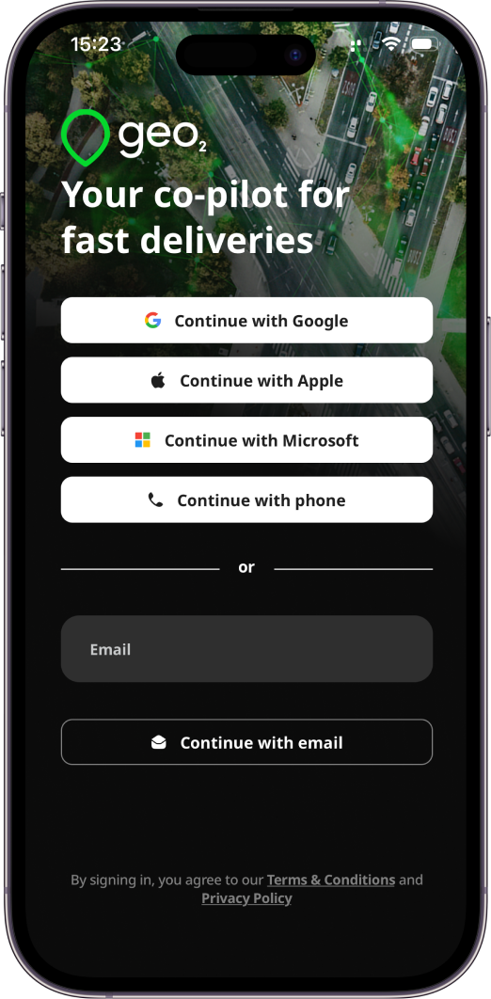
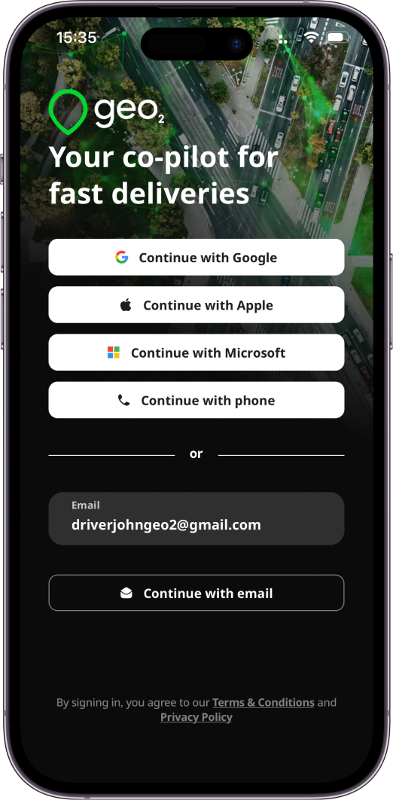
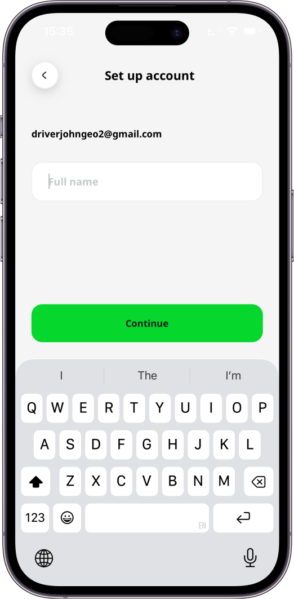
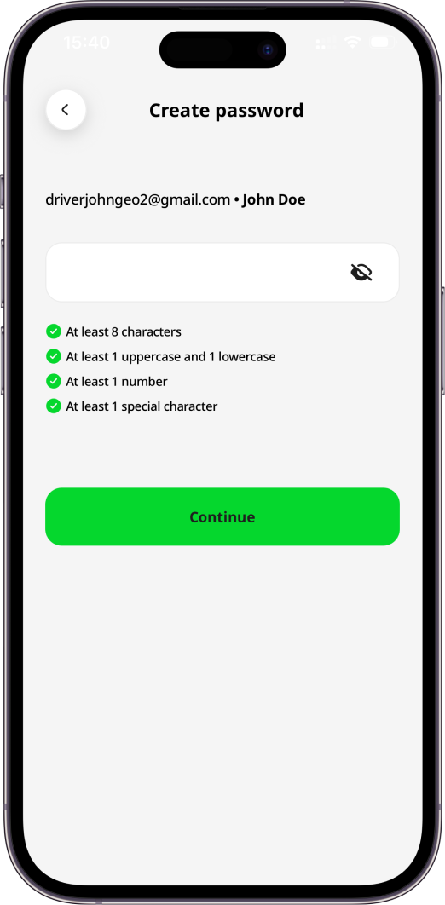
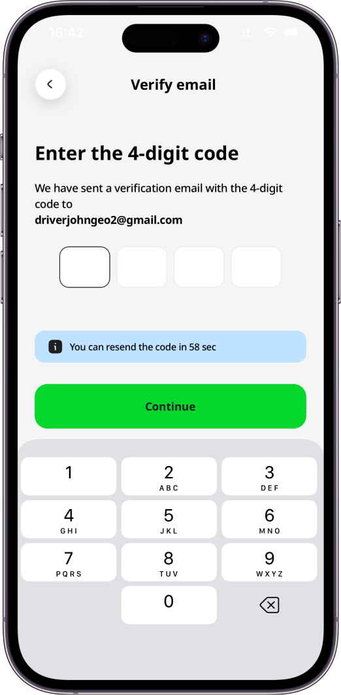
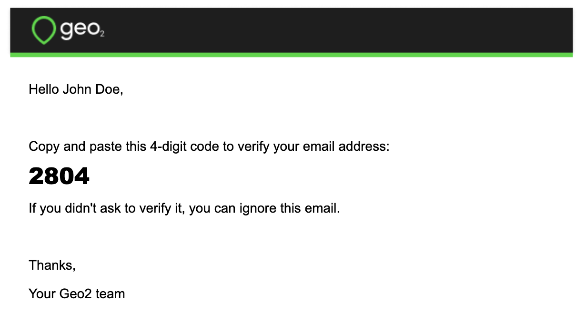
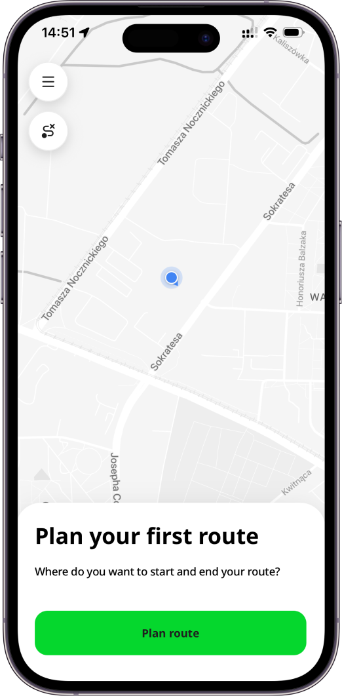
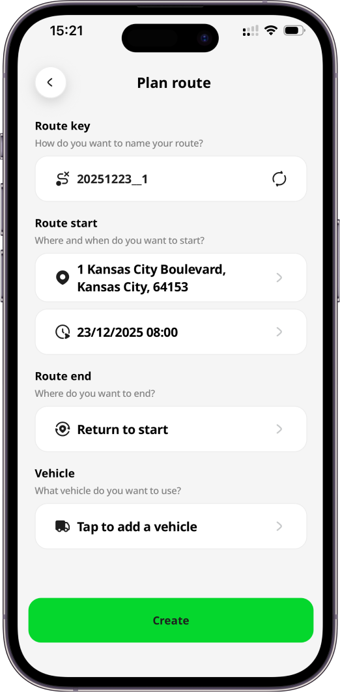
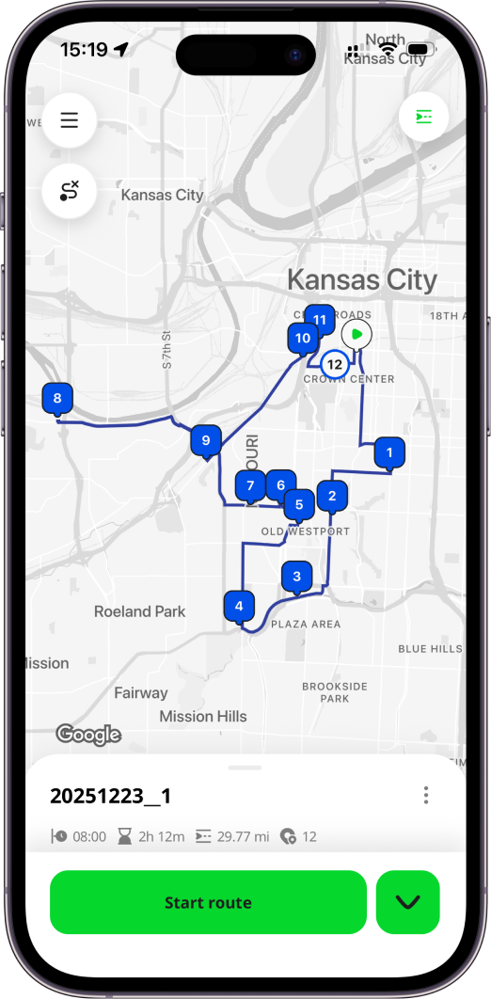
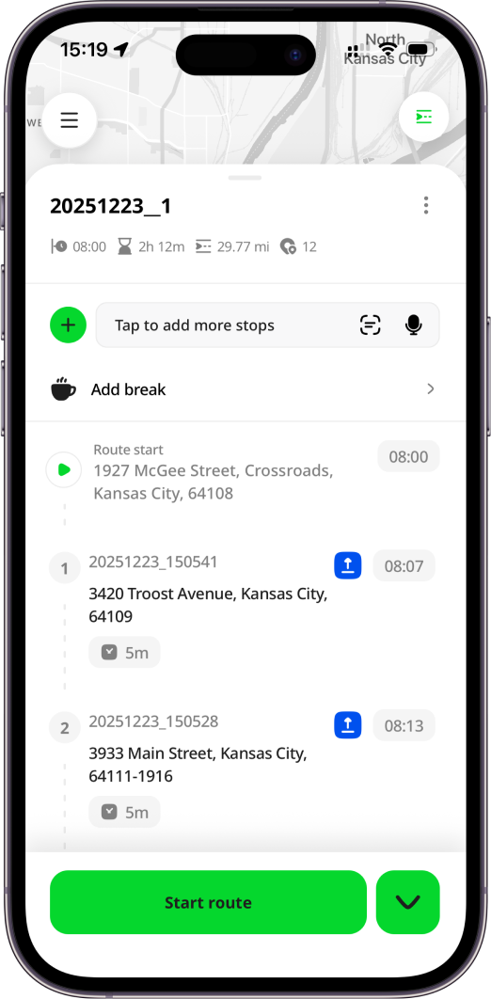

# Getting Started in Mobile App

- [Introduction](#introduction)
- [Register Account](#register-account)
  - [Verify Email](#verify-email)
- [Set Up Organization](#set-up-organization)
- [Features Included to Free Level](#features-included-to-free-level)
- [Recommended Hardware](#recommended-hardware)

# Introduction

Once the mobile app is installed on your device from[**App Store**](https://apps.apple.com/app/geo2/id1594180686) and [**Google Play**](https://play.google.com/store/apps/details?id=com.geo2.app), you can register an account and create your own [Hub: Organization Settings](Web-Based%20Hub/Hub_%20Organization%20Settings.md) to which you invite other users in the mobile app.  You have the option to authenticate either with an email address and password, mobile phone number or via an identity provider - Apple, Google, or Microsoft. You may also be invited to join other organizations.  To [Hub: Accept Invitation](Web-Based%20Hub/Hub_%20Accept%20Invitation.md), [Mobile App: Sign In](Mobile%20App/Mobile%20App_%20Sign%20In.md) to the app using the email address or mobile phone number to which the invitation has been sent.

You can use both the Geo2 web-based Hub and the mobile app, depending on your role and workflow. Both platforms support route planning and optimization, as well as order management. The mobile app is best suited for solo drivers, couriers, gig drivers, and drivers working for companies where route planning is done by a transport manager/dispatcher in Hub. Additionally, the mobile app includes Proof of Delivery (POD) and vehicle check features to capture delivery confirmations and vehicle status at route start and completion. While the mobile app allows drivers to create and optimize routes and manage orders, the Hub offers advanced features for larger-scale operations, such as bulk order import via Excel (CSV), managing multiple routes on a single map, analytics and reporting, and AI-powered route building.

# Register Account

To create your account, provide your email address and press `Continue with email` button. Alternatively, you can press the buttons for other authentication providers in order to authenticate with your existing Google, Microsoft, or Apple identity or mobile phone number. Learn more about registration in [Mobile App: Register](Mobile%20App/Mobile%20App_%20Register.md).

If you provide an email address and press `Continue with email`, the system checks if the email is already registered. If it is a new email address, you will be asked to set up your account by providing a full name. It will be shown to other users within the organization and to recipients on Proof of Delivery (POD) page.

By pressing the `Continue` button, you will be redirected to create your password. The password should contain at least 8 characters, 1 uppercase and lowercase, 1 number and 1 special character. Your email and password enable you to sign in to Geo2 mobile app and Hub.

## Verify Email

If you register an account using an email and password, you need to verify it. By pressing the `Continue` button, you are required to confirm your email address before you can fully use the application.  You will see a prompt for you to check your inbox for a verification code sent to the provided email address. Copy the code and paste it to the form in the mobile app:

# Set Up Organization

Once your email is verified, you can continue working in the mobile app.  If you are not invited to any organization, the default organization will be created. **Free level subscription** will be assigned to you - **no payment details are required**.

You can start working with the app immediately:

- Plan routes
- Add stops using address search, scanning, and voice search
- Load vehicle with photos
- Start and complete routes
- Navigate to stops using your preferred navigation app (Waze, Google Maps, Apple Maps, etc.)
- Create PODs and vehicle checks with signatures and photos

After creating your first route and adding stops, load vehicle with optional package photos, start the route and navigate to stops with your preferred navigation app, create PODs, or use the `Complete` button to quickly mark stops as done.

# Features Included to Free Level

With a **Free** subscription in Geo2, you get access to a solid set of core features at no cost both in the Geo2 web-based Hub and the mobile app. It is available for **one user per organization**, and additional users cannot be added on this level. The Free subscription includes:

- **Order management** (Hub and mobile app): Create unlimited orders each month, set time windows, assign them to routes, and view proof of delivery (POD) history in both the web Hub and mobile app. Use address scanning and voice search in the mobile app for fast adding route stops.
- **Route planning** (Hub and mobile app): Build unlimited routes with up to 15 orders per route, optimize them with vehicle restrictions, adjust stops and timings, plan driver breaks.
- **Vehicle loading** (mobile app): Set package placements in the vehicle with optional photos.
- **Navigation** (mobile app):Use your preferred navigation app (e.g., Google Maps, Apple Maps, Waze) for turn-by-turn directions.
- **Proof of delivery** (Hub and mobile app): Create PODs with photos and signatures (planned or ad-hoc) in the app, store up to 30 days of data both in Hub and the mobile app.
- **Offline mode** (mobile app): Work without an internet connection: create routes and stops, add breaks, capture PODs, and record location data, with all offline actions syncing when back online.
- **Support:** Contact the Geo2 team for help or to request new features.

This gives you the essentials for planning, managing, and executing routes effectively before upgrading to a paid level.

On each subscription level (including Free), you can use both the Hub and mobile app. The same limitations apply to both platforms.

# Recommended Hardware

> [!CAUTION]
> Due to the large number of available mobile devices, it is not possible to test compatibility with all of them.  We recommend that a sample device is sourced and tested for compatibility with the application before any larger purchase.

The minimum supported operating system versions are:

- Android 11
- iOS 16.1

On any device, it is important to ensure spare hardware capacity is available, both in terms of storage and not overloading the device with a large number of running apps.  Here are examples of device models, which have been successfully used with Geo2:

- Google Pixel 7 Pro, Android 14
- Oppo Find X5 Pro
- Samsung Galaxy A05
- Samsung S20, Android 12 and up
- Xiaomi Poco X3 Pro, Android 12
- iPhone 12, 12 Pro, 12 Pro Max
- iPhone 13, 13 Pro, 13 Pro Max
- iPhone 14, 14 Pro, 14 Pro Max

Aim to meet or exceed the hardware specifications of these devices.
