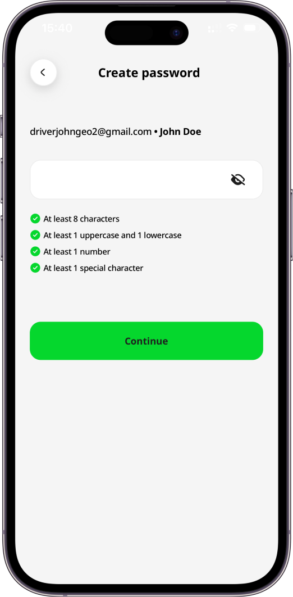
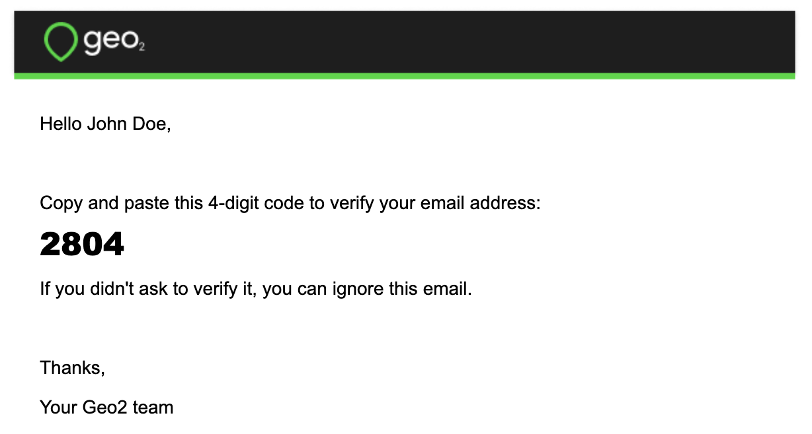

# Getting Started

- [Getting Started in Hub](#getting-started-in-hub)
  - [Register Account](#register-account)
  - [Verify Email](#verify-email)
  - [Set Up Organization](#set-up-organization)
  - [Install Geo2 Mobile App](#install-geo2-mobile-app)
    - [Important Data Notice](#important-data-notice)
  - [Recommended Hardware](#recommended-hardware)
- [Getting Started in Mobile App](#getting-started-in-mobile-app)
  - [Register Account](#register-account)
  - [Verify Email](#verify-email)
  - [Set Up Organization](#set-up-organization)
- [Features Included to Free Level](#features-included-to-free-level)

# Getting Started in Hub

To create a Geo2 user account, register with a browser at [**Geo2 Hub**](https://hub.geo2.com/en-GB/auth/register).  If you are joining an existing organization, the admin of that organization needs to add your user account and assign a subscription to you.  Learn how to [Hub: Accept Invitation](Web-Based%20Hub/Hub_%20Accept%20Invitation.md)

## Register Account

On Registration page, after you have completed the requested details, press `Register` to create an account, using the password you have specified.  Alternatively, you can press the buttons for other authentication providers in order to authenticate with your existing Google, Microsoft, or Apple identity or mobile phone number.  Learn more about registration in [Hub: Register](Web-Based%20Hub/Hub_%20Register.md). 

## Verify Email

If you register an account using an email and password, you need to verify it.  You will get a verification email with a one-time code that you need to copy and paste into the form in Hub.  Learn more about [Hub: Register](Web-Based%20Hub/Hub_%20Register.md).

## Set Up Organization

Once your account is created and the email is verified, you need to set up your Geo2 organization.  We ask for information about your company to set up an organization for you.

By pressing the `Continue` button, you will be redirected to Set up first depot page. This depot can be optionally used during route planning. You can add more depots later in Settings → Environment → [Hub: Depots Settings](Web-Based%20Hub/Hub_%20Environment%20Settings/Hub_%20Depots%20Settings.md).

You can start searching for the address by typing it in the Address line 1 field or giving access to your current geolocation.  Once the address is provided, you can drag and drop the pin on the map to adjust the address. By pressing the `Continue` button, your organization, environment, and its first depot will be created.

**Organization** is a group of users who share a subscription and collaborate on data in one or more environments. By default, for your newly created organization, **you get a** **Free subscription, no card required.**

**Environments** let you represent teams within a single company or provide separate spaces for testing and productive use.

Examples:

- A large company (organization) with smaller teams (environments) working on different projects.
- A holding company (organization) with smaller companies (environments) working in different spheres.
- A middle-size company (organization) with several depots (environments).

Next, you can select one of the following options to start working with Geo2 Hub:

- **Create route** (recommended). Add stops and plan your first route. Learn more about [Hub: Routes](Web-Based%20Hub/Hub_%20Routes.md).
- **Create order**. Create your first order with advanced options to add to a route later. Learn more about [Hub: Order Creation and Editing](Web-Based%20Hub/Hub_%20Orders/Hub_%20Order%20Creation%20and%20Editing.md).
- **Invite more people**. Invite more people to your organization and assign their roles. Learn more about [Hub: Organization Settings](Web-Based%20Hub/Hub_%20Organization%20Settings.md).
- **Customize settings**. Add more depots and vehicles, create templates for recipient notifications. Explore your [Hub: Environment Settings](Web-Based%20Hub/Hub_%20Environment%20Settings.md).

When orders are created and added to a route, the route can be released to a driver.  It will be displayed in the mobile app for the assigned driver.

## Install Geo2 Mobile App

By pressing your avatar and selecting the `Profile` option, you will be redirected to Profile menu. Press on `Mobile app` tab. There is a QR code to install the app for iOS or Android.  Depending on the OS of your device, you will either be redirected to App Store (if iOS) or Google Play (if Android).

> [!CAUTION]
> ### Important Data Notice
>
> Before proceeding with a mobile app update, make sure your data are synchronised to guard against potential data loss.

The mobile app is available from[**App Store**](https://apps.apple.com/app/geo2/id1594180686) and [**Google Play**](https://play.google.com/store/apps/details?id=com.geo2.app).

## Recommended Hardware

> [!CAUTION]
> Due to the large number of available mobile devices, it is not possible to test compatibility with all of them.  We recommend that a sample device is sourced and tested for compatibility with the application before any larger purchase.

The minimum supported operating system versions are:

- Android 11
- iOS 16.1

On any device, it is important to ensure spare hardware capacity is available, both in terms of storage and not overloading the device with a large number of running apps.  Here are examples of device models, which have been successfully used with Geo2:

- Google Pixel 7 Pro, Android 14
- Oppo Find X5 Pro
- Samsung Galaxy A05
- Samsung S20, Android 12 and up
- Xiaomi Poco X3 Pro, Android 12
- iPhone 12, 12 Pro, 12 Pro Max
- iPhone 13, 13 Pro, 13 Pro Max
- iPhone 14, 14 Pro, 14 Pro Max

Aim to meet or exceed the hardware specifications of these devices.

# Getting Started in Mobile App

Once the mobile app is installed on your device from[**App Store**](https://apps.apple.com/app/geo2/id1594180686) and [**Google Play**](https://play.google.com/store/apps/details?id=com.geo2.app), you can register an account and create your own [Hub: Organization Settings](Web-Based%20Hub/Hub_%20Organization%20Settings.md) to which you invite other users in the mobile app.  You have the option to authenticate either with an email address and password, mobile phone number or via an identity provider - Apple, Google, or Microsoft. You may also be invited to join other organizations.  To [Hub: Accept Invitation](Web-Based%20Hub/Hub_%20Accept%20Invitation.md), [Mobile App: Sign In](Mobile%20App/Mobile%20App_%20Sign%20In.md) to the app using the email address or mobile phone number to which the invitation has been sent.

## Register Account

To create your account, provide your email address and press `Continue with email` button. Alternatively, you can press the buttons for other authentication providers in order to authenticate with your existing Google, Microsoft, or Apple identity or mobile phone number. Learn more about registration in [Mobile App: Register](Mobile%20App/Mobile%20App_%20Register.md).

If you provide an email address and press `Continue with email`, the system checks if the email is already registered. If it is a new email address, you will be asked to set up your account by providing a full name. It will be shown to other users within the organization and to recipients on Proof of Delivery (POD) page.

By pressing the `Continue` button, you will be redirected to create your password. The password should contain at least 8 characters, 1 uppercase and lowercase, 1 number and 1 special character. Your email and password enable you to sign in to Geo2 mobile app and Hub.

## Verify Email

If you register an account using an email and password, you need to verify it. By pressing the `Continue` button, you are required to confirm your email address before you can fully use the application.  You will see a prompt for you to check your inbox for a verification code sent to the provided email address. Copy the code and paste it to the form in the mobile app:

## Set Up Organization

Once your email is verified, you can continue working in the mobile app.  If you are not invited to any organization, the default organization will be created. **Free level subscription** will be assigned to you - **no payment details are required**.

You can start working with the app immediately:

- Plan routes
- Add stops using address search, scanning, and voice search
- Load vehicle with photos
- Start and complete routes
- Navigate to stops using your preferred navigation app (Waze, Google Maps, Apple Maps, etc.)
- Create PODs and vehicle checks with signatures and photos

After creating your first route and adding stops, load vehicle with optional package photos, start the route and navigate to stops with your preferred navigation app, create PODs, or use the `Complete` button to quickly mark stops as done.

# Features Included to Free Level

With a **Free** subscription in Geo2, you get access to a solid set of core features at no cost both in the Geo2 web-based Hub and the mobile app. It is available for **one user per organization**, and additional users cannot be added on this level. The Free subscription includes:

- **Order management** (Hub and mobile app): Create unlimited orders each month, set time windows, assign them to routes, and view proof of delivery (POD) history in both the web Hub and mobile app. Use address scanning and voice search in the mobile app for fast adding route stops.
- **Route planning** (Hub and mobile app): Build unlimited routes with up to 15 orders per route, optimize them with vehicle restrictions, adjust stops and timings, plan driver breaks.
- **Vehicle loading** (mobile app): Set package placements in the vehicle with optional photos.
- **Navigation** (mobile app):Use your preferred navigation app (e.g., Google Maps, Apple Maps, Waze) for turn-by-turn directions.
- **Proof of delivery** (Hub and mobile app): Create PODs with photos and signatures (planned or ad-hoc) in the app, store up to 30 days of data both in Hub and the mobile app.
- **Offline mode** (mobile app): Work without an internet connection: create routes and stops, add breaks, capture PODs, and record location data, with all offline actions syncing when back online.
- **Support:** Contact the Geo2 team for help or to request new features.

This gives you the essentials for planning, managing, and executing routes effectively before upgrading to a paid level.
