[Mobile App](../Mobile%20App.md)

# Mobile App: Settings

- [Introduction](#introduction)
- [Routes Settings](#routes-settings)
  - [Stop Duration](#stop-duration)
  - [Start Time](#start-time)
  - [Vehicles](#vehicles)
  - [Vehicle Checks](#vehicle-checks)
  - [Failure Reason Codes](#failure-reason-codes)
- [Recipient Notifications Settings](#recipient-notifications-settings)
  - [POD Notifications](#pod-notifications)
  - [Public Tracking Notifications](#public-tracking-notifications)
- [Users Settings](#users-settings)
- [Device Settings](#device-settings)
- [Account Settings](#account-settings)

# Introduction

In Settings, you can edit your organization (Users and Subscriptions settings), environment (Routes and Recipient notifications settings) and device settings.

**Organization** is a group of users who share a subscription and collaborate on data in one or more environments. **Environments** let you represent teams within a single company or provide separate spaces for testing and productive use.

Examples:

- A large company (organization) with smaller teams (environments) working on different projects.
- A holding company (organization) with smaller companies (environments) working in different spheres.
- A middle-size company (organization) with several depots (environments).

As a Free level user, you will have only 1 environment. If you want to use more environments for different purposes, [**upgrade to Enterprise in Geo2 Hub**](https://hub.geo2.com/en-GB/auth/signin).

# Routes Settings

In the Routes settings, you can select whether distance, length, or weight is shown in metric or imperial units, set default stop duration and route start time, add vehicles, enable vehicle checks on route start and end, and update failure reason codes for POD’s.

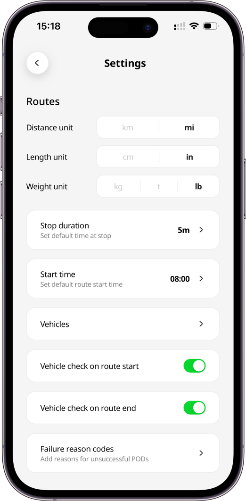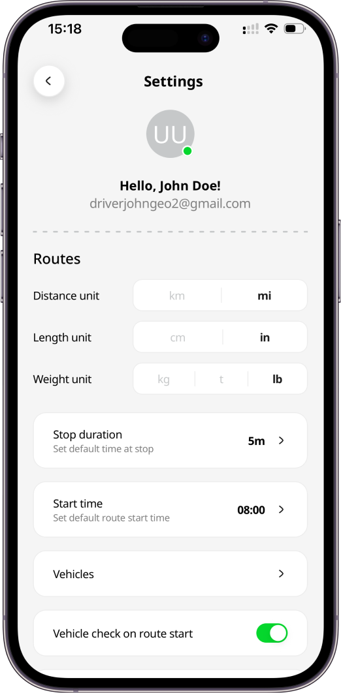

## Stop Duration

Stop duration means the default amount of time the delivery vehicle is expected to remain at a route stop.  This is used when orders are first brought into a route and, together with drive times, stop durations are intended to lead to route durations that are more realistic than if only drive time was considered.

Once a new organization is created, by default, the stop duration is set to 5 minutes. You can click on the setting to put your custom duration. Press `Confirm` to save changes.

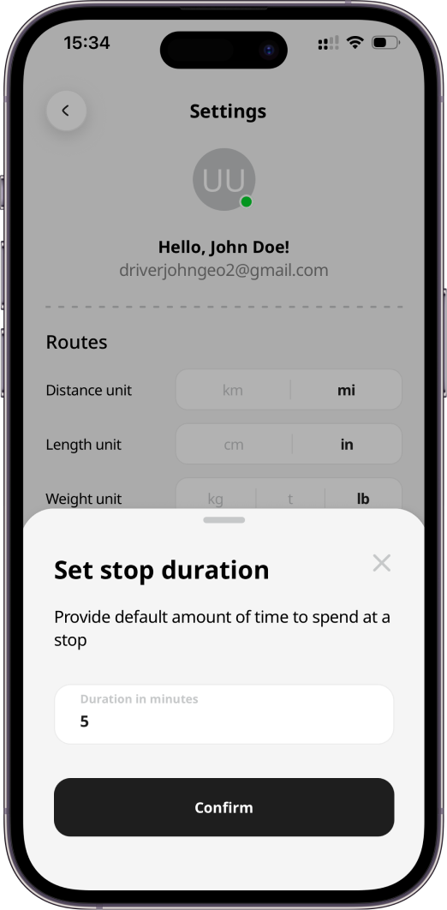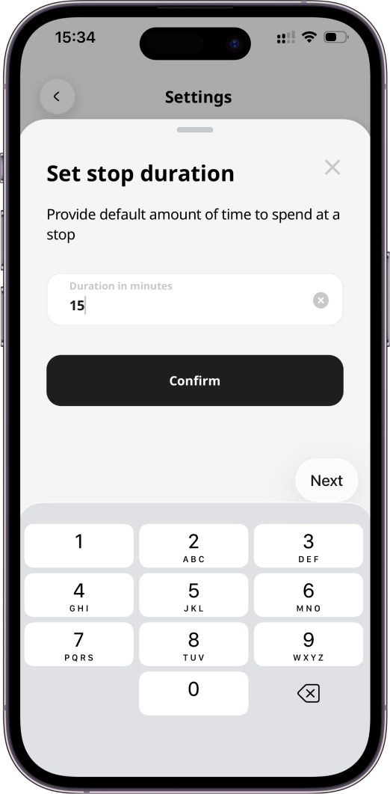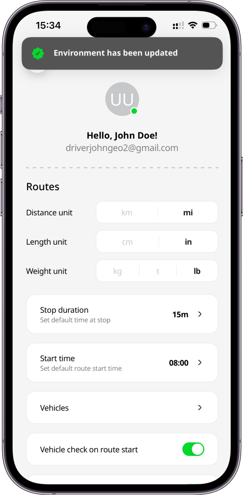

## Start Time

The setting means the default route start time, i.e. the time when a vehicle sets off from the depot.

Once a new organization is created, by default, the start time is set to 08:00. You can click on the setting to add your custom start time. Press `Update` to save changes.

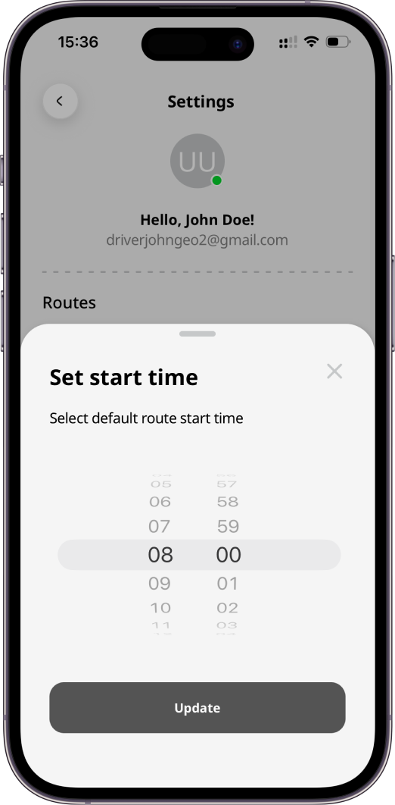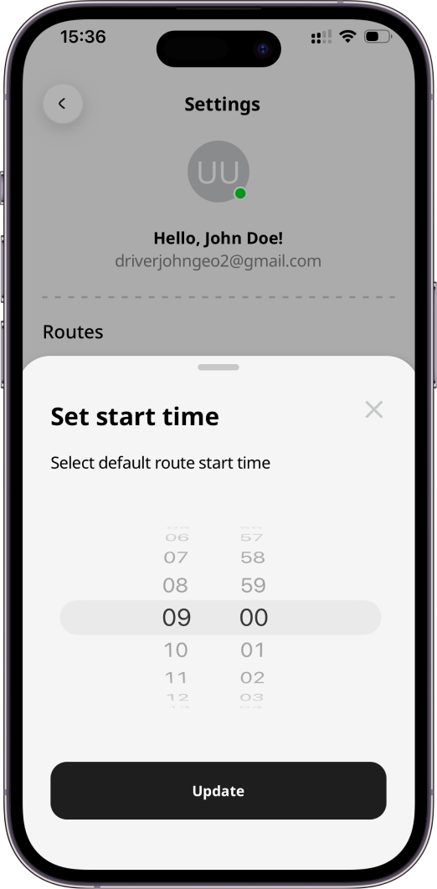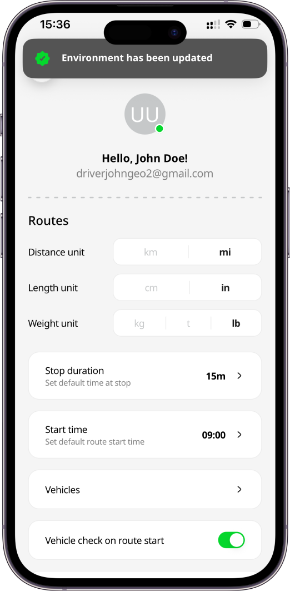

## Vehicles

Vehicles are assigned to deliver routes with orders.  You can add vehicles either one by one by pressing the `Add vehicle` button or all at once by pressing the `Import` button in Geo2 Hub → [Hub: Environment Settings](../Web-Based%20Hub/Hub_%20Environment%20Settings.md).

By pressing the `Add vehicle` button in the app, you will see the dialog to fill in the information.  Required fields are Key and Type.  All other fields are optional. By pressing the `Measures` button, you will see additional fields like Gross weight, Height, Width, and Length.

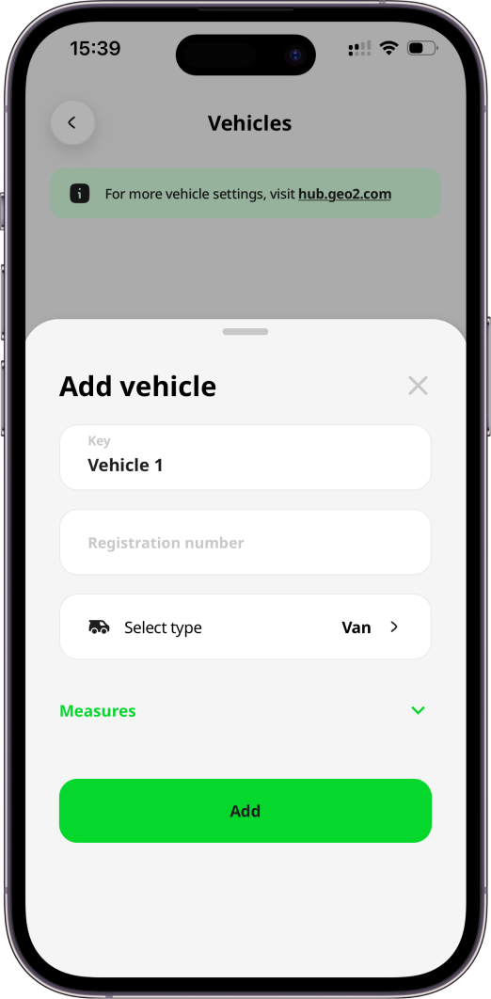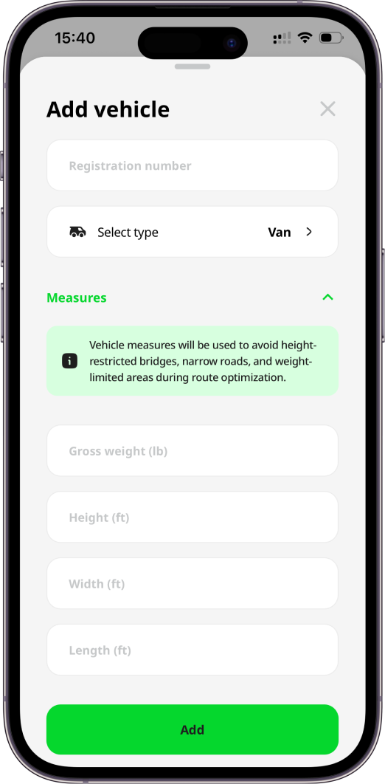

The properties of each vehicle are:

|  **Property**    |  **Description**                                                                                                                                                                                                                                                                                                                                          |  **Mandatory**    |
|:-----------------|:----------------------------------------------------------------------------------------------------------------------------------------------------------------------------------------------------------------------------------------------------------------------------------------------------------------------------------------------------------|:------------------|
| Key              | Your unique identifier for the vehicle in this environment, for example, Vehicle 1. It is used for displaying vehicles for route assignment and vehicle check creation.                                                                                                                                                                                   | Yes               |
| Registration     | Vehicle registration number to help identify your vehicle, for example, ABCD012.                                                                                                                                                                                                                                                                          | No                |
| Type             | Vehicle type used to consider average speed for route optimization and planned timing adjustments - truck, van, car, motorbike, bicycle.                                                                                                                                                                                                                  | Yes               |
| Gross weight     | Number to specify the maximum vehicle weight in the weight units specified in Routes → Weight unit, for example, 22000. It is considered for route optimization and calibration with vehicle restrictions.                                                                                                                                                | No                |
| Height           | Number to specify the maximum vehicle height based on the length units specified in in Routes → Length unit, for example, 9. This is considered for route optimization and calibration with vehicle restrictions.   For metric environment settings (cm), the value is in metres.   For imperial environment settings (in), the value is in feet. | No                |
| Width            | Number to specify the maximum vehicle width based on the length units in Routes → Length unit, for example, 9. This is considered for route optimization and calibration with vehicle restrictions.   For metric environment settings (cm), the value is in metres.   For imperial environment settings (in), the value is in feet.               | No                |
| Length           | Number to specify the maximum vehicle length based on the length units specified in Routes → Length unit, for example, 9. This is considered for route optimization and calibration with vehicle restrictions.   For metric environment settings (cm), the value is in metres.   For imperial environment settings (in), the value is in feet.    | No                |

Once information is provided, press the `Add` button to save changes.  You can edit vehicle properties by clicking on it.  Remember to press the `Update` button to save changes.

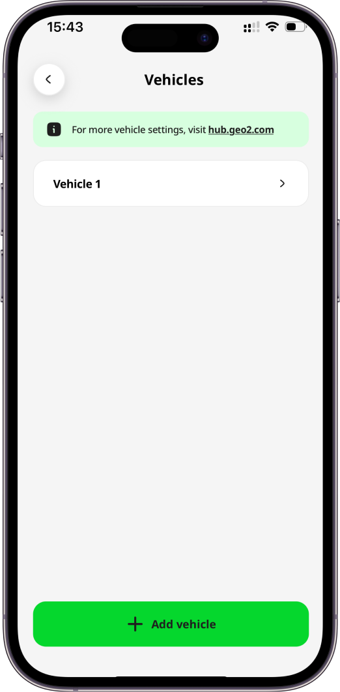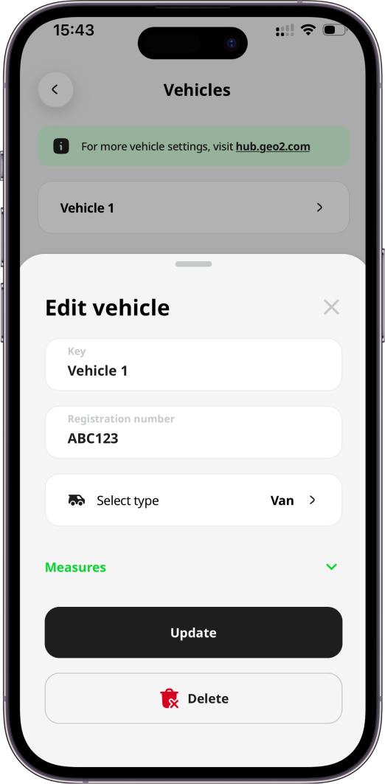

You can select a vehicle to `Delete` it.  For data integrity, it is best to not delete a vehicle once it has started to be used.

## Vehicle Checks

You can activate vehicle check in the mobile app when the route is being started and/or completed by enabling/disabling the Vehicle check on route start/end toggle. Learn more about [Mobile App: Vehicle Checks](Mobile%20App_%20Vehicle%20Checks.md).

## Failure Reason Codes

Failure reason codes let you classify reasons for failed deliveries/collections and are available in the mobile app when recording a POD.  Once an environment is created, the first 8 default failure reason codes are added automatically.  Thus, you can create a proof of delivery in the mobile app in a failed or partially successful status.

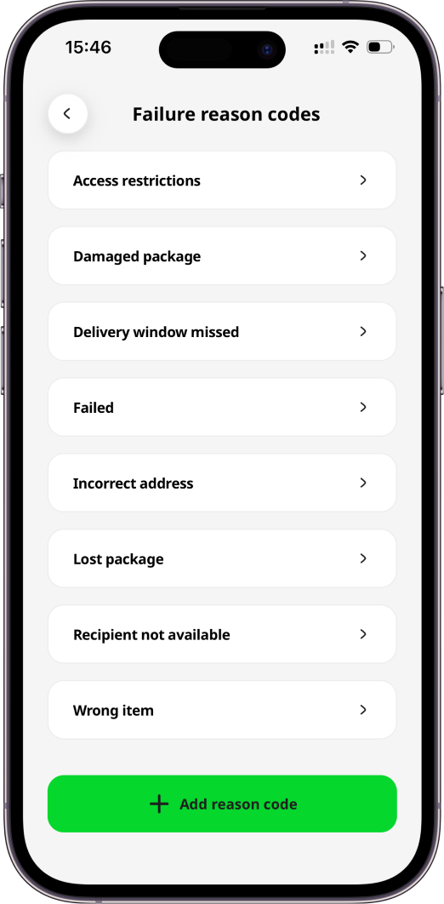

To add a failure reason code, press the `Add reason code` button.  A prompt will be shown to specify the details of the new failure reason code.  Both fields are required.  The Reason code field value will be displayed to recipients then on public POD page and POD PDF. The Description field is for internal usage only. To save changes, press the `Add` button.

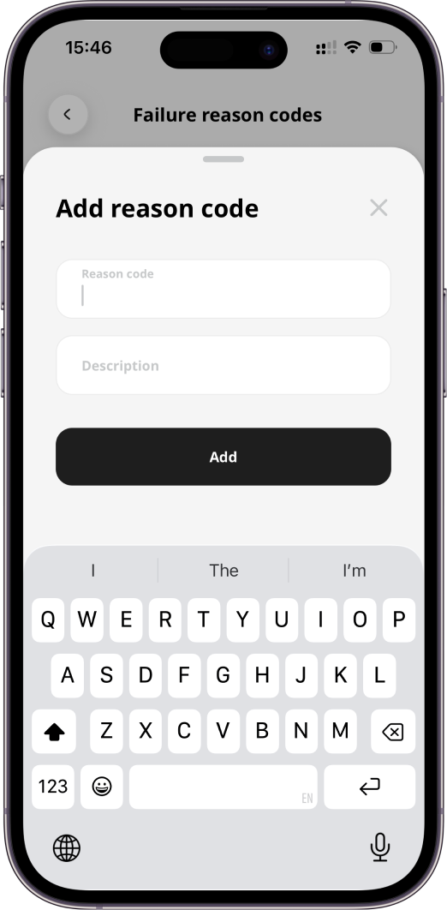

To edit a reason code, click on it.   Remember to press the `Update` button to save any changes.

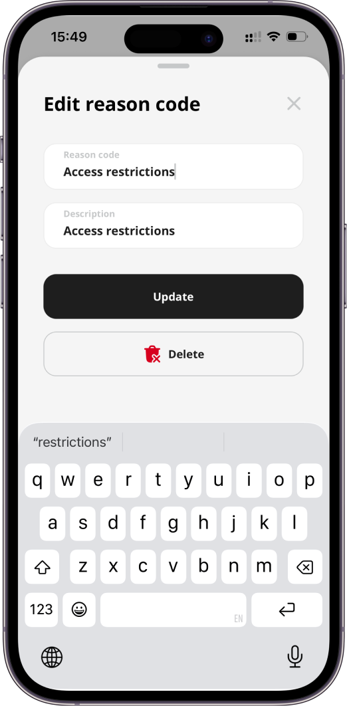

You can select a reason code to `Delete` it.  For data integrity, it is best to not delete a reason code once it has started to be used. It is not possible to delete all reason codes as it will impact a POD creation. Your environment needs at least 1 added failure reason code.

# Recipient Notifications Settings

A recipient can be sent emails with a link to track an order delivery progress and an order POD.

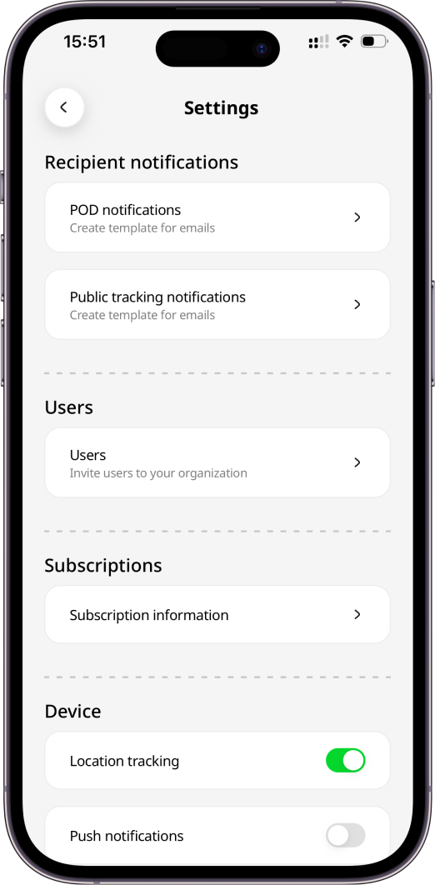

## POD Notifications

A recipient can be sent an email with an order POD - both automatically when the POD is recorded and manually at any time from Geo2 Hub. The sender address of email notifications is [noreply@geo2.com](mailto:noreply@geo2.com) if there is no indicated Sender name at Geo2 Hub.  Learn more about the [Hub: Environment Settings](../Web-Based%20Hub/Hub_%20Environment%20Settings.md).

Here are the configurable settings in the app:

|  **Setting**            |  **Description**                                                                                                                                                                           |
|:------------------------|:-------------------------------------------------------------------------------------------------------------------------------------------------------------------------------------------|
| Successful/Failed       | Settings from the relevant section will be used in the event of a successful/partially successful/failed delivery/collection.                                                              |
| Allow sending of emails | If selected, POD messages will be sent automatically to a recipient email address once a POD is recorded.                                                                                  |
| Attach PDF              | Attach a PDF document with POD details to the message.                                                                                                                                     |
| Subject                 | Subject line of notifications.  You can use these tokens for POD emails:   **{CONTACT\_NAME}** - recipient name   **{ORDER\_KEY}** - order key                                     |
| Body                    | Body of notifications.  You can use these tokens for POD emails:   **{CONTACT\_NAME}** - recipient name   **{ORDER\_KEY}** - order key   **{PUBLIC\_POD}** - POD tracking link |

Once all information is provided, click the `Update` button to save changes.

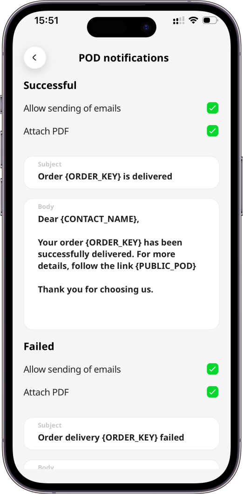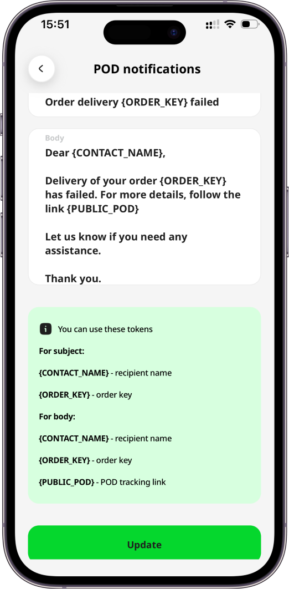

Once a POD is created and an order has a recipient email address, the POD notification email will be sent (if it was enabled in Settings).

## Public Tracking Notifications

It's possible for external users such as recipients to optionally track the progress of their orders on a public web page.  Public tracking links can be sent via email and SMS notifications (available for [Hub: Environment Settings](../Web-Based%20Hub/Hub_%20Environment%20Settings.md)).  The sender address of email notifications is [noreply@geo2.com](mailto:noreply@geo2.com) if there is no indicated Sender name at Geo2 Hub.

Here are the configurable settings in the app:

|  **Setting**                     |  **Description**                                                                                                                                                                                                                                                                                                                                                                                                                                            |
|:---------------------------------|:------------------------------------------------------------------------------------------------------------------------------------------------------------------------------------------------------------------------------------------------------------------------------------------------------------------------------------------------------------------------------------------------------------------------------------------------------------|
| Tracking email enabled on status | Send an email notification to the recipient, in which you can include the tracking page address, to enable them to track the order prior to delivery/collection.  The possible triggers are:   **None** - Do not send emails.   **Released** - When the order is assigned to a released route.   **In Transit** - When the route, to which the order has been assigned, has been started.                                                       |
| Subject                          | Subject for the notification email.  You can use these tokens for Public tracking emails:   **{CONTACT\_NAME}** - recipient name   **{ORDER\_KEY}** - order key                                                                                                                                                                                                                                                                                     |
| Body                             | Body of the notification email.  Ensure that the wording of the email is appropriate for the trigger you have configured.  You can use the next tokens for an email notification:   **{CONTACT\_NAME}** - recipient name   **{ORDER\_KEY}** - order key   **{PUBLIC\_TRACKING}** - public tracking link                                                                                                                                         |
| Disclose calculated ETA          | On Public tracking page, when an order has not been delivered/collected yet, show a calculated ETA based on the last known vehicle position.  This can be expressed as a range.  The calculated ETA is likely to fluctuate as the route progresses and you may find it too volatile for practical use.  When the option is not enabled or when tracking data for the route is not available, the committed time for the order is displayed instead, if set. |
| Disclose stop position           | On Public tracking page, when an order has not been delivered/collected yet, show the last delivered stop on the route, giving the recipient an indication of how far away the delivery vehicle is from them in terms of the number of stops.                                                                                                                                                                                                               |
| Disclose vehicle position        | On Public tracking page, when an order has not been delivered/collected yet, show the last known vehicle position on the map.                                                                                                                                                                                                                                                                                                                               |

Once the route status changes to the configured value (e.g. In Transit), an email notification with a public tracking link will be sent to the recipient's email address.  For this to work, it is important that the recipient’s contact details (email address and mobile phone number) are specified in the order.

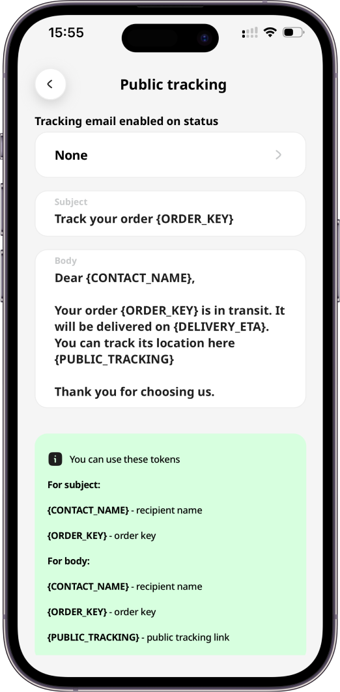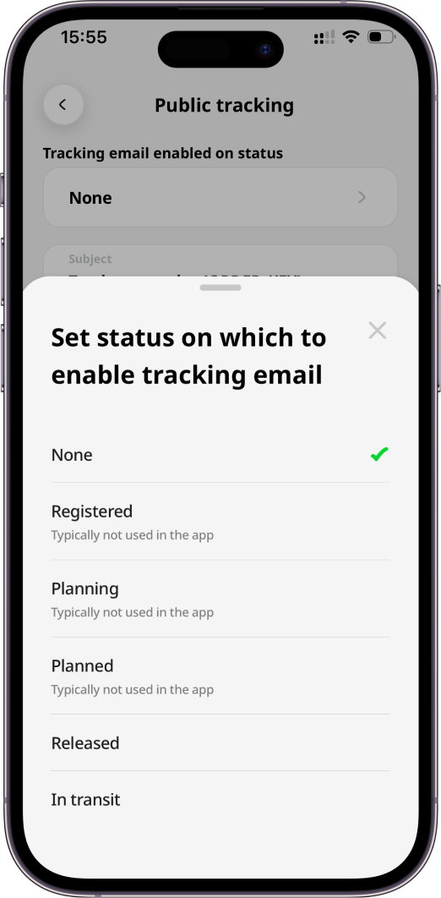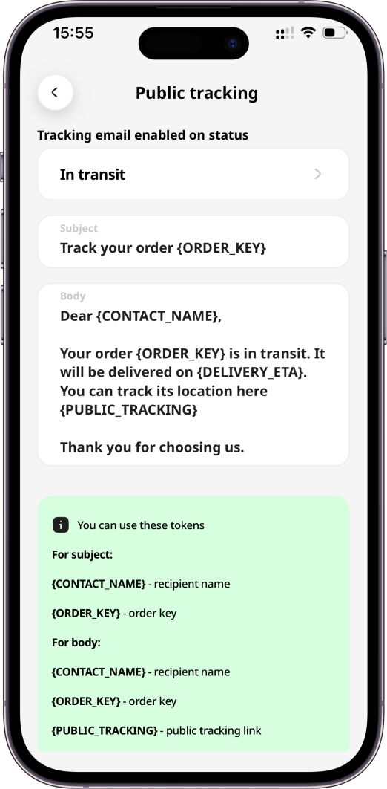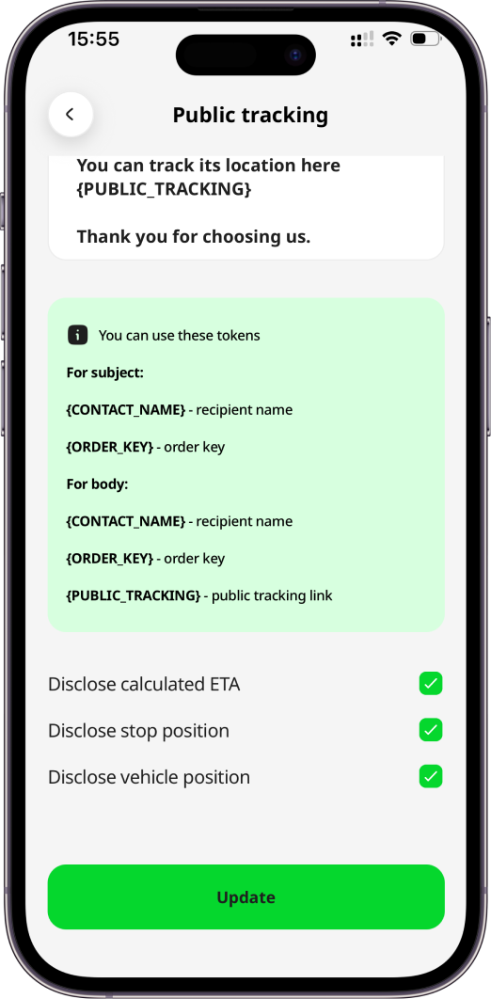

# Users Settings

If you are on a Free subscription level, you will see only your user. It is possible to add new users to the current subscription level in [**Geo2 Hub**](https://hub.geo2.com/en-GB/auth/signin), for example, for seasonal workers if you are on Advanced or Enterprise subscription level.  If you are on Advanced level, you can add up to 10 users to your organization in total. If you are on Enterprise level, you are not limited in the number of users. You can press the  `Add users` button, [Hub: Organization Settings](../Web-Based%20Hub/Hub_%20Organization%20Settings.md), and proceed with payment.

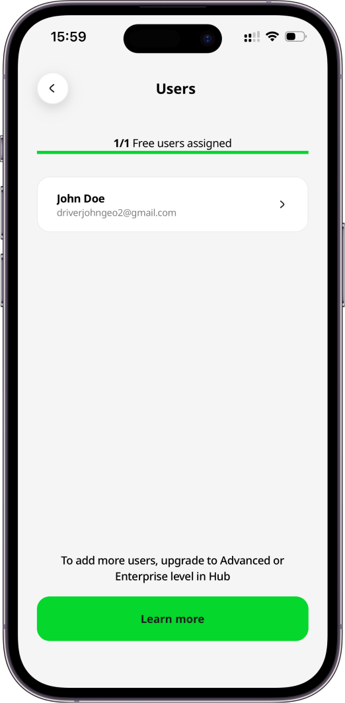

If you are on Advanced or Enterprise level, you can invite other users to your organization.  You can invite them either one-by-one, by pressing the `Invite user` button, or all at once, by pressing the `Import` button in Geo2 Hub.

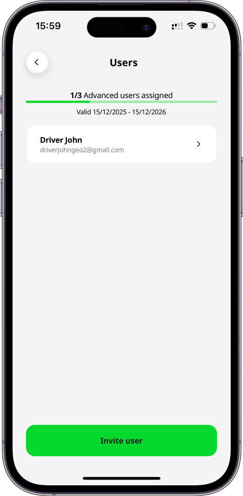

By press `Invite user`, you will see the dialog prompting you for an email address, full name, role and subscription.  Make sure the email address used is valid and can receive incoming messages.  Instructions for the invited user are in the invitation email message and [Hub: Accept Invitation](../Web-Based%20Hub/Hub_%20Accept%20Invitation.md).

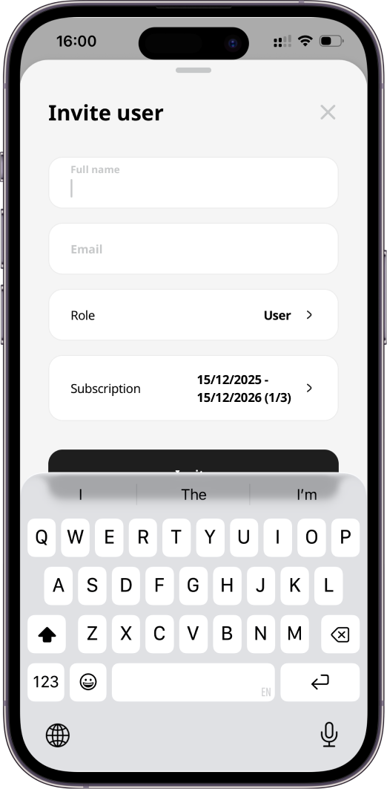

The properties of each user are:

|  **Property**                 |  **Description**                                                                                                                                                                                                                                                                                                                                                                                                                                                                                                                                                                                       |
|:------------------------------|:-------------------------------------------------------------------------------------------------------------------------------------------------------------------------------------------------------------------------------------------------------------------------------------------------------------------------------------------------------------------------------------------------------------------------------------------------------------------------------------------------------------------------------------------------------------------------------------------------------|
| Email                         | The email address must be in a valid email format - [recipient@domain\_name.domain\_suffix.](#recipient-domain-name-domain-suffix) For example, [john.doe@gmail.com.](mailto:janedoe@gmail.com)                                                                                                                                                                                                                                                                                                                                                                                                        |
| Full name                     | For example, Driver John Doe.  It is used for displaying users for route assignment, POD, and vehicle check creation.                                                                                                                                                                                                                                                                                                                                                                                                                                                                                  |
| Organization/environment role | Role is a set of permissions for the user in the organization/environment.  Each user can either have the role of User, which does not enable them to modify the organization and environment (including route and order creation), or Admin, which gives them control over the organization and environment.  For organization and environment user roles and their permissions, see [**User Roles**](https://balloonone.atlassian.net/wiki/x/L4D_Ag#Organization-Roles). In the mobile app, you can select either User or Admin role that will be applied both to your organization and environment. |

**To enable the use of the Geo2 product, an Organization Admin needs to assign a subscription to a newly invited user.**The message at the top of the `Users` page informs you about your current organization subscription.

By pressing on a user, you can edit their role and subscription. Remember to press the `Update` button to save changes.

If you want to delete a user from your organization, press the `Delete` button. This user will lose access to your organization.

# Device Settings

In the Device settings, you can choose whether location tracking is enabled.  Geo2 organizations use collected location data for management and reporting.

There are further options that customise the behaviour of the app:

- Barcode sound - select the sound that confirms the scanning of a barcode.
- Photo resolution - select the resolution of photos taken by the app - higher resolution produces higher quality but also increases the amount of network data that will be used to sync the photos.

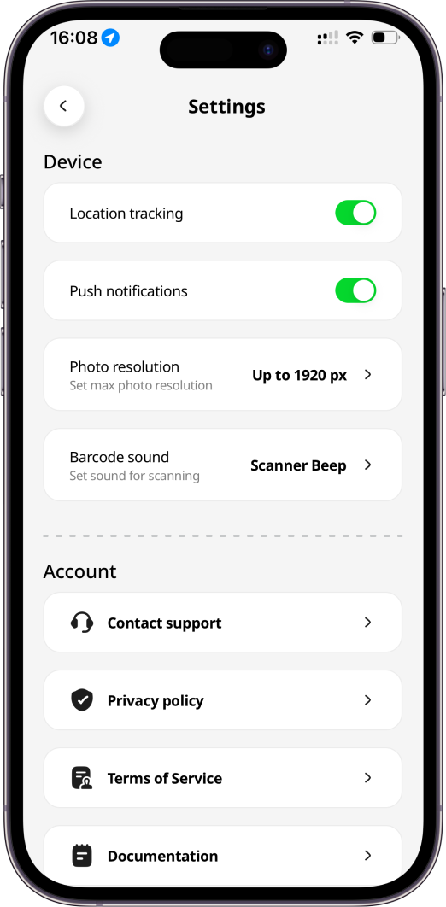

# Account Settings

Here you can find the next information:

- Contact Support - to report the issue, ask a question about Geo2, or leave your feedback to improve the product.
- Privacy Policy and Terms of Service.

To remove your account data, please click on the `Delete account` button and confirm the action.

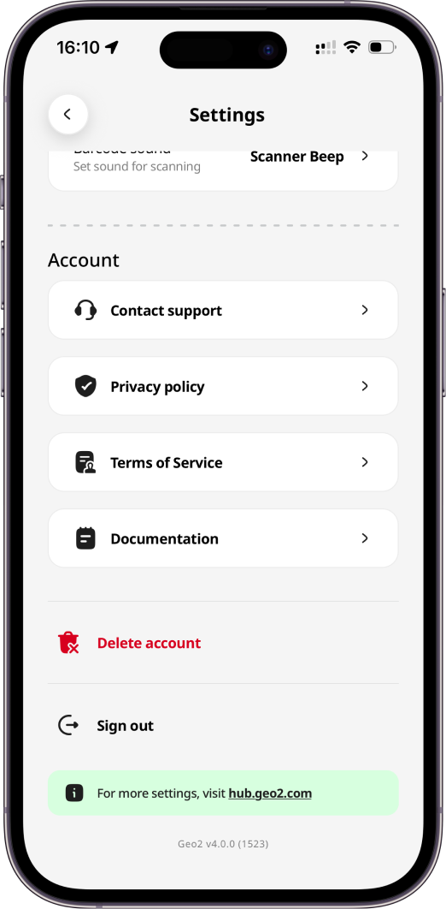
