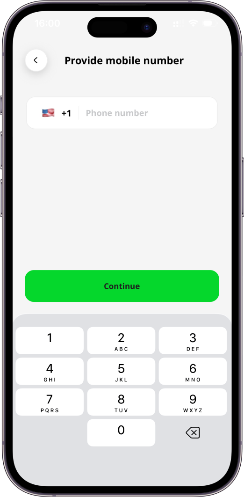

[Mobile App](../Mobile%20App.md)

# Mobile App: Sign In

- [Introduction](#introduction)
- [Sign In Using Email](#sign-in-using-email)
- [Sign In Using Mobile Number](#sign-in-using-mobile-number)

# Introduction

Once you are registered as a Geo2 user, you can sign in.  You have the option to authenticate either with an email and password, mobile phone number or via an identity provider - Apple, Google, or Microsoft.

# Sign In Using Email

If you type the email address, you will be redirected to provide your password used for registration at Geo2. Your password has to include at least 8 characters, 1 uppercase and lowercase, 1 number, and 1 special character. By pressing the `Continue` button, you will sign in to Geo2.

If you have forgotten your password and cannot sign in successfully, follow the link [Mobile App: Forgot Password](Mobile%20App_%20Sign%20In/Mobile%20App_%20Forgot%20Password.md).  This will enable you to reset your Geo2 password.

# Sign In Using Mobile Number

If you press the `Continue with phone` button, you will be redirected to provide your mobile number used for registration at Geo2.

By pressing the `Continue` button, you are required to confirm your mobile phone number to sign in.  You will see a prompt to copy and paste the verification code from the SMS sent to the provided mobile number.

If you have not received an SMS with a verification code, press the `Resend code` button in a minute, and a new code will be sent. Once your mobile number is verified, you will sign in to Geo2.
