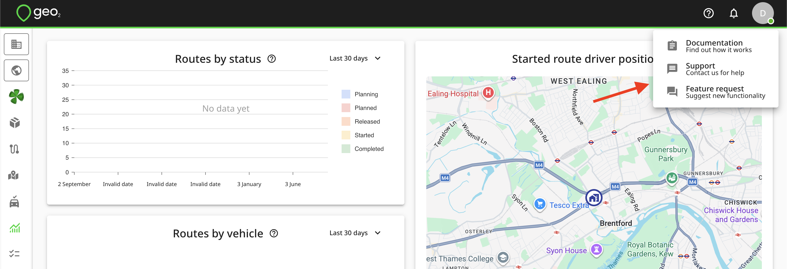

# Support

# Introduction

As a Geo2 user, you can request assistance through the Support and Feature request forms in Hub.  The options are shown under the Question toolbar icon.

# Data Removal Request

Organization admins can remove user accounts and delete organizations and environments. To remove your Geo2 account, ask your organization admin. If you are an organization admin, read more about:

- [Hub: Organization Settings](Web-Based%20Hub/Hub_%20Organization%20Settings.md)
- [Hub: Environment Settings](Web-Based%20Hub/Hub_%20Environment%20Settings.md)
- Removing users from your [Hub: Organization Settings](Web-Based%20Hub/Hub_%20Organization%20Settings.md)/[Hub: Users Settings](Web-Based%20Hub/Hub_%20Environment%20Settings/Hub_%20Users%20Settings.md)

# Support Request

The Support menu option in the toolbar diplays a form in which you can detail any problem you are experiencing with the application.  Please write the summary of the issue in the Summary field, and describe the issue in detail in the Feedback field.  Please be as specific as possible.  The more details you provide, the faster we can solve your issue.

The following information will be useful:

1. What did you do step by step? On what page(s) did the issue happen?

2. Was the issue related to Hub, mobile app, or API?

3. What device/browser do you use?

4. If the issue is related to a route/order/vehicle check, what is the route ID (or route key) / order ID (or order key) / vehicle check ID? Could be copied from the URL in the browser if the bug is on Hub user interface.

5.  If the issue is related to a POD, what are the POD ID (if it's possible) and order ID (or order key)?

Do not hesitate to attach some files and screenshots if you think it will help to solve your question.

Once the form is filled in, press the `Submit` button.  A support request will be created in our service desk and you will receive an email acknowledgement with a link to the browser-based service desk interface for further communication.

# Feature Request

To suggest new functionality, please use the Feature request form.  The Feature request option in the toolbar displays a form for your suggestion.  Do not hesitate to attach files and screenshots with the visualization of how you see this new functionality.

The following information will be useful:

1. How will you use the feature?

2. How this will improve the product and which part of it? Is it for Hub, mobile app, or the API? Is this functionality for managers or drivers?

3. Is there any visualization of where this new functionality can be added?

4. What is the demand level for this functionality? Is it critical or it could wait for a month or longer?

5. How do you solve the issue in the application now (without this new functionality)?

Once the form is filled in, press the `Submit` button.  A feature request will be created in our service desk and you will receive an email acknowledgement with a link to the browser-based service desk interface for further communication.
