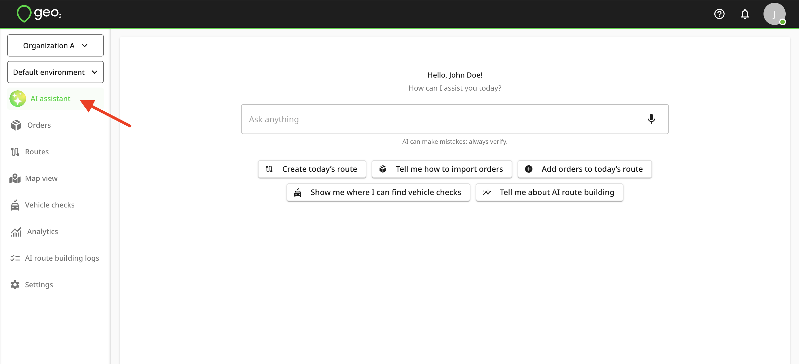
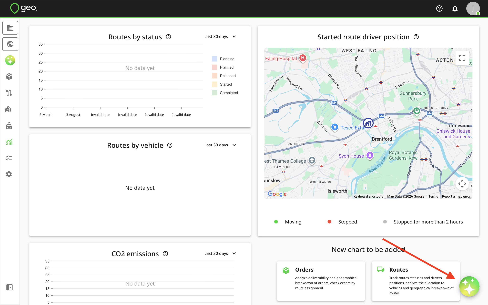
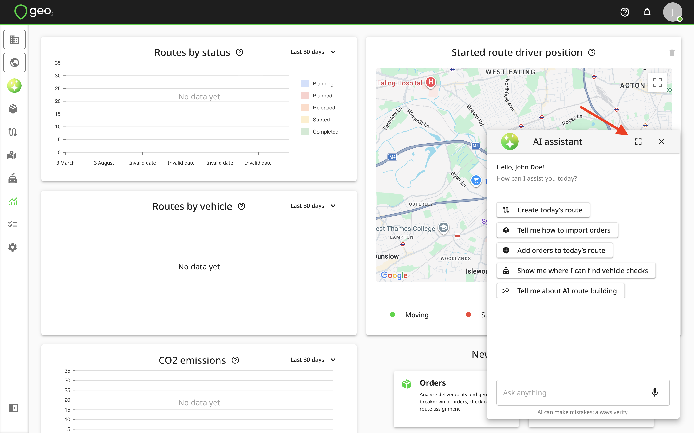
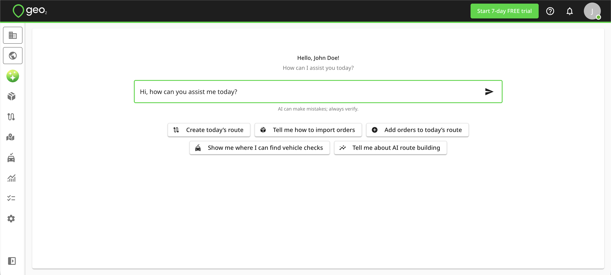
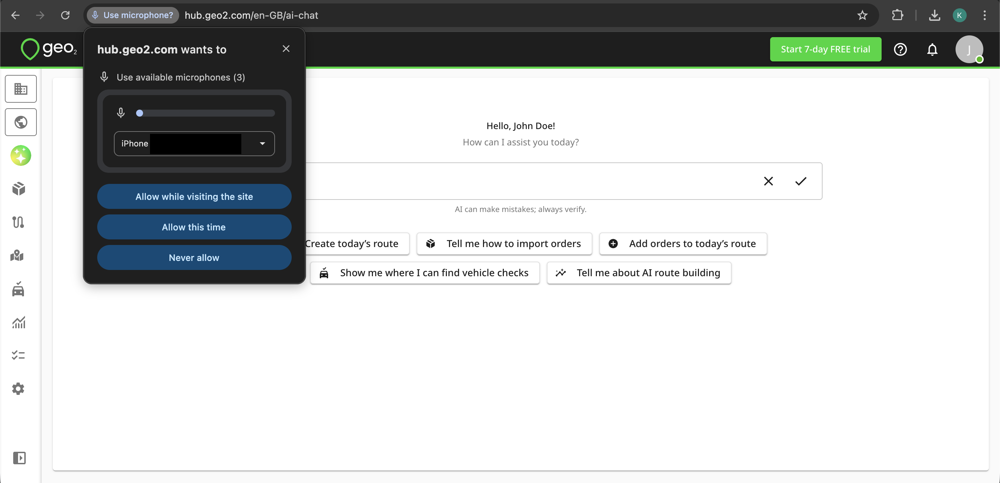
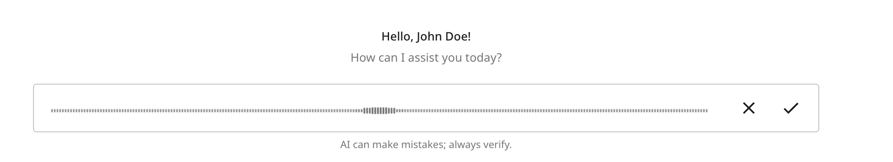
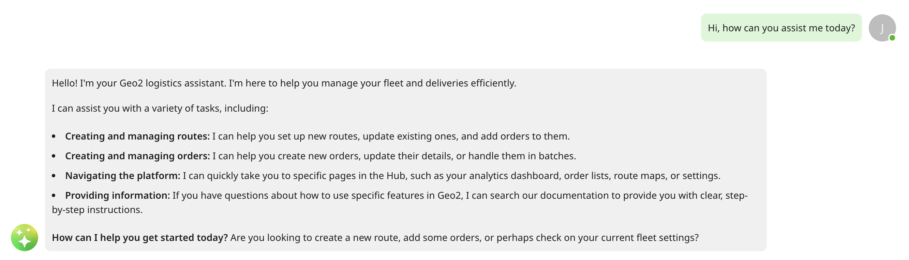

[Web-Based Hub](../Web-Based%20Hub.md)

# Hub: AI Assistant

- [Introduction](#introduction)
- [AI Access Points](#ai-access-points)
- [AI Assistant Interface](#ai-assistant-interface)
- [Limitations](#limitations)

# Introduction

Managing delivery operations often means too many clicks, too much searching, and too much time spent on routine actions inside the system. That’s exactly where Geo AI Assistant comes in. It helps you complete key tasks faster inside Geo2 Hub, without digging through menus or switching between pages.

Here’s what AI Assistant can do:

- Create and update routes
- Create and update orders
- Add stops to routes
- Help you navigate through Hub pages

That means:

- Less manual admin
- Faster actions inside Hub
- Less time spent searching for the right page or function
- A smoother workflow for delivery teams

# AI Access Points

You can access the AI assistant by clicking the `AI assistant` button in the menu, which opens the dedicated AI assistant page.

It is also available via the AI icon located in the bottom-right corner of each page. The assistant appears as a small dialog window, with the option to expand it to full-screen view.

# AI Assistant Interface

The input field "Ask anything" allows manual typing, voice input, or selection from suggested options below. To submit a typed request, press `Enter` or click the `Send` icon.

To use voice input, click the `Mic` icon inside the “Ask anything input field and grant microphone access to dictate your request.

After dictating your request, press the `Tick` icon to finish. The system will transcribe your voice to text, which will appear in the input. If correct, press the `Send` icon to send the message.

Your message appears in green, while AI assistant replies appear in grey.

# Limitations

The AI assistant is available to users of all levels. However, Free and Pro users are limited to 5 requests per day, while users with Advanced and Enterprise subscriptions have no restrictions on the number of requests.

The AI assistant is available to all organization and environment [User Roles](../User%20Roles.md), with access tailored by user permissions. For example, a user with the Environment User role cannot access Settings page or create and update routes and orders. However, they can still use the assistant to get guidance on tasks such as locating their assigned routes, recording a POD, or creating a vehicle check within the app.

Order and route creation via the AI assistant is available to users across all subscription levels. However, Free and Pro users can only create one order at a time, while bulk operations are reserved for Advanced and Enterprise users.
