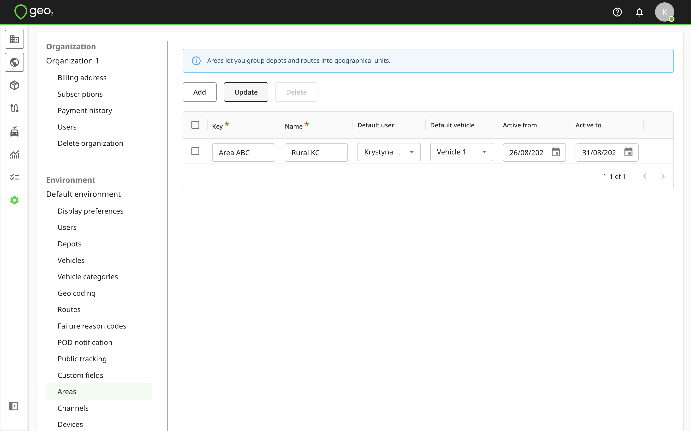
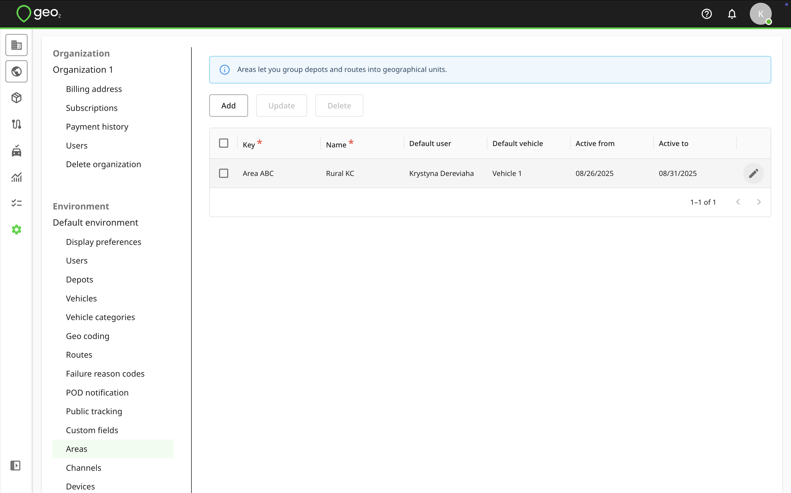
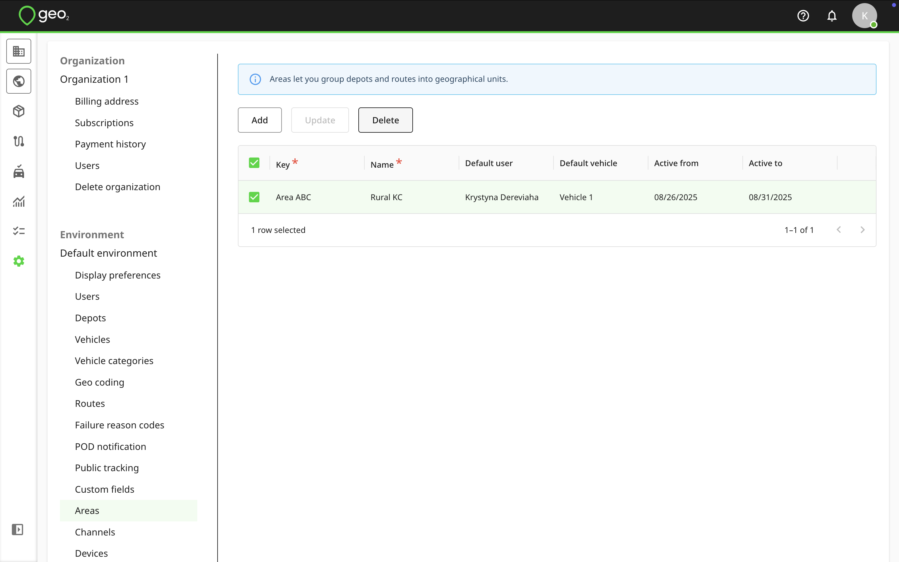

[Web-Based Hub](../../Web-Based%20Hub.md) > [Hub: Environment Settings](../Hub_%20Environment%20Settings.md)

# Hub: Areas Settings

Areas let you tag depots and routes by user-defined geographical regions.  To add an area, press the `Add` button in Settings → Environment → Areas.

You will see the form to fill in the information.  Key and Name are required fields, others are optional.

|  **Property**    |  **Description**                                                                                                                                                  |
|:-----------------|:------------------------------------------------------------------------------------------------------------------------------------------------------------------|
| Key              | Key is an area identifier which is required to be unique within the environment, e.g. Area ABC.                                                                   |
| Name             | Name is a user-definable name that is used to display areas for an order or route creation, e.g. Rural KC.                                                        |
| Default user     | Default user set for the Driver field on Create route page when selecting an area if another value for this field is not selected.                                |
| Default vehicle  | Default vehicle set for the Vehicle field on Create route page when selecting an area if another value for this field is not selected.                            |
| Active from/to   | Set up the Active from and Active to dates to provide the expiry dates for an area.  Expired areas will not be possible to select for an order or route creation. |

Press the `Update` button to save your edits.

To edit area information, click the `Edit (pencil)` icon by hovering over the area row.  Remember to press the `Update` button.

You can select an area to `Delete` it.  For data integrity, it is best to not delete an area once it has started to be used.

