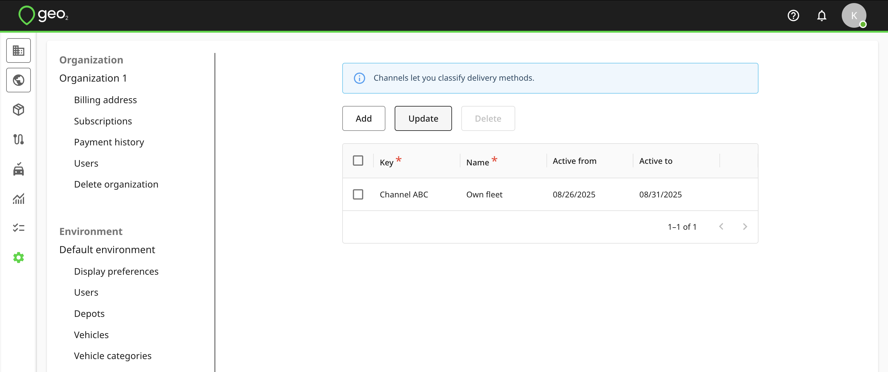
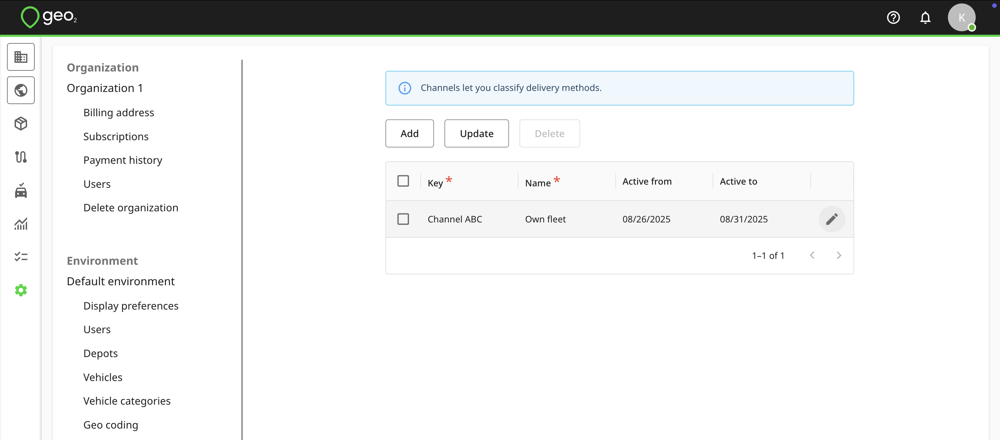
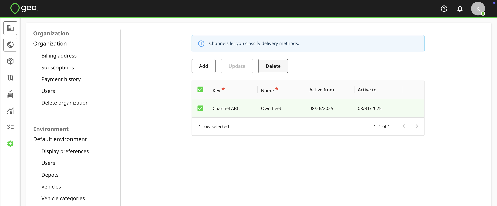

[Web-Based Hub](../../Web-Based%20Hub.md) > [Hub: Environment Settings](../Hub_%20Environment%20Settings.md)

# Hub: Channels Settings

Channels are lightweight tags that let you classify delivery methods.  They are reserved for future use.  To add a channel, press the `Add` button in Settings → Environment → Channels.  You will see the form to fill in the information.  Key and Name fields are required.

|  **Property**    |  **Description**                                                                                  |
|:-----------------|:--------------------------------------------------------------------------------------------------|
| Key              | Channel identifier that is required to be unique within the environment, e.g. Channel 1.          |
| Name             | User-definable name that is used to display channels for an order creation, e.g. Own fleet.       |
| Active from/to   | Set up Active from/to dates if you want to limit the period during which the channel can be used. |

 A blank value for one of these fields means no limit.  Press the `Update` button to save changes.

To edit channel information, click the `Edit (pencil)` icon in the channel row.  Remember to press the `Update` button.

You can select a channel to `Delete` it.  For data integrity, it is best to not delete a channel once it has started to be used.

