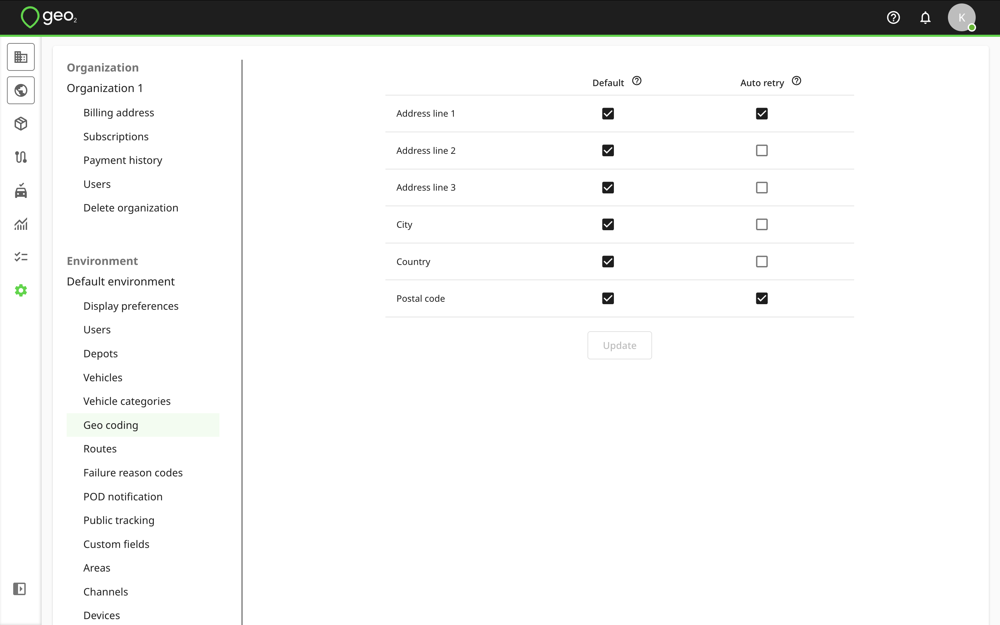

[Web-Based Hub](../../Web-Based%20Hub.md) > [Hub: Environment Settings](../Hub_%20Environment%20Settings.md)

# Hub: Geo Coding Settings

Geo2 geo-codes determine the geographical location of different types of addresses:

- Organization and environment addresses
- Depot addresses
- Route start/end addresses
- Order addresses

Environment geo coding settings let you control which address elements are used during geo-coding.  The first geo-coding attempt is made using `Default` settings.  If this does not lead to an accurate location, `Auto retry` settings are used instead.

Typical settings would be:

|  **Default**    |  **Auto retry**    |
|:----------------|:-------------------|
| Address line 1  | Address line 1     |
| Address line 2  | Postal code        |
| Address line 3  |                    |
| City            |                    |
| Country         |                    |
| Postal code     |                    |

Press `Update` to save the settings.
