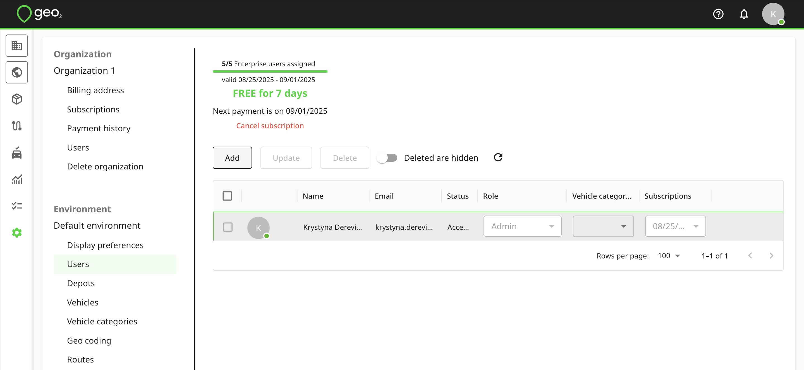
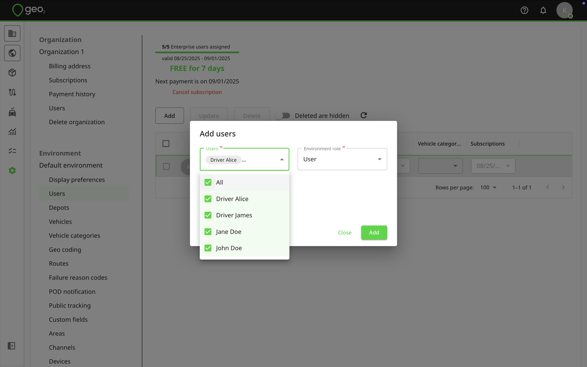
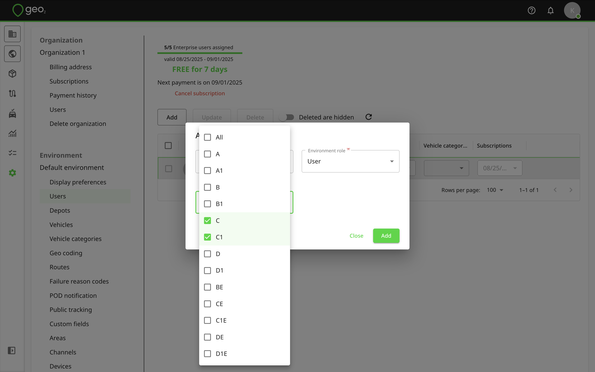
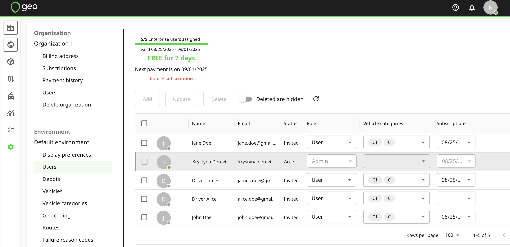
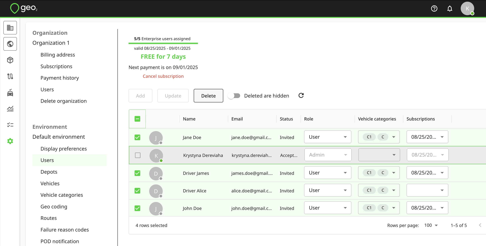

[Web-Based Hub](../../Web-Based%20Hub.md) > [Hub: Environment Settings](../Hub_%20Environment%20Settings.md)

# Hub: Users Settings

You can manage the users who have access to the environment and set their roles in Settings → Environment → Users.  You can add users from your organization using the `Add` button.

The Add users dialog will appear with 3 fields - Users, Role, and Vehicle categories.  By clicking on the User field, you can choose multiple users for adding them to the environment, assigning them [Hub: User Roles](../Hub_%20User%20Roles.md) and vehicle categories.  The role will apply to all the selected users.  It is not possible to add users to the environment who are not defined in [Hub: Organization Settings](../Hub_%20Organization%20Settings.md).  If all organization users are added to the environment already, the Add button will be disabled.  You need to add users to your organization first.

The vehicle categories will apply to all selected users. See [Hub: Vehicle Categories Settings](Hub_%20Vehicle%20Categories%20Settings.md) for more information about vehicle categories and their usage.

By pressing the `Add` button, users will be added to the environment.

Once a new user is added, you will see it in the table with the next columns: name, email, status, role, vehicle categories and subscription.

|  **Property**      |  **Description**                                                                                                                                                                                                                                                                                                                                                                                                                                                                                                                                                                                                                                                                                                                                                                                                                                                                 |
|:-------------------|:---------------------------------------------------------------------------------------------------------------------------------------------------------------------------------------------------------------------------------------------------------------------------------------------------------------------------------------------------------------------------------------------------------------------------------------------------------------------------------------------------------------------------------------------------------------------------------------------------------------------------------------------------------------------------------------------------------------------------------------------------------------------------------------------------------------------------------------------------------------------------------|
| Name               | Full name of the user's Geo2 account.                                                                                                                                                                                                                                                                                                                                                                                                                                                                                                                                                                                                                                                                                                                                                                                                                                            |
| Email              | Email of the user's Geo2 account.                                                                                                                                                                                                                                                                                                                                                                                                                                                                                                                                                                                                                                                                                                                                                                                                                                                |
| Status             | <ul local-id="4a61858d-d3b2-4fb3-a991-57365056dcdc"><li local-id="e8ff29f0-f46b-4912-a41a-135a8af3b74e">
<code>Invited</code>
</li><li local-id="cf5a73a6-5db3-4970-8f40-5119b238a243">
<code>Accepted</code>
</li></ul>                                                                                                                                                                                                                                                                                                                                                                                                                                                                                                                                                                                               |
| Role               | <ul local-id="5274cfdf-ae51-41df-9c8d-83b7f50a951d"><li local-id="4a4f01cc-4379-4d2d-8e2e-b17f405c52c1">
<code>User</code> - most applicable to mobile app users, who only access data assigned to them.
</li><li local-id="3ca95cb5-daad-45cd-a4dc-565a40c54337">
<code>Manager</code> - access to all data, but not able to modify environment settings.
</li><li local-id="39106e74-4395-490d-8201-16194ecfb6eb">
<code>User Admin</code> - in addition to Manager, able to manage environment users.
</li><li local-id="d6bead17-78b8-4cb7-a5b7-5f0f9705a9d3">
<code>Admin</code> - full access to the environment data and its settings.
</li></ul> See [Hub: User Roles](../Hub_%20User%20Roles.md) for more information about environment user roles. |
| Vehicle categories | Categories that let you match users and vehicles for a load assignment. By default, standard driving categories (A, B, C, etc.) are listed. You can edit or delete them and create custom categories for your environment.   See [Hub: Vehicle Categories Settings](Hub_%20Vehicle%20Categories%20Settings.md) for more information about vehicle categories and their usage.                                                                                                                                                                                                                                                                                                                                                                                                                                                                                                |
| Subscription       | A subscription assigned to a user by an Organization Admin.                                                                                                                                                                                                                                                                                                                                                                                                                                                                                                                                                                                                                                                                                                                                                                                                                      |

When you modify a user setting such as `Role`, you can save the change using the `Update` button.

When you select one or more users and press the `Delete` button, the users are removed from the environment, i.e. lose access to it.

When `Deleted are hidden` is selected, there is an option to restore a deleted user to give them access once again.  You cannot remove your own user from the environment.
