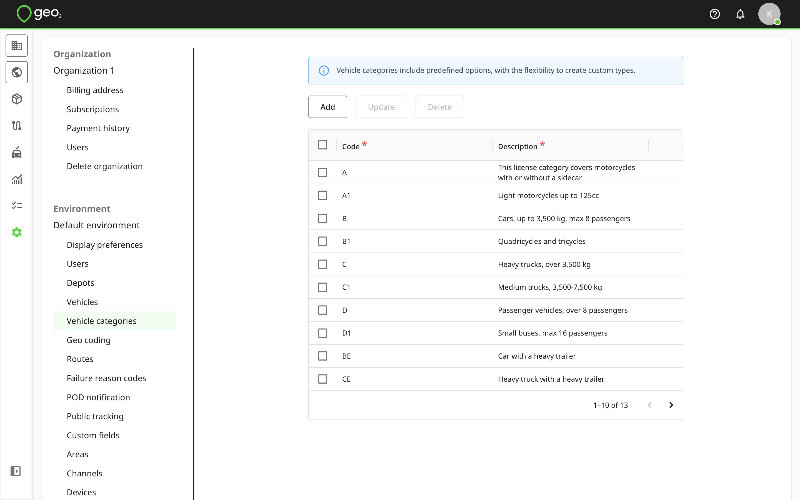
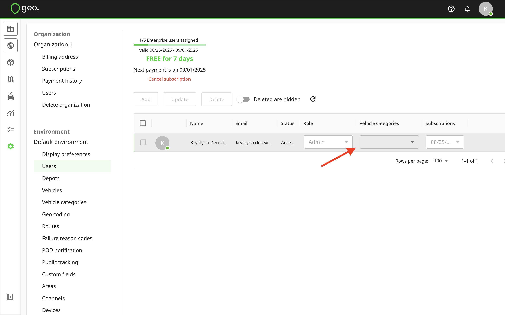
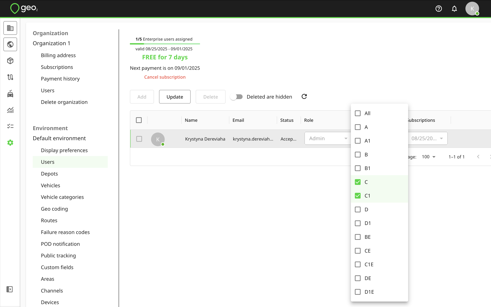
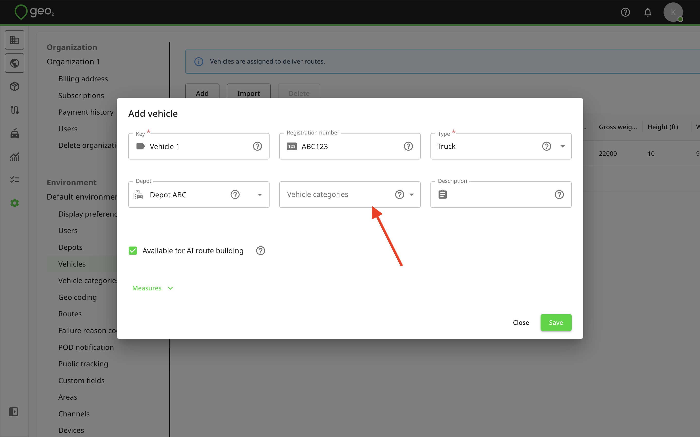
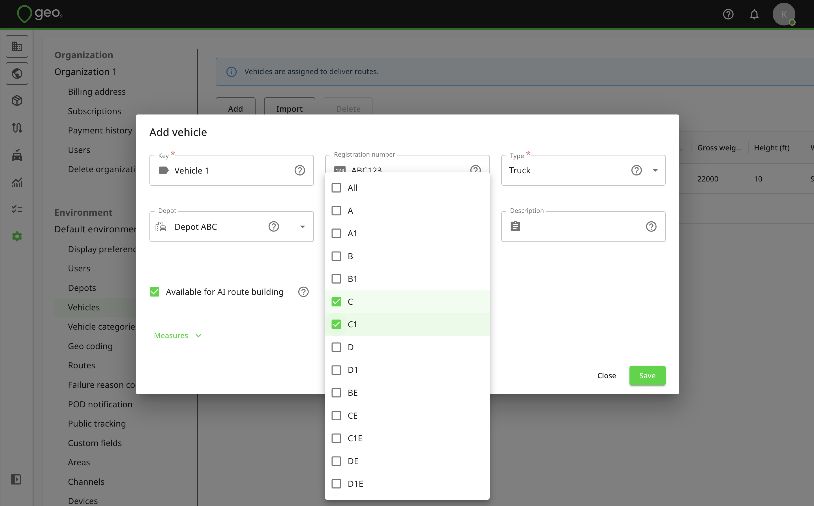
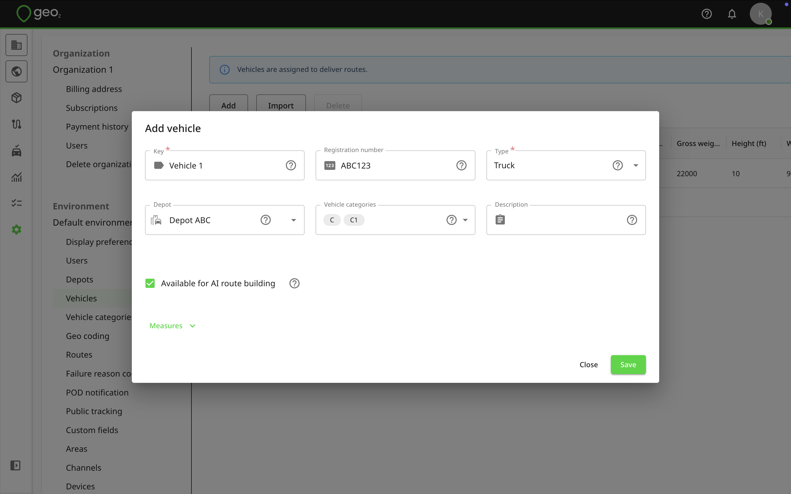

[Web-Based Hub](../../Web-Based%20Hub.md) > [Hub: Environment Settings](../Hub_%20Environment%20Settings.md)

# Hub: Vehicle Categories Settings

Vehicle categories let you match users and vehicles for a route assignment. By default, standard driving categories (A, B, C, etc.) are listed. You can edit or delete them and create custom categories for your environment.

These categories can then be assigned to vehicles (via Settings → Environment → [Hub: Vehicles Settings](Hub_%20Vehicles%20Settings.md)) and users (via Settings → Environment → [Hub: Users Settings](Hub_%20Users%20Settings.md)). It is possible to select multiple categories.

Assigning categories to users:

Remember to press `Update` to save changes.

Assigning categories to Vehicles:

Remember to press `Save` to save changes.

When planning a route on [Hub: Routes](../Hub_%20Routes.md)in Hub or via Geo2 API, the system will match the user’s and vehicle’s categories. Users without categories can only be assigned to vehicles without categories. Vehicles without categories can be assigned to any user.
