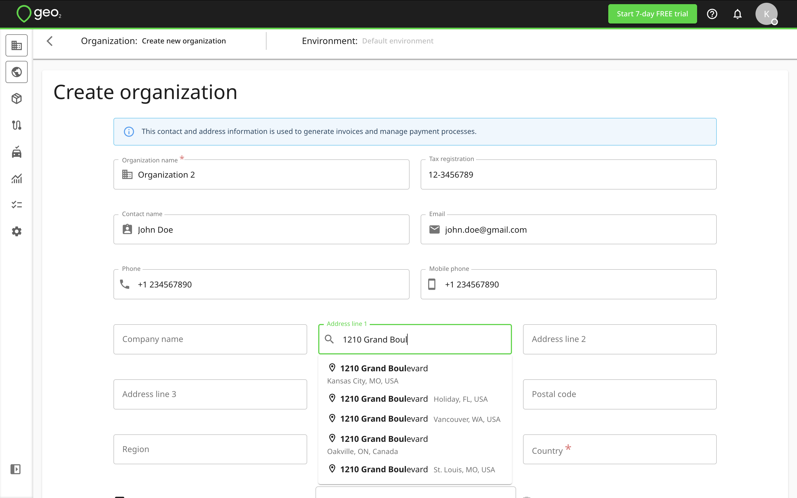
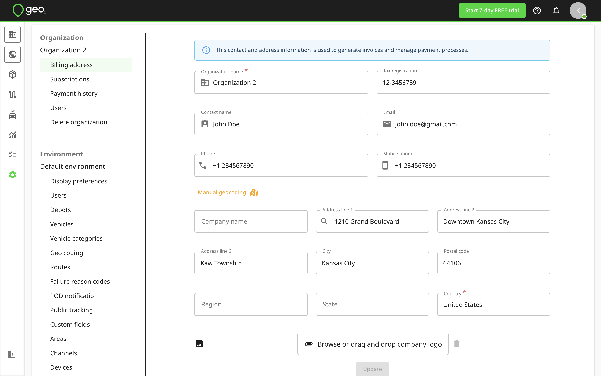
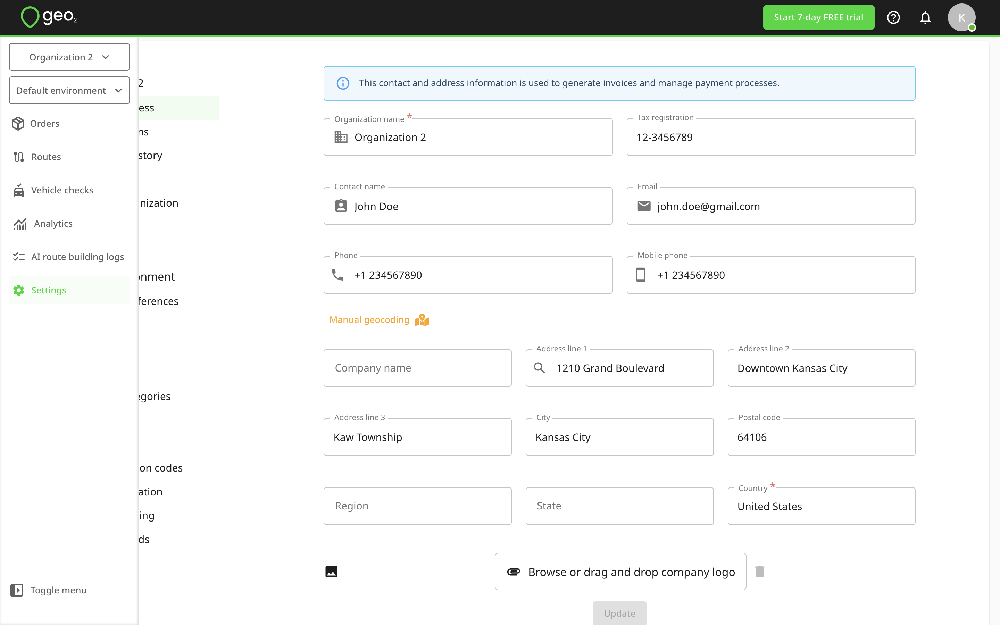
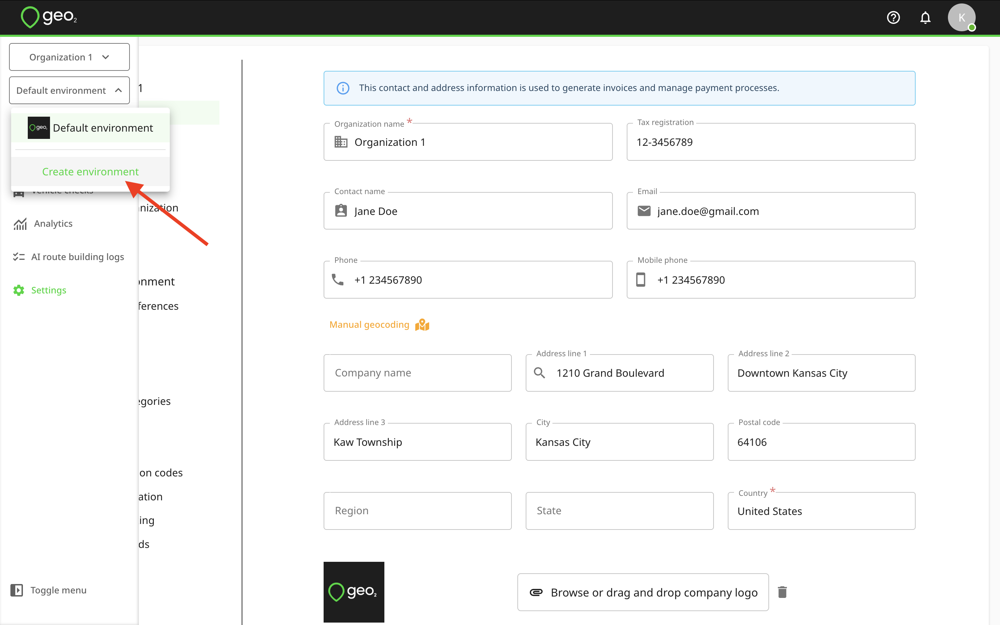
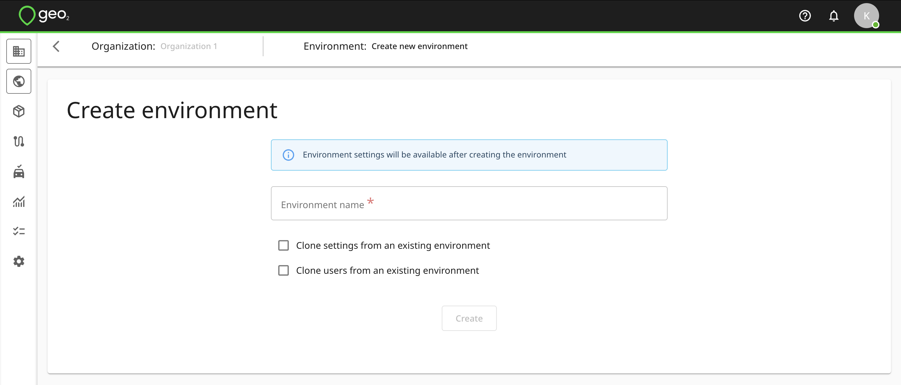
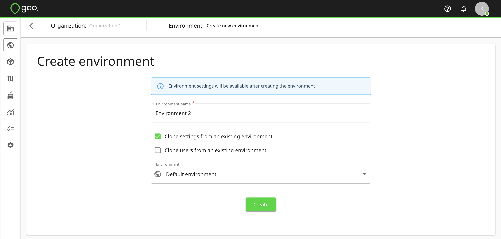

[Web-Based Hub](../Web-Based%20Hub.md)

# Hub: Menu

- [Introduction](#introduction)
- [Organization Selector](#organization-selector)
- [Environment Selector](#environment-selector)

# Introduction

The vertical menu in Hub includes these options:

- Organization selector
- Environment selector
- [Hub: Orders](Hub_%20Orders.md)
- [Hub: Routes](Hub_%20Routes.md)
- [Hub: Map View](Hub_%20Map%20View.md)
- [Hub: Vehicle Checks](Hub_%20Vehicle%20Checks.md)
- [Hub: Analytics](Hub_%20Analytics.md)
- [Hub: AI Route Building Logs](Hub_%20AI%20Route%20Building%20Logs.md)
- Settings([Hub: Organization Settings](Hub_%20Organization%20Settings.md)and[Hub: Environment Settings](Hub_%20Environment%20Settings.md))

# Organization Selector

When registering a new account and [Hub: Set Up Organization](Hub_%20Set%20Up%20Organization.md), your default organization is created using the name you provided during workspace setup. Its name appears in the menu.

To create a new organization, click the `Create organization` button in the menu. You will be redirected to the Create organization page. Provide the Organization name and billing address (Address line 1, City, and Country); other fields are optional. The tax registration number appears on the combined invoice/receipt after payment.

To enter the address, start typing it into Address line 1 and select from the drop-down. If no match appears, complete the address fields manually.

Press the `Create` button to create an organization. After creation, you will be redirected to Settings → Organization → Billing address.

To edit organization settings later, select Settings from the menu. To save changes to an existing organization, press `Update`. Learn more about [Hub: Organization Settings](Hub_%20Organization%20Settings.md).

# Environment Selector

During the registration of a new account and [Hub: Set Up Organization](Hub_%20Set%20Up%20Organization.md), the address entered will be saved as the environment’s address as well.  If you want to create one more environment in your organization, press the environment selector in the menu bar and press `Create environment`.  This option is available only with Enterprise subscription level. You will be redirected to Create environment page where you will have the option to clone settings and users from an existing environment.

It is up to you whether you decide to clone settings or users or start an entirely fresh environment definition.

If cloning settings and/or users from an existing environment, you will need to select an environment to clone them from.

By pressing the `Create` button, a new environment will be created.  You will be redirected to the settings of the newly created environment.
