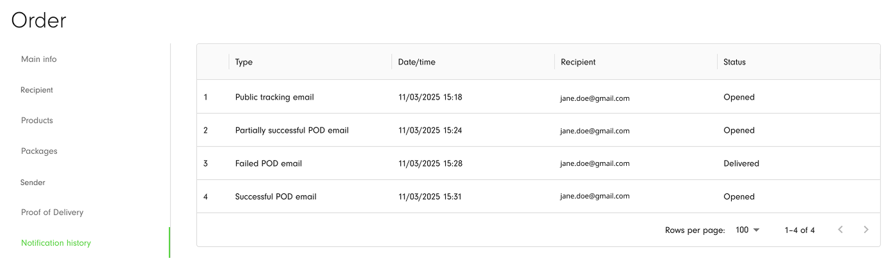

[Web-Based Hub](../../Web-Based%20Hub.md) > [Hub: Orders](../Hub_%20Orders.md)

# Hub: Order Notification History

If you have set up sending the [Hub: POD Notification Settings](../Hub_%20Environment%20Settings/Hub_%20POD%20Notification%20Settings.md) and [Hub: Public Tracking Settings](../Hub_%20Environment%20Settings/Hub_%20Public%20Tracking%20Settings.md) and an order has indicated the **recipient** **email address/mobile phone number**, you can then track the statuses of emails/SMS notifications on Notification history tab inside the Order details.

|  **Column**    |  **Description**                                                                                                                                                                                                                             |
|:---------------|:---------------------------------------------------------------------------------------------------------------------------------------------------------------------------------------------------------------------------------------------|
| Type           | The type of notification that has been sent: Successful POD email, Partially successful POD email, Failed POD email, Public tracking email, Public tracking SMS.                                                                             |
| Date/time      | The date and time when the email/SMS notification has been sent to the recipient.                                                                                                                                                            |
| Recipient      | Recipient email address (POD and Public tracking emails) and mobile phone number (for Public tracking SMS).  Every fixed recipient for a Failed POD email will be displayed separately in the table to check the status of every sent email. |
| Status         | The status of the email/SMS that has been sent.  Statuses for emails are Sent, Undelivered, Delivered, Opened, and Clicked.  Statuses for SMS notifications are Sent, Undelivered, and Delivered.                                            |

