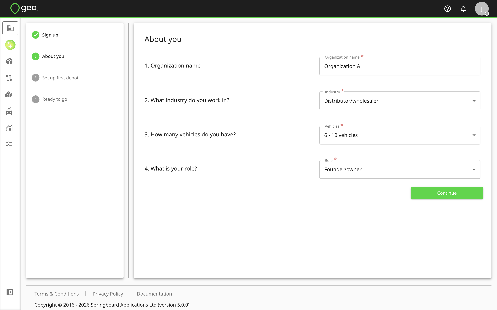
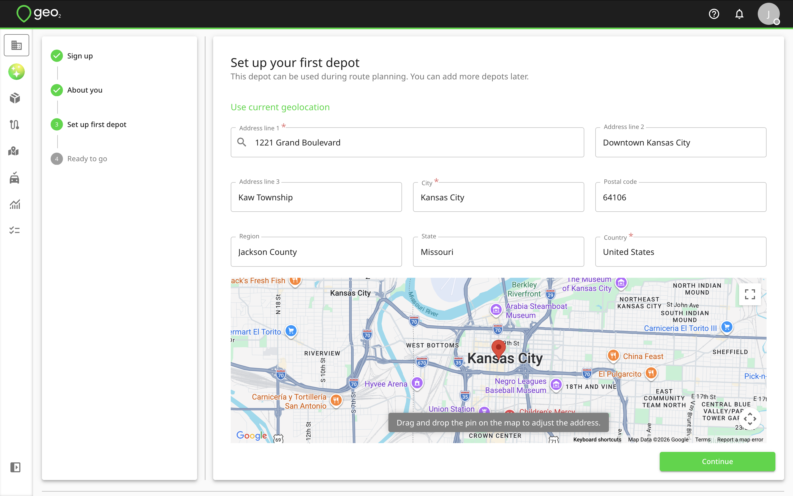
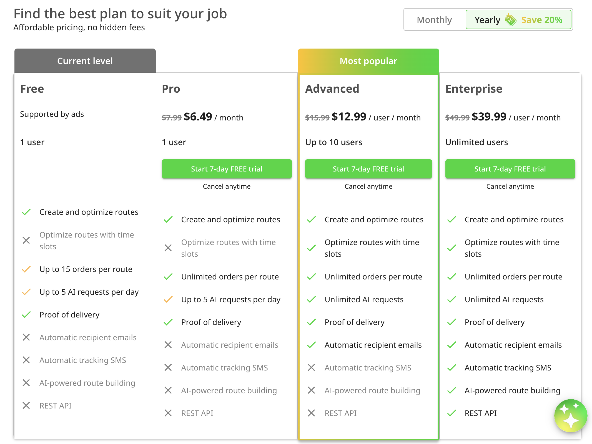
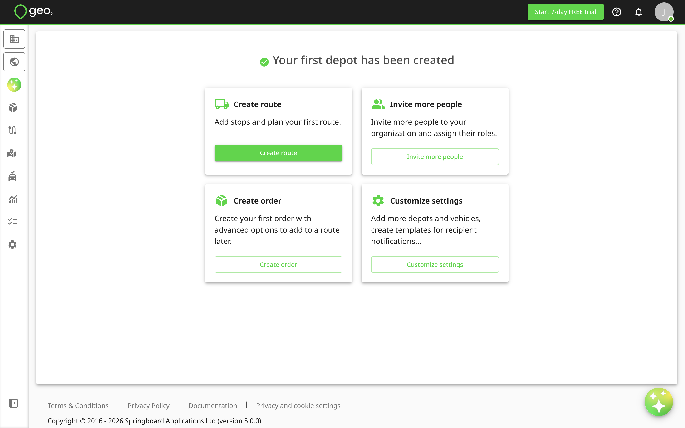
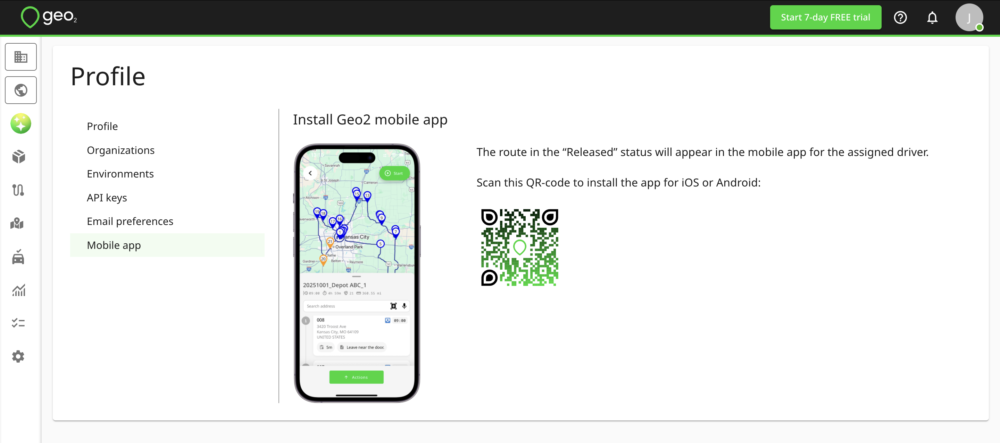

[Web-Based Hub](../Web-Based%20Hub.md)

# Hub: Set Up Organization

- [Introduction](#introduction)
- [About You](#about-you)
- [Set Up First Depot](#set-up-first-depot)
  - [Features Included in a Free Subscription Level](#features-included-in-a-free-subscription-level)
- [Select Next Action](#select-next-action)
- [Install Geo2 Mobile App](#install-geo2-mobile-app)

# Introduction

Once your account is created, you need to set up your Geo2 workspace.

# About You

We ask for information about your company to set up an organization for you.  You need to provide your organization’s name, select the industry you work in, the number of vehicles your company has, and your role in the company.

By pressing the `Continue` button, you will be redirected to Set up first depot page.

# Set Up First Depot

On this page, you can create your first depot. It can be optionally used as a route start and end points during route planning. You can add more depots later in Settings → Environment -> [Hub: Depots Settings](Hub_%20Environment%20Settings/Hub_%20Depots%20Settings.md).

You can start searching for the address by typing it in the Address line 1 field or giving access to your current geolocation.  Once the address is provided, you can drag and drop the pin on the map to adjust the address. By pressing the `Continue` button, your organization, environment, and its first depot will be created.

**Organization** is a group of users who share a subscription and collaborate on data in one or more environments. By default, for your newly created organization, **you get a Free subscription**, **no card is required**. A subscription would be automatically assigned to you.

**Environments** let you represent teams within a single company or provide separate spaces for testing and productive use.

Examples:

- A large company (organization) with smaller teams (environments) working on different projects.
- A holding company (organization) with smaller companies (environments) working in different spheres.
- A middle-size company (organization) with several depots (environments).

## Features Included in a Free Subscription Level

With a **Free** subscription in Geo2, you get access to a solid set of core features at no cost both in the Geo2 web-based Hub and the mobile app. It is available for **one user per organization**, and additional users cannot be added on this level. The Free subscription includes:

- **Order management** (Hub and mobile app): Create unlimited orders each month, set time windows, assign them to routes, and view proof of delivery (POD) history in both the web Hub and mobile app. Use address scanning and voice search in the mobile app for fast adding route stops.
- **Route planning** (Hub and mobile app): Build unlimited routes with up to 15 orders per route, optimize them with vehicle restrictions, adjust stops and timings, plan driver breaks.
- **Vehicle loading** (mobile app): Set package placements in the vehicle with optional photos.
- **Navigation** (mobile app):Use your preferred navigation app (e.g., Google Maps, Apple Maps, Waze) for turn-by-turn directions.
- **Proof of delivery** (Hub and mobile app): Create PODs with photos and signatures (planned or ad-hoc) in the app, store up to 30 days of data both in Hub and the mobile app.
- **Offline mode** (mobile app): Work without an internet connection: create routes and stops, add breaks, capture PODs, and record location data, with all offline actions syncing when back online.
- **AI Assistant** (Hub): Create and update orders and routes, add stops, navigate across the platform, and receive step-by-step guidance on key features. Limited to 5 requests per day for Free and Pro level users.
- **Support:** Contact the Geo2 team for help or to request new features.

On each subscription level (including Free), you can use both the Hub and mobile app. The same limitations apply to both platforms.

This gives you the essentials for planning, managing, and executing routes effectively before upgrading to a paid level.

# Select Next Action

Next, you can select one of the following options to start working with Geo2 Hub:

- **Create route** (recommended). Add stops and plan your first route. Learn more about [Hub: Routes](Hub_%20Routes.md).
- **Create order**. Create your first order with advanced options to add to a route later. Learn more about [Hub: Order Creation and Editing](Hub_%20Orders/Hub_%20Order%20Creation%20and%20Editing.md).
- **Invite more people**. Invite more people to your organization and assign their roles. Learn more about [Hub: Organization Settings](Hub_%20Organization%20Settings.md).
- **Customize settings**. Add more depots and vehicles, create templates for recipient notifications. Explore your [Hub: Environment Settings](Hub_%20Environment%20Settings.md).

When orders are created and added to a route, the route can be released to a driver.  It will be displayed in the mobile app for the assigned driver.

# Install Geo2 Mobile App

By pressing your avatar and selecting the `Profile` option, you will be redirected to Profile menu. Press on `Mobile app` tab. There is a QR code to install the app for iOS or Android.  Depending on the OS of your device, you will either be redirected to App Store (if iOS) or Google Play (if Android).

The mobile app is available from[**App Store**](https://apps.apple.com/app/geo2/id1594180686) and [**Google Play**](https://play.google.com/store/apps/details?id=com.geo2.app).
