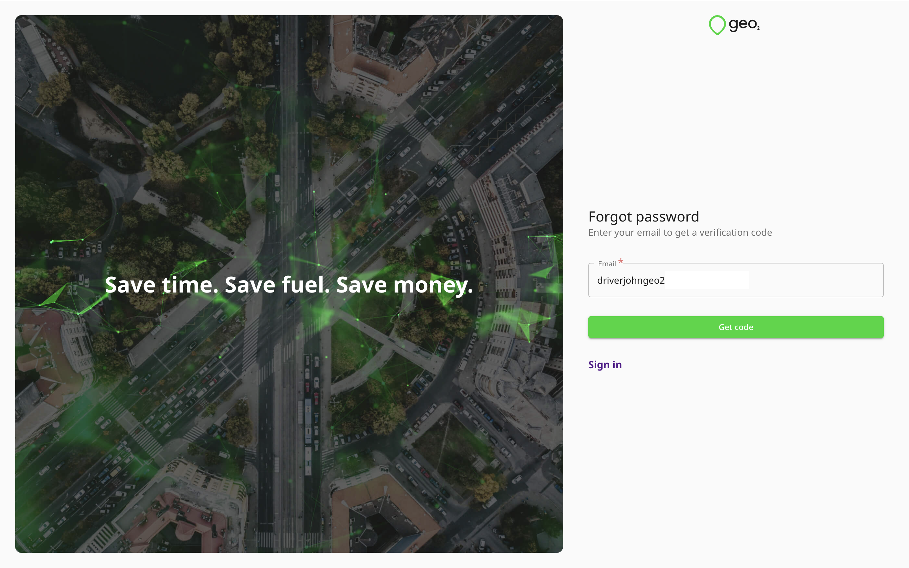
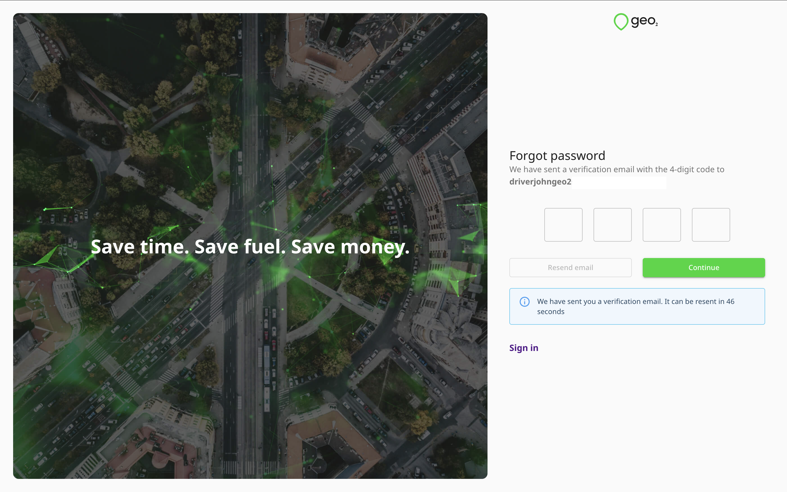
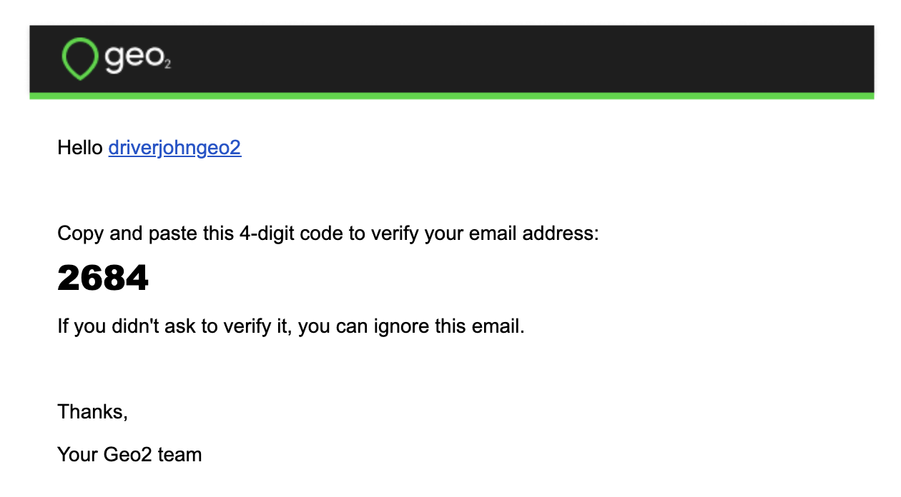
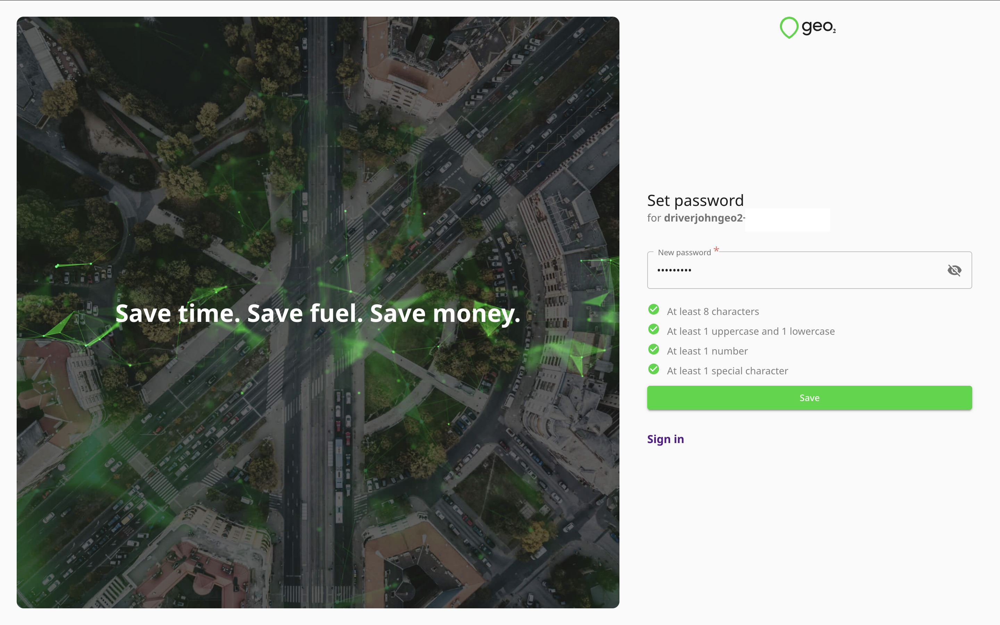

[Web-Based Hub](../../Web-Based%20Hub.md) > [Hub: Sign In](../Hub_%20Sign%20In.md)

# Hub: Forgot Password

If you have forgotten or have not set up yet your password and cannot sign in successfully, follow the link `Forgot password?` on [**Sign in**](https://hub.geo2.com/en-GB/auth/signin) page.  This will enable you to reset your Geo2 password.

After you have filled in your email address, press `Get code`. You will see a prompt for you to check your inbox for a verification code sent to the provided email address. You need to copy the code and paste it to the form in Hub:

If you have not received an email with a verification code, press the `Resend email` button on Forgot password page, and a new code will be sent. Once the code is pasted, press the `Continue` button. You will be redirected to create a new password.

Press `Save` to create a new password. Once the password is changed, you will be logged in and redirected to Analytics page. A confirmation will appear:

